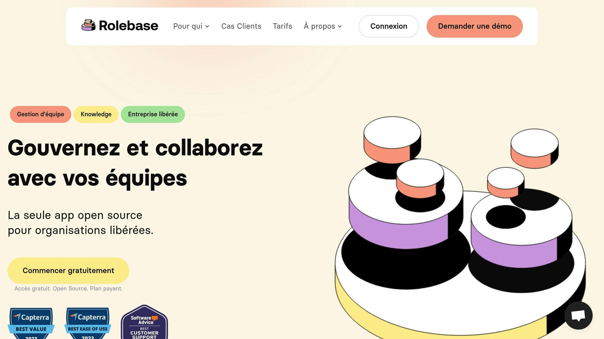

**Associer l'amélioration continue au management horizontal peut transformer la performance de votre entreprise. Voici comment :**

1. **Décentralisez les décisions**: Donnez plus d'autonomie aux équipes pour accélérer les processus.

2. **Encouragez le feedback**: Installez des systèmes réguliers et transparents pour améliorer les pratiques.

3. **Fixez des objectifs clairs**: Définissez des priorités mesurables pour suivre les progrès.

4. **Célébrez les réussites**: Renforcez la motivation collective en valorisant les efforts.

5. **Utilisez des outils collaboratifs**: Simplifiez la gestion des rôles et des tâches avec des solutions numériques adaptées.

**Clé du succès** : Combinez autonomie, collaboration et outils efficaces pour ancrer une culture d’amélioration continue dans un management horizontal.

## Principes clés pour l'intégration

### Les leaders comme guides d'équipe

Dans une approche de management horizontal, les leaders jouent un rôle de facilitateurs plutôt que de contrôleurs. Leur mission principale est d'aider les équipes à gagner en autonomie et à progresser en continu.

Pour y parvenir, les managers doivent :

- **Faciliter la prise de décision**en définissant un cadre clair et des objectifs précis.

- **Encourager l'expérimentation**en offrant un environnement où les erreurs sont acceptées et vues comme des opportunités d'apprentissage.

- **Renforcer les compétences**des équipes grâce au coaching et à la formation continue.

Ce rôle de guide repose sur un flux constant de retours d'information, indispensable pour soutenir une dynamique d'amélioration continue.

### Mettre en place des systèmes de feedback efficaces

Des systèmes de feedback bien conçus sont essentiels pour soutenir l'amélioration continue. Ces systèmes doivent répondre à certains critères clés :

| Caractéristique | Description | Avantage principal |
| --- | --- | --- |
| Réguliers | Réunions d'équipe hebdomadaires | Détection rapide des problèmes |
| Structurés | Processus standardisés de feedback | Évaluations cohérentes et comparables |
| Transparents | Résultats partagés ouvertement | Renforcement de la confiance |
| Constructifs | Axés sur les solutions | Implication dans le progrès |

L'utilisation d'outils collaboratifs numériques simplifie la centralisation et le suivi de ces retours, tout en favorisant le partage des apprentissages au sein des équipes.

Mais pour que ces retours portent leurs fruits, il est crucial que les équipes s'approprient les résultats et les transforment en actions concrètes.

### Responsabilisation des équipes et résultats

Pour renforcer l'engagement collectif, plusieurs étapes sont nécessaires :

1. **Définir des objectifs communs**

Impliquer les équipes dans la définition des objectifs permet de renforcer leur engagement et leur compréhension des priorités.

2. **Établir des indicateurs de performance**

Des indicateurs clairs et accessibles, mis à jour régulièrement, permettent de suivre les progrès et d'identifier les axes d'amélioration.

3. **Célébrer les réussites**

Reconnaître les réussites collectives renforce la cohésion et encourage les efforts continus. Quelques bonnes pratiques incluent :

- Partager les succès lors des réunions d'équipe.

- Mettre en avant les contributions individuelles et collectives.

- Utiliser les retours positifs pour enrichir les pratiques communes.

Rolebase propose des outils dédiés pour suivre les objectifs et documenter les processus, favorisant une amélioration continue tout en préservant l'autonomie des équipes.

## Étapes de mise en œuvre

### Définir des objectifs et des indicateurs

Commencez par établir des objectifs clairs et mesurables. Pour cela, pensez à fixer des ambitions à long terme, des cibles trimestrielles, ainsi que des indicateurs à suivre au quotidien.

Associez chaque objectif à des KPIs précis pour évaluer les progrès. Un tableau de bord centralisé peut grandement simplifier le suivi et la communication des résultats.

| Type d'indicateur | Exemple | Fréquence de suivi |
| --- | --- | --- |
| Stratégique | Taux de satisfaction client | Trimestriel |
| Tactique | Délai moyen de résolution | Mensuel |
| Opérationnel | Nombre de demandes traitées | Hebdomadaire |

Ces indicateurs s'inscrivent dans une logique d'amélioration continue déjà en place.

### Développer les compétences

Pour réussir une démarche d'amélioration continue, il est essentiel de renforcer les compétences des équipes. Trois domaines clés doivent être abordés :

- **[Formation aux méthodes agiles](https://www.rolebase.io/blog/introduction-aux-methodes-agiles)**: Les équipes doivent comprendre les bases du management horizontal et des pratiques d'amélioration continue.

- **Compétences collaboratives**: Cela inclut la communication constructive, la résolution collective de problèmes et la prise de décision participative.

- **Maîtrise des outils**: Une formation approfondie sur les outils collaboratifs est indispensable pour en tirer le meilleur parti.

Une fois formées, les équipes peuvent utiliser ces compétences pour obtenir des résultats concrets en s'appuyant sur des outils adaptés.

### Utiliser des outils pour une gestion efficace des processus

Un management horizontal efficace nécessite des outils bien conçus. Rolebase propose une suite d'outils qui répond à ces besoins.

> "Rolebase facilite l'onboarding de nos nouvelles recrues, nous aide à organiser des réunions courtes et efficaces et à conserver le focus dans le temps. Bref on ne peut plus s'en passer. Sa simplicité permet une adoption rapide et un bénéfice immédiat en productivité des équipes." - Frédéric Faurennes, Fondateur & CEO

Les principales fonctionnalités incluent :

- Des [organigrammes dynamiques](https://www.rolebase.io/plateforme/organigramme) pour visualiser la structure organisationnelle

- Des outils de gestion des rôles pour clarifier les responsabilités

- Un système intégré pour le suivi des tâches

- Des fonctionnalités dédiées à la [facilitation des réunions](https://www.rolebase.io/plateforme/optimisation-des-temps-de-reunions)

Ces outils garantissent une meilleure transparence et une fluidité accrue dans les processus de travail.

## Pourquoi et comment développer une démarche d ...

<Youtube videoId="PbgKMLEbYcI" />

###### sbb-itb-77d9745

## Méthodes pour un succès durable

Après avoir posé les bases, appliquez des approches éprouvées pour maintenir une dynamique d'amélioration continue.

### Méthodes [Kaizen](https://en.wikipedia.org/wiki/Kaizen) et Lean

La méthode japonaise Kaizen, centrée sur l'amélioration continue, s'adapte bien à une gestion horizontale. Elle privilégie des progrès réguliers à petite échelle plutôt que des transformations majeures.

Voici comment appliquer Kaizen efficacement :

1. **Standardisation des processus** Commencez par documenter les processus existants. Chaque équipe doit analyser ses flux de travail pour identifier des points à améliorer.

2. **Cycles [PDCA](https://en.wikipedia.org/wiki/PDCA)** Utilisez le cycle Plan-Do-Check-Act (PDCA) pour structurer les améliorations :

- **Planifier**: Fixez des objectifs précis pour les améliorations.

- **Réaliser**: Testez des changements à petite échelle.

- **Vérifier**: Évaluez les résultats obtenus.

- **Ajuster**: Intégrez les bonnes pratiques dans les processus standards.

Cette démarche permet aux équipes de cultiver une dynamique d'amélioration continue, essentielle dans un cadre de gestion horizontale.

- **Réduction des gaspillages**Identifiez et éliminez les 7 types de gaspillages courants en management :

| Type de gaspillage | Exemple en gestion horizontale |
| --- | --- |
| Surproduction | Réunions non nécessaires |
| Attente | Délais dans les validations |
| Transport | Échanges d'informations répétitifs |
| Processus superflus | Rapports inutiles |
| Stocks | Tâches en attente qui s'accumulent |
| Mouvements | Difficulté à naviguer entre les outils |
| Défauts | Problèmes de communication |

### Outils numériques pour les équipes

Pour ancrer l'amélioration continue, tirez parti d'outils numériques qui renforcent la collaboration et facilitent les ajustements quotidiens. Par exemple, Rolebase propose des fonctionnalités comme un organigramme interactif et un suivi des actions en cours, idéales pour soutenir une structure horizontale.

Pour maximiser leur efficacité :

- Mettez en place des processus clairs pour documenter les améliorations.

- Formez les équipes à une utilisation optimale des outils.

- Organisez des rituels réguliers pour partager les pratiques efficaces.

- Suivez l'impact des changements grâce à des indicateurs pertinents.

En utilisant ces outils de façon cohérente, vous intégrez l'amélioration continue au cœur du management horizontal, garantissant ainsi une évolution constante.

## Suivi des progrès et maintenance

Le suivi, l'évaluation et l'ajustement des processus sont essentiels pour maintenir une dynamique d'amélioration continue dans un management horizontal.

### Analyse des progrès avec des données

Pour progresser, il faut un suivi précis des performances. Les équipes doivent surveiller des indicateurs clés de performance (KPI) adaptés :

| Type d'indicateur | Indicateurs | Fréquence de suivi |
| --- | --- | --- |
| Productivité | Temps de cycle, taux de réalisation | Hebdomadaire |
| Qualité | Taux d'erreurs, satisfaction client | Mensuelle |
| Engagement | Participation aux réunions, suggestions d'amélioration | Bimensuelle |
| Collaboration | Temps de réponse, résolution de problèmes | Mensuelle |

Rolebase propose des tableaux de bord personnalisés pour visualiser les données en temps réel, détecter les points à améliorer et agir rapidement. Une fois les données analysées, il est tout aussi important de mettre en avant les réussites.

### Mettre en avant les réussites d'équipe

Reconnaître les réussites stimule la motivation et l'engagement. Voici quelques pistes pour valoriser les progrès réalisés :

1. **Célébrations régulières**

Organisez des réunions mensuelles pour partager les résultats obtenus. Mettez en avant les données clés et les retours positifs des parties prenantes.

2. **Archivage des réussites**

Créez une base de connaissances où chaque initiative réussie est documentée avec ses résultats concrets. Cela servira de guide et d'inspiration pour de futures améliorations.

### Ajustements fréquents des processus

Une fois les progrès suivis et célébrés, il est important de mettre à jour les processus régulièrement :

- Planifiez des revues trimestrielles pour évaluer les résultats.

- Organisez des ateliers collaboratifs pour identifier des pistes d'amélioration.

- Testez et ajustez les processus via des cycles d'itération.

Rolebase facilite ces ajustements grâce à ses outils de gestion des rôles et des processus. Vous pouvez documenter les modifications et vous assurer que toutes les parties concernées en sont informées.

**À retenir** : Le succès repose sur un équilibre entre un suivi rigoureux et la souplesse nécessaire au management horizontal. Les outils numériques doivent simplifier cette démarche, sans ajouter de complexité inutile.

## Conclusion

### Résumé des points clés

La mise en place d'une démarche d'amélioration continue dans un management horizontal repose sur trois éléments principaux :

- **Une définition claire des rôles et responsabilités**, pour que chacun comprenne sa contribution.

- **Un système de retour d'information efficace**, favorisant un apprentissage constant.

- **Des outils pratiques**, permettant de suivre et d'évaluer les progrès réalisés.

Le véritable défi est de trouver un équilibre entre autonomie individuelle et coordination collective. Les organisations qui réussissent dans ce domaine instaurent une culture où chaque collaborateur se sent impliqué dans l'amélioration des processus.

Ces bases solides permettent de passer à une application concrète.

### Étapes d'implémentation avec [Rolebase](https://rolebase.io/)

Rolebase propose une méthode structurée en trois étapes :

1. **Phase d'initiation**

Commencez par un projet pilote bien ciblé. Cela permet de tester l'approche et de former une première équipe aux nouveaux processus.

2. **Phase de déploiement**

Mettez en œuvre les outils de [cartographie des rôles](https://www.rolebase.io/plateforme/roles) pour clarifier les responsabilités.

> "Rolebase est devenu un outil indispensable à Evea. Les équipes retrouvent facilement qui fait quoi. On peut disposer d'une cartographie en temps réel des rôles au sein de l'entreprise." - Damien Delmotte, Communication & Brand Manager chez Evea

3. **Phase de consolidation**

Assurez un suivi régulier des actions et décisions prises en réunion. Les outils de gestion des tâches et les tableaux de bord aident à maintenir une dynamique pérenne d'amélioration.

### Points d'attention pour une transformation réussie

Pour maximiser l'impact de cette transformation, concentrez-vous sur :

- La formation continue des équipes pour renforcer leurs compétences.

- L'ajustement des processus en fonction des retours d'expérience.

- La mise en avant des réussites collectives pour motiver les équipes.

- Une communication claire et ouverte pour maintenir la transparence.

Rolebase offre un cadre collaboratif qui soutient les principes du management horizontal tout en structurant efficacement l'amélioration continue.
