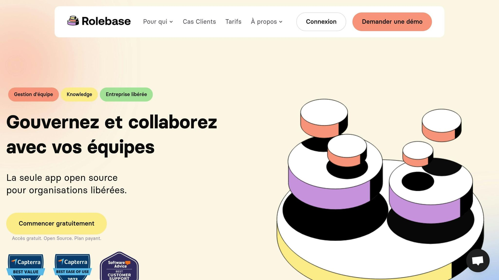

Dans une organisation horizontale, la [définition des rôles](https://www.rolebase.io/plateforme/roles) est essentielle pour éviter la confusion et améliorer la collaboration. Voici les points clés à retenir :

- **Clarté des rôles**: Chaque rôle doit avoir un nom clair, un objectif précis, un champ d'action défini et des responsabilités bien établies.

- **Fixer des limites**: Définir les niveaux d'autorité, les protocoles de communication et les horaires pour équilibrer autonomie et responsabilité.

- **Flexibilité et révision**: Ajuster les rôles régulièrement en fonction des besoins de l'équipe et des projets.

- **Outils utiles**: Utilisez des méthodes comme la matrice[RACI](https://en.wikipedia.org/wiki/Responsibility_assignment_matrix)pour clarifier les responsabilités et des outils comme[Rolebase](https://rolebase.io/)pour visualiser les rôles.

- **Prise de décision partagée**: Adoptez des processus collaboratifs pour impliquer les équipes tout en désignant un décideur unique si nécessaire.

### Avantages :

- [Moins de réunions inutiles](https://www.rolebase.io/plateforme/optimisation-des-temps-de-reunions), décisions plus rapides.

- Meilleure collaboration, réduction des conflits internes.

- Équipes plus autonomes et efficaces.

### Exemple concret :

[Spotify](https://newsroom.spotify.com/company-info/) a ajusté les rôles de son équipe marketing en 2023, réduisant le taux de rebond de 12,3 % à 2,1 % en 60 jours, générant 2,3 millions de dollars.

**En résumé :** Une organisation horizontale réussit grâce à des rôles bien définis, une communication claire et une capacité d'adaptation continue.

## Principes Fondamentaux pour la Définition des Rôles

### Aligner les Rôles avec les Objectifs de l'Entreprise

Assurez-vous que les rôles correspondent aux objectifs et aux valeurs de l'entreprise. Chaque rôle doit inclure un **nom clair**, un **objectif précis**, un **champ d'action défini** et des **responsabilités bien établies**. La matrice RACI est un excellent outil pour organiser ces responsabilités et simplifier la prise de décision en équipe. Cela permet de créer un cadre structuré pour attribuer à la fois autonomie et clarté aux rôles.

### Établir les Limites de l'Autonomie

Fixer des limites précises est essentiel pour équilibrer la liberté individuelle et la responsabilité collective. Voici quelques aspects clés à considérer :

| Aspect | Description | Avantage |
| --- | --- | --- |
| Temps de travail | Définir des horaires spécifiques (ex. : mode « ne pas déranger ») | Réduction du surmenage |
| Prise de décision | Préciser les niveaux d'autorité pour chaque rôle | Amélioration de l'efficacité |
| Communication | Instaurer des protocoles de communication clairs | Meilleure collaboration |

Ces limites aident également à protéger les individus contre l'épuisement professionnel.

### Ajuster les Rôles pour Plus de Flexibilité

En mars 2023, l'équipe marketing de Spotify a réorganisé ses rôles pour intégrer une API de vérification d'e-mails. Résultat ? Une réduction du taux de rebond de 12,3 % à 2,1 % en seulement 60 jours, générant 2,3 millions de dollars. Ce type de révision montre comment des ajustements ciblés peuvent équilibrer stabilité et flexibilité.

Pour conserver cette flexibilité :

- Planifiez des**révisions régulières**des rôles.

- Encouragez les collaborateurs à**prendre des initiatives**.

- **Communiquez clairement**les changements apportés aux rôles.

## L'organisation horizontale

<Youtube videoId="UtB2dN9iPGQ" />

## Étapes pour Cartographier et Attribuer les Rôles

Une fois les rôles clairement définis, ces étapes pratiques permettent de les attribuer avec précision et efficacité au sein de l'organisation.

### Analyser les Schémas de Travail

Commencez par examiner les schémas de travail pour mieux comprendre les rôles. La matrice RACI peut aider à clarifier les responsabilités.

Voici quelques éléments clés à analyser :

| Aspect à Analyser | Objectif | Méthode d'Évaluation |
| --- | --- | --- |
| Flux d'information | Identifier les goulots d'étranglement | Cartographie des processus |
| Points de décision | Clarifier les responsabilités | Analyse des décisions |
| Interactions d'équipe | Repérer les zones de collaboration | Observation directe |

Ces analyses permettent de poser les bases pour l'étape suivante : associer les compétences aux rôles.

### Associer les Compétences aux Rôles

Un outil comme le "Nuage de Compétences" peut faciliter cette étape en mettant en avant les compétences spécifiques nécessaires pour chaque rôle.

> "Plus votre titre de poste est spécifique, plus votre crédibilité dans les domaines qui n'en font pas partie s'effritera." - Leif Abraham

Pour réussir cette association, pensez à :

- Construire un**inventaire dynamique**des compétences disponibles dans l'équipe.

- Encourager le**développement transversal**pour élargir les capacités des collaborateurs.

- Aligner les**projets**avec les**intérêts personnels**des membres pour une meilleure implication.

Une fois les compétences identifiées, des outils spécialisés peuvent aider à organiser et visualiser ces attributions.

### Utiliser [Rolebase](https://rolebase.io/) pour la Gestion des Rôles

L'exemple de [Loyco](https://www.loyco.ch/en/) montre les avantages d'une cartographie organisationnelle bien structurée. Leur équipe, comprenant plus de 100 personnes, a rapidement adopté un nouveau système, ce qui a simplifié l'intégration des nouveaux employés.

> "C'est un outil convivial qui nous a aidés à rendre notre modèle organisationnel tangible. Nos collaborateurs se sont habitués en quelques jours seulement, et les nouveaux employés disent qu'ils sont immédiatement orientés, comparé à ce qui leur prenait des années dans leurs organisations précédentes !" - Christophe Barman, Loyco

Pour tirer le meilleur parti de Rolebase :

- Utilisez des**[organigrammes interactifs](https://www.rolebase.io/plateforme/organigramme)**pour voir la structure en un coup d'œil.

- Appuyez-vous sur les outils de**suivi des tâches**pour clarifier les responsabilités.

- Exploitez les fonctionnalités de**collaboration en temps réel**pour garder l'équipe alignée.

###### sbb-itb-77d9745

## Méthodes pour Définir les Tâches et les Décisions

Ces approches complètent les stratégies précédentes en précisant les tâches et les décisions dans une organisation horizontale.

### Rédiger les Descriptions de Rôles en Équipe

Rédiger des descriptions de rôles en équipe permet d'assurer clarté et engagement.

| Aspect | Description | Objectif |
| --- | --- | --- |
| Autorité | Fixer l'autorité | Clarifier l'autonomie |
| Collaboration | Définir la collaboration | Assurer la coordination |
| Responsabilités | Détailler les tâches | Établir les attentes |

> "Holacracy incites us to *think* differently about how authority and accountability flow between roles." – Olivier Compagne, HolacracyOne

Pour rédiger des descriptions efficaces :

- Utilisez des termes précis comme*accompagner*,*assister*ou*conseiller*.

- Clarifiez les modes de collaboration.

- Définissez des domaines d'action bien délimités.

Ces descriptions servent de base pour structurer des équipes autonomes.

### Créer des Équipes Auto-gérées

L'exemple de [Buurtzorg](https://www.buurtzorg.com/), une organisation néerlandaise dans le secteur de la santé, illustre bien le succès des équipes auto-gérées. Ce modèle repose sur des équipes autonomes d'infirmiers qui gèrent tous les aspects des soins.

Pour mettre en place une équipe auto-gérée :

1. **Élaborer un manuel d'équipe**

  Ce document décrit les processus, les modes de prise de décision et les protocoles de résolution.

2. **[Répartir les responsabilités](https://www.rolebase.io/plateforme/responsabilites-des-equipes)**

  Identifiez les activités nécessaires et regroupez-les en rôles alignés avec les compétences et motivations.

3. **Établir un rythme de travail**

  Fixez une cadence pour :

- Les[réunions d'équipe](https://www.rolebase.io/plateforme/reunions-dequipe)

- Les sessions de feedback

- Les révisions d'objectifs

### Prendre des Décisions en Équipe

Une fois les rôles définis et les équipes structurées, il est crucial de clarifier le processus décisionnel. Une approche « république », où les membres contribuent mais un représentant prend la décision finale, peut être particulièrement efficace.

Pour améliorer ce processus :

- Attribuez un décideur unique pour chaque décision.

- Impliquez les personnes directement concernées par le problème.

- Fixez des délais clairs pour chaque décision.

Pour les décisions complexes, commencez par des choix moins critiques. Cela aide à développer de bonnes pratiques, renforce la confiance au sein de l'équipe et affine progressivement le processus.

## Maintenir l'Efficacité des Rôles

### Systèmes de Feedback en Équipe

La méthode « Triple A » (Appréciation, Amplification, Ajustement) s'avère utile pour garantir que les rôles restent pertinents.

Voici comment structurer un système de feedback efficace :

| Phase | Objectif | Actions Clés |
| --- | --- | --- |
| Préparation | Définir le cadre | Établir des critères d'évaluation |
| Formation | Développer les compétences | Former à donner un feedback constructif |
| Suivi | Assurer la progression | Organiser des points réguliers |

> « Un rôle n'appartient pas à une personne mais plutôt à l'équipe, à la division ou à l'organisation. Vous ne possédez pas un rôle, vous en prenez soin pendant un temps. Quelqu'un s'en occupait avant vous, et quelqu'un s'en occupera après vous. » - Samantha Slade

Ces mécanismes de feedback permettent d'adapter les rôles à l'évolution des besoins.

### Évolution des Rôles et Apprentissage

Les entreprises performantes investissent dans le développement continu des compétences techniques, sociales et émotionnelles.

Pour favoriser cette évolution :

- Planifiez des mini-points de contrôle mensuels pour évaluer les rôles attribués.

- Mettez en place un système de binôme pour faciliter la transmission des responsabilités.

- Documentez les apprentissages et les méthodes efficaces.

Les managers jouent un rôle clé dans ce processus et doivent maîtriser des compétences comme la communication, l'organisation et la résolution de problèmes. Ces efforts permettent non seulement d'accompagner les changements mais aussi de résoudre rapidement les éventuels blocages.

### Résolution des Problèmes de Rôles

Gérer les conflits liés aux rôles nécessite une approche collaborative et transparente. Les équipes doivent être équipées pour identifier et résoudre les problèmes efficacement.

Pour y parvenir :

1. **Identification précoce**

  Surveillez les tensions grâce à des indicateurs d'alerte. Des outils comme Rolebase peuvent aider à suivre l'évolution des rôles et à repérer les chevauchements.

2. **Résolution collaborative**

  Encouragez une culture où les employés se considèrent comme partenaires. Pratiquez l'écoute active et cherchez des solutions qui profitent à tous.

3. **Ajustement continu**

  Intégrez des évaluations régulières pour aligner les rôles sur les besoins changeants. Renforcer les équipes après un changement augmente les chances de succès des projets.

En intégrant ces pratiques, les organisations peuvent non seulement résoudre les conflits mais aussi conserver des rôles adaptés à leurs objectifs.

## Conclusion : Construire des Rôles d'Équipe Clairs

### Points Clés à Retenir

Définir des rôles précis dans une organisation horizontale demande une approche structurée et collaborative. Voici les éléments principaux :

| Aspect | Objectif | Mise en œuvre |
| --- | --- | --- |
| **Communication** | Assurer la transparence | Réunions régulières et outils collaboratifs numériques |
| **Responsabilités** | Clarifier les attentes | Répartition basée sur les compétences et la motivation |
| **Prise de décision** | Favoriser l'autonomie | Processus décisionnels partagés |
| **Développement** | Encourager la progression | Formations continues et retours constructifs |

Ces piliers, déjà abordés, posent les bases pour ajuster régulièrement les rôles et les responsabilités.

### Importance des Ajustements Continus

Pour garantir l'efficacité des rôles, une révision régulière est indispensable. Les organisations horizontales qui réussissent mettent l'accent sur :

- Une analyse fréquente des responsabilités pour s'assurer qu'elles restent adaptées aux besoins.

- Une révision des rôles en fonction des changements dans les projets ou les priorités.

- L'acquisition de nouvelles compétences pour accompagner le développement professionnel.

La clé réside dans une approche souple et évolutive. Les équipes doivent être encouragées à exprimer leurs besoins et à suggérer des ajustements quand nécessaire. Cela permet non seulement d'améliorer les performances collectives, mais aussi de cultiver un environnement de travail stimulant et enrichissant.

Rolebase, par exemple, illustre cette capacité à allier agilité et structure. Ces ajustements constants incarnent l'esprit d'évolution et d'autonomie qui caractérise les organisations horizontales.
