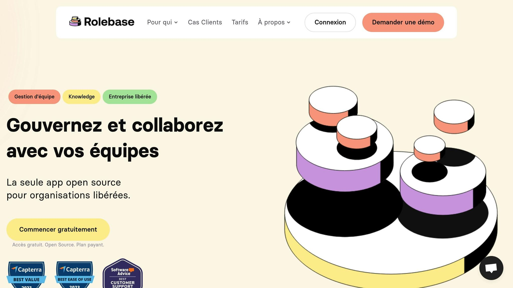

**Les réunions de gouvernance sont essentielles pour améliorer la prise de décision, renforcer la transparence et optimiser la collaboration dans les organisations, en particulier celles adoptant une structure horizontale.** Voici les points clés à retenir :

- **Objectifs des réunions de gouvernance :**
   - Ajuster les [rôles et responsabilités](https://www.rolebase.io/plateforme/roles) pour une meilleure performance.
   - Favoriser des décisions collectives et précises.
   - Réduire les conflits grâce à des échanges réguliers et ouverts.
- **Structure recommandée d'une réunion :**
   - **Révision de l'ordre du jour** (5-10 min) : Ajustements et validation.
   - **Points stratégiques** (45-60 min) : Décisions majeures.
   - **Points opérationnels** (30-45 min) : Suivi des actions.
   - **Bilan** (15 min) : Synthèse et prochaines étapes.
- **Rôles et outils essentiels :**
   - Animateur : Guide les discussions et facilite les décisions.
   - Secrétaire : Documente les décisions et assure le suivi.
   - Outils numériques comme [Rolebase](https://rolebase.io/) : Simplifient la [gestion des réunions](https://www.rolebase.io/plateforme/optimisation-des-temps-de-reunions) et garantissent la [conformité RGPD](https://www.rolebase.io/privacy).
- **Exigences spécifiques en France :**
   - Respect des horaires (9h-17h, hors pause déjeuner).
   - Planification à l'avance et documentation bilingue si nécessaire.
   - Respect des obligations légales, comme les entretiens professionnels.

Les réunions de gouvernance, bien structurées et adaptées au contexte français, permettent aux organisations de mieux collaborer et de s'aligner sur leurs objectifs stratégiques.

## La Constitution [Holacracy](https://en.wikipedia.org/wiki/Holacracy) version 5.0 - Bernard Marie Chiquet

<Youtube videoId="6jL9uVwkwAo" />

## Construire un Ordre du Jour Efficace

Dans une [gouvernance horizontale](https://www.rolebase.io/blog/introduction-a-lholacratie-repenser-la-gouvernance-organisationnelle), un ordre du jour bien structuré est essentiel pour garantir des réunions productives et alignées sur les objectifs de l'organisation.

### Méthodes d'Organisation de l'Ordre du Jour

Un ordre du jour clair et organisé améliore considérablement l'[efficacité des réunions](https://www.rolebase.io/plateforme/reunions). Les sujets doivent être classés selon leur priorité et leur complexité, ce qui permet d'optimiser le temps et les décisions prises.

| Phase de la Réunion | Durée Recommandée | Objectif |
| --- | --- | --- |
| Révision de l'ordre du jour | 5-10 minutes | Ajustements et validation collective |
| Points stratégiques | 45-60 minutes | Décisions majeures et orientations clés |
| Points opérationnels | 30-45 minutes | Suivi des actions et questions pratiques |
| Bilan et prochaines étapes | 15 minutes | Synthèse et planification des actions |

Cette structure garantit une gestion rigoureuse des sujets abordés, en maximisant la productivité et en évitant les digressions inutiles. Voyons maintenant comment sélectionner et hiérarchiser les points à traiter.

### Sélection et Hiérarchisation des Sujets

Pour chaque point à l'ordre du jour, il est recommandé de le formuler sous forme de question ciblée, orientée vers une réponse précise. Cela aide à clarifier les attentes et à structurer les discussions. Chaque sujet doit inclure :

- **L'objectif visé**: informer, consulter, ou décider.

- **Le temps alloué**: pour éviter les débordements.

- **Le responsable**: la personne en charge de la présentation.

- **Les documents préparatoires**: à distribuer à l'avance pour maximiser l'efficacité.

Cette approche garantit que chaque sujet est traité avec la préparation et l'attention nécessaires.

### Standards des Réunions d'Affaires en France

En France, les réunions professionnelles suivent des normes bien définies, influencées par des considérations horaires et pratiques. Les créneaux habituels pour les réunions se situent entre 9h00 et 17h00, en évitant la pause déjeuner (12h00-14h00).

Quelques [bonnes pratiques pour organiser des réunions](https://en.rolebase.io/plateforme/optimisation-des-temps-de-reunions) efficaces :

- Planifier les réunions au moins deux semaines à l’avance.

- Éviter les périodes peu propices, comme le mois d’août ou les jours autour des fériés.

- Préparer les documents en français et en anglais si des participants non francophones sont attendus.

En dépit d’une certaine horizontalité dans les échanges, la prise de décision en France reste souvent centralisée. Ces pratiques s'intègrent parfaitement dans un cadre de management où la clarté et l'efficacité sont au cœur des priorités.

## Les Rôles et Tâches en Réunion

Une organisation claire des rôles est essentielle pour garantir des réunions productives et transparentes, des principes clés dans toute démarche de management horizontal. Ces rôles contribuent à structurer les échanges et à maximiser l'efficacité de chaque rencontre.

### Directives pour l'Animation

L'animateur occupe une place centrale dans le bon déroulement de la réunion. Il est chargé de guider les discussions, de maintenir les participants concentrés et de faciliter les prises de décision. Voici ses principales responsabilités :

| Responsabilité | Description | Objectif |
| --- | --- | --- |
| **Cadrage initial** | Présenter les objectifs et les règles de base | Poser un cadre clair dès le début |
| **Gestion des échanges** | Encadrer les discussions pour éviter les dérives | Garder les échanges productifs |
| **Facilitation** | Encourager la participation de tous | Assurer une implication collective |
| **Synthèse** | Reformuler les décisions et points essentiels | Garantir une compréhension partagée |

### Exigences de Documentation

En France, la [documentation des réunions](https://www.rolebase.io/plateforme/comptes-rendus-de-reunions) revêt une importance particulière, notamment pour des raisons juridiques. Le rôle du secrétaire de séance est ici clé : il rédige des procès-verbaux précis, consigne les décisions prises, suit les actions à mener et diffuse rapidement les comptes-rendus. Ces pratiques renforcent la transparence et permettent un suivi efficace des engagements pris.

### Protocoles de Gestion du Temps

Une gestion rigoureuse du temps est tout aussi cruciale pour tirer le meilleur parti des réunions. Par exemple, réunir 10 ingénieurs pendant une heure représente un coût d’environ 399,19 €. Cela souligne l’importance d’évaluer la pertinence et la valeur ajoutée de chaque réunion.

Pour optimiser le temps consacré aux rencontres :

- Respecter scrupuleusement l'horaire et le temps alloué à chaque point de l'ordre du jour.

- Appliquer une méthode stricte pour répartir le temps, afin d’éviter que des sujets secondaires ne monopolisent la discussion.

Enfin, l’utilisation d’outils numériques adaptés peut grandement simplifier ces tâches. Ces outils assurent également une traçabilité efficace des échanges et des décisions prises, contribuant ainsi à une organisation plus fluide et performante.

## Outils Numériques pour la Gestion des Réunions

La [digitalisation des réunions](https://www.rolebase.io/plateforme/capture-du-knowledge) de gouvernance s’appuie sur des outils spécifiques, conçus pour répondre aux normes et attentes du marché français.

### Les Outils [Rolebase](https://rolebase.io/) pour les Réunions

Rolebase propose une gamme d’outils pensée pour optimiser la gestion des réunions de gouvernance. Voici un aperçu des fonctionnalités principales :

| Fonctionnalité | Note | Avantage principal |
| --- | --- | --- |
| Gestion des Réunions | 5,0/5 | Organisation claire et structurée |
| Notes Collaboratives | 5,0/5 | Documentation en temps réel |
| Synchronisation Agenda | 4,9/5 | Coordination fluide et efficace |
| Gestion des Ordres du Jour | 4,9/5 | Préparation simplifiée et complète |

Cette solution s’intègre harmonieusement aux outils et exigences du marché français, tout en garantissant une expérience utilisateur fluide.

> "J'utilise quotidiennement Rolebase au sein de mon organisation ! Rolebase me permet de rapidement animer des réunions hebdomadaires de mon cercle métier en respectant une structure mais aussi pouvoir retrouver rapidement les actions et discussions relatives à l'activité de mon cercle." - Valentin R., Product Manager

### Compatibilité avec les Systèmes Français

Rolebase a été conçu pour s’adapter parfaitement aux besoins des organisations en France. Ses caractéristiques incluent :

- Un support complet de la langue française, pour une utilisation intuitive.

- Une intégration directe avec des outils collaboratifs populaires comme Slack,[Microsoft Teams](https://www.microsoft.com/en-us/microsoft-teams/group-chat-software)et Google Meet.

- La[génération automatique de comptes-rendus](https://www.rolebase.io/blog/comment-faire-des-comptes-rendus-de-reunions-gagner-du-temps-nourrir-la-documentation-interne)conformes aux normes françaises.

> "Facile à prendre en main, aide à bien rester focus, facilite l'organisation des réunions." - Guillaume V., Lead développeur

### Normes de Protection des Données

La sécurité des données est un élément clé pour toute solution numérique. Rolebase met un point d’honneur à respecter les réglementations françaises en matière de protection des données :

1. **Sécurité des Données**

La plateforme est conforme au RGPD et à la Loi Informatique et Libertés, garantissant une protection stricte des informations personnelles.

2. **Contrôle d’Accès**

Grâce à un système de [gestion des rôles](https://www.rolebase.io/blog/introduction-au-role-based-management-votre-solution-contre-les-silos) (RBAC), les droits d’accès sont précisément définis pour chaque utilisateur, assurant la confidentialité des données sensibles.

3. **Traçabilité**

Toutes les actions effectuées sur la plateforme sont enregistrées, offrant un suivi détaillé et conforme aux exigences légales françaises.

## Mise en Place des Réunions de Gouvernance

Adoptez une méthode claire et structurée, en tenant compte des spécificités françaises, pour organiser des réunions de gouvernance efficaces.

### Étapes de Mise en Œuvre

- **Préparation initiale**

  Commencez par définir un cadre précis, former les équipes concernées et initier des réunions mensuelles. La fréquence pourra ensuite être ajustée selon les besoins identifiés.

- **Formation des participants**
  Assurez-vous que chaque membre comprenne :
   - Les bases de la gouvernance partagée,
   - Les techniques pour animer des réunions efficacement,
   - L'utilisation des outils numériques adaptés.
- **Système de rotation des rôles**

  Alternez les rôles, notamment celui de facilitateur, pour encourager une participation active et renforcer les compétences collectives.

Ces étapes permettent de poser des bases solides et d’anticiper les éventuels défis liés au changement.

### Gestion du Changement

La transition vers une nouvelle gouvernance exige une attention particulière à l’aspect humain. Voici un aperçu des actions clés :

| Phase | Actions Concrètes | Objectifs |
| --- | --- | --- |
| **Communication** | Organiser des réunions d'information régulières | Clarifier les avantages et répondre aux préoccupations. |
| **Formation** | Proposer des ateliers pratiques | Développer les compétences nécessaires. |
| **Accompagnement** | Offrir un suivi personnalisé | Faciliter l'adaptation des équipes. |

> "Une entreprise est une équipe. Nous devons travailler ensemble vers un objectif commun. Le temps consacré à aligner les perspectives de chacun est un investissement, pas une perte de temps. Il est important que chacun puisse se faire entendre et comprendre la décision finale." - Gilles de Richemond, PDG Fairlyne

### Exigences Légales Françaises

En parallèle de la [gestion du changement](https://www.rolebase.io/blog/la-conduite-du-changement--comment-inviter-aux-changements-), il est crucial de respecter les obligations légales en vigueur en France :

- **Entretiens obligatoires**

  Tous les salariés doivent bénéficier d’entretiens professionnels tous les deux ans, distincts des réunions de gouvernance.

- **Documentation obligatoire**

  Dans les entreprises de 50 salariés ou plus, le non-respect de ces obligations peut engendrer une pénalité pouvant atteindre 3 000 € par salarié.

- **Cas spécifiques**

  Les salariés en forfait jours nécessitent un entretien annuel pour évaluer leur charge de travail.

> "Le but est d'avoir des décisions de projet partagées, inclusives et prises rapidement !" - Olivier Bas

###### sbb-itb-77d9745

## Conclusion : Pour des Réunions de Gouvernance Efficaces

Après avoir examiné différents aspects de la gouvernance, voici quelques points clés pour transformer vos réunions en véritables moteurs de performance.

### Points Clés

Une gouvernance réussie repose sur une structure bien définie et une méthodologie rigoureuse. Comme le souligne [PwC](https://www.pwc.com/gx/en/services.html), la gouvernance d’entreprise est avant tout une question de performance. Cela met en lumière l’importance de disposer d’un cadre solide pour garantir :

| Aspect | Avantages |
| --- | --- |
| **Transparence** | Une communication claire qui renforce la confiance entre les parties prenantes |
| **Prise de décision** | Des processus plus rapides et mieux structurés |
| **Conformité** | Le respect des obligations légales en France |
| **Performance** | Une meilleure productivité grâce à l’optimisation des processus |

Pour aller plus loin, il est essentiel de mettre en place des actions concrètes.

### Mise en Pratique

Voici quelques étapes pour intégrer ces principes dans votre organisation :

- Définissez un cadre précis qui tienne compte des spécificités françaises, comme la formalité des échanges, le respect des périodes de congés, et une documentation détaillée.

- Mettez en place une démarche d’amélioration continue en utilisant des indicateurs de performance (KPI) adaptés à vos objectifs.

> « Un cadre de gouvernance, également appelé structure de gouvernance, est essentiel pour la gouvernance moderne et les opérations juridiques »

En combinant structure rigoureuse et souplesse, vos réunions de gouvernance peuvent devenir un outil puissant pour accompagner l’évolution cohérente et efficace de votre organisation.

## FAQs

### Comment les réunions de gouvernance favorisent-elles la transparence et une meilleure prise de décision dans une organisation ?

## L'importance des réunions de gouvernance

Les réunions de gouvernance jouent un rôle essentiel pour garantir une communication claire et structurée au sein d'une organisation. Elles offrent un cadre où chaque membre de l'équipe peut s'exprimer et contribuer activement, créant ainsi un climat de confiance et un engagement collectif renforcé.

Un des points forts de ces réunions est la documentation précise des décisions prises et des raisons qui les motivent. Cela permet non seulement une meilleure compréhension des orientations stratégiques, mais aussi une plus grande responsabilisation des participants. En intégrant des points de vue variés, ces échanges enrichissent les discussions et mènent à des choix plus réfléchis et équilibrés.

Enfin, une structure bien définie lors de ces rencontres aide à clarifier les rôles et responsabilités de chacun. En réduisant les zones d'ombre, cela améliore l'efficacité globale de l'organisation et facilite la coordination des efforts.

### Quels outils numériques sont les plus efficaces pour optimiser les réunions de gouvernance dans un contexte français ?

## Optimiser vos réunions de gouvernance avec des outils adaptés

Pour rendre vos réunions de gouvernance plus efficaces et mieux adaptées au contexte français, voici quelques outils numériques qui peuvent faire la différence :

- **[Sherpany](https://www.sherpany.com/en/)**: Parfait pour organiser et suivre les réunions des conseils d’administration et des comités. Cet outil offre une gestion structurée et efficace, idéale pour les environnements exigeants.

- **[Beeboard](https://beenote.io/board-of-directors-management-software/)**: Une solution simple et sécurisée, pensée pour les équipes recherchant une gestion collaborative et fluide de leurs réunions.

- **Microsoft Teams**: Grâce à des politiques de gouvernance bien définies, cet outil assure une gestion sécurisée des accès et des échanges, tout en facilitant la collaboration.

Ces plateformes permettent non seulement de centraliser les informations clés, mais aussi de respecter les normes locales tout en favorisant des décisions éclairées et une meilleure collaboration.

### Comment structurer efficacement l'ordre du jour d'une réunion de gouvernance ?

## Comment structurer un ordre du jour efficace ?

Pour élaborer un ordre du jour qui fonctionne vraiment, commencez par définir des **objectifs précis**. Ces objectifs doivent guider les discussions et orienter les décisions de manière claire et ciblée. Chaque point inscrit à l'ordre du jour doit servir directement ces objectifs. Pas de place pour les sujets hors propos !

Ensuite, organisez les thèmes dans un ordre logique. Par exemple, commencez par l'ouverture de la réunion, suivez avec l'approbation des comptes rendus précédents, puis passez aux points stratégiques ou prioritaires. N'oubliez pas d'attribuer un temps bien défini à chaque sujet. Cela évitera de s'éterniser sur certains points et garantira que tout soit abordé.

Enfin, envoyez l'ordre du jour à l'avance. En le partageant suffisamment tôt, vous donnez à chacun le temps de se préparer, ce qui rend les discussions plus fluides et les décisions plus rapides lors de la réunion. Une bonne préparation, c'est la clé d'une réunion réussie !
