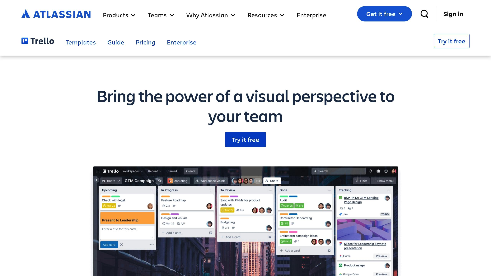
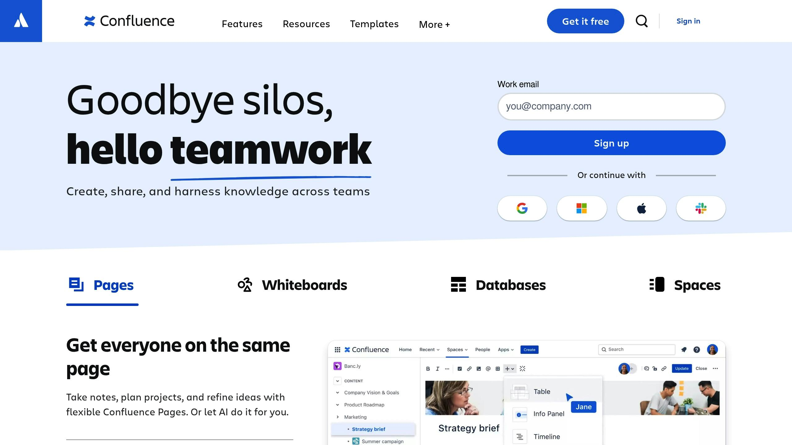

Les équipes horizontales sont de plus en plus populaires pour encourager la collaboration et l'autonomie. Mais sans hiérarchie traditionnelle, elles nécessitent des outils spécifiques pour fonctionner efficacement. Voici les 7 meilleurs outils pour améliorer la communication, la coordination et la prise de décision dans ces équipes :

1. **[Rolebase](https://rolebase.io/)**: Une plateforme open-source pour organiser les rôles, planifier des réunions et clarifier les responsabilités.

2. **[Trello](https://www.atlassian.com/software/trello)**: Un tableau visuel pour gérer les projets grâce à une interface kanban intuitive.

3. **[Miro](https://miro.com/)**: Un tableau blanc en ligne pour brainstormer et collaborer visuellement.

4. **[Slack](https://slack.com/)**: Une messagerie instantanée pour fluidifier les échanges et structurer les discussions.

5. **[Confluence](https://www.atlassian.com/software/confluence)**: Un espace centralisé pour documenter les connaissances et simplifier leur partage.

6. **[Google Workspace](https://workspace.google.com/)**: Une suite collaborative pour travailler simultanément sur des documents, feuilles et présentations.

7. **[Clockify](https://clockify.me/)**: Un outil de suivi du temps pour assurer la transparence et l'organisation.

### Comparatif rapide des outils

| Outil | Fonction principale | Points forts | Tarif de base |
| --- | --- | --- | --- |
| **Rolebase** | Organisation des rôles | Open-source, gratuit | Gratuit ou premium |
| **Trello** | Gestion de projets | Interface visuelle simple | Gratuit, dès 5 €/mois |
| **Miro** | Collaboration visuelle | Idéal pour brainstorming | Gratuit, dès 8 €/mois |
| **Slack** | Communication instantanée | Intégrations multiples | Gratuit, dès 7,25 €/mois |
| **Confluence** | Documentation partagée | Centralisation des infos | Gratuit, dès 5,75 €/mois |
| **Google Workspace** | Collaboration documentaire | Travail en temps réel | Dès 6 €/mois |
| **Clockify** | Suivi du temps | Version gratuite complète | Gratuit, dès 3,99 €/mois |

Ces outils sont essentiels pour optimiser la gestion des équipes horizontales et renforcer leur efficacité.

## Le management collaboratif, avec une organisation horizontale

<Youtube videoId="V2cuOD2h_Oc" />

## 1. [Rolebase](https://rolebase.io/) : Plateforme Open-Source pour l'Organisation des Équipes

Rolebase est une plateforme open-source qui aide les organisations à adopter un mode de gestion horizontal. Elle regroupe les outils nécessaires pour une collaboration fluide au sein d'équipes sans hiérarchie traditionnelle. Voici trois fonctionnalités clés qui illustrent son approche.

- **Organigrammes circulaires dynamiques**

  Les équipes peuvent visualiser leur structure grâce à des organigrammes circulaires, facilitant une compréhension rapide des rôles et responsabilités.

- **Gestion des rôles et responsabilités**

  Chaque membre bénéficie d'une fiche détaillée décrivant ses missions, ce qui améliore l'autonomie et garantit une répartition claire des tâches.

- **Amélioration des réunions**

  La plateforme simplifie la planification des réunions, le suivi des décisions et le partage des comptes rendus.

Des utilisateurs tels que Maxime M. et Dylann C. ont mis en avant l'utilité de Rolebase pour clarifier les compétences, centraliser les décisions et améliorer la gouvernance collaborative.

Les avis sur GetApp confirment la qualité de la plateforme avec les notes suivantes :

| Critère | Note |
| --- | --- |
| Facilité d'utilisation | 4,9/5 |
| Fonctionnalités | 4,9/5 |
| Rapport qualité-prix | 5,0/5 |
| Support client | 5,0/5 |

Rolebase propose trois options :

- Une version gratuite avec les outils de base

- Une formule avec accompagnement pour bien démarrer

- Une offre premium incluant du coaching personnalisé

## 2. [Trello](https://www.atlassian.com/software/trello) : Tableau de Gestion Visuelle des Projets

Trello, utilisé par plus de deux millions d'équipes, propose une interface kanban intuitive pour gérer les projets collaboratifs. Grâce à ses tableaux, automatisations et intégrations, il facilite le partage d'informations et la coordination des équipes travaillant de manière horizontale.

**Une Interface Visuelle Intuitive**

Les colonnes représentent les étapes du projet, et les cartes peuvent être déplacées par glisser-déposer. Cette méthode simple et visuelle permet à chaque membre de l'équipe de comprendre rapidement l'état d'avancement des projets.

**Des Outils Pensés pour les Équipes**

| Fonctionnalité | Avantage principal |
| --- | --- |
| Vue Tableau de Bord | Répartition équilibrée des tâches |
| Automatisations | Suppression des tâches répétitives, alertes automatiques |
| Vues multiples | Options comme Timeline, Calendrier ou Table |
| Intégrations | Compatibilité avec Slack, Google Drive, Confluence |

Ces outils permettent des résultats concrets : 74 % des utilisateurs notent une meilleure communication au sein de leur équipe, et 75 % des organisations voient des effets positifs dès le premier mois.

**Retours d'Utilisateurs**

> "Que les collaborateurs soient au bureau, en télétravail ou chez un client, chacun peut partager le contexte et les informations via Trello."
> 
> 
> 
> - Sumeet Moghe, Chef de Produit chez ThoughtWorks

Jefferson Scomacao, Directeur du Développement chez IKEA/PTC, partage son expérience :

> "Nous avons utilisé Trello pour clarifier les étapes, les exigences et les procédures. Cela a été très utile pour communiquer avec des équipes ayant des différences culturelles et linguistiques importantes."

Avec ces témoignages et ses fonctionnalités, Trello propose des options tarifaires pour répondre à différents besoins :

**Options de Tarification**

- **Gratuit**: jusqu'à 10 collaborateurs par espace de travail

- **Standard**: 5 € par utilisateur/mois (facturation annuelle)

- **Premium**: 10 € par utilisateur/mois (facturation annuelle)

- **Enterprise**: 17,50 € par utilisateur/mois (facturation annuelle)

## 3. [Miro](https://miro.com/) : Tableau Blanc Collaboratif en Ligne

Après Trello, voici un outil conçu pour stimuler la créativité et améliorer l'échange visuel au sein des équipes.

Miro est une plateforme de collaboration visuelle utilisée par plus de **90 millions d'utilisateurs** et **250 000 organisations** dans le monde entier. Elle propose un espace de travail sans limites, parfait pour encourager l'échange d'idées et la collaboration dans des équipes où les hiérarchies sont moins marquées.

### **Un espace pour collaborer efficacement**

Miro offre une gamme d'outils visuels pour répondre à divers besoins collaboratifs :

| Fonctionnalité | Utilisation |
| --- | --- |
| Notes adhésives virtuelles | Pour brainstormer et organiser les idées |
| Diagrammes interactifs | Pour représenter des processus complexes |
| Modèles préconçus | Pour des ateliers de design thinking ou la planification |
| Outils de vote | Pour des décisions collectives rapides |
| Timer intégré | Pour gérer efficacement les sessions collaboratives |

### **Des décisions plus rapides**

Pour des équipes travaillant de manière horizontale, Miro permet de réduire les délais de décision. Par exemple, [PepsiCo](https://en.wikipedia.org/wiki/PepsiCo) a réussi à diminuer le temps nécessaire entre un brief et un lancement, passant de 3 ans à seulement 10 mois.

### **Des intégrations pratiques**

Miro se connecte à plus de **160 outils**, comme Google Workspace, Microsoft 365, Confluence et Jira. Ces intégrations permettent une synchronisation en temps réel, rendant le travail d'équipe encore plus fluide.

### **Un retour utilisateur concret**

> "We use Miro for whiteboarding during meetings, to visualize complex architectures and landscapes, and to collaborate. During meetings where some or all participants are working remotely, Miro provides the best replacement for a real whiteboard that I've found."
> 
> 
> 
> - Edward Rousseau, Senior Manager, Deloitte

### **Quelques astuces pour tirer le meilleur parti de Miro**

Voici quelques conseils pour bien utiliser Miro :

- Divisez le tableau en sections bien définies.

- Envoyez l'ordre du jour avant la réunion.

- Encouragez la participation via différents moyens (audio, chat, dessin).

- Sélectionnez des modèles adaptés aux objectifs de votre session.

Avec cette méthode, les équipes peuvent centraliser toutes les informations et mieux comprendre les choix réalisés. Une approche essentielle pour les organisations qui privilégient une structure horizontale.

###### sbb-itb-77d9745

## 4. [Slack](https://slack.com/) : Hub de Communication et de Chat d'Équipe

Découvrons Slack, une plateforme qui améliore la communication au sein des équipes.

### Une communication simplifiée

Les équipes utilisant Slack constatent une hausse de 47 % de leur productivité. Grâce à la messagerie instantanée, chaque collaborateur économise en moyenne **32 minutes par jour**. Cela permet de fluidifier les échanges et d'accélérer les prises de décision.

### Organisation des échanges

Slack propose une structure claire pour organiser les conversations :

| Type de canal | Utilisation recommandée |
| --- | --- |
| **Canaux publics** | Discussions d'équipe, annonces, projets |
| **Messages directs** | Conversations privées, sujets sensibles |
| **Canaux thématiques** | Sujets spécifiques, veille, discussions sociales |
| **Slack Connect** | Collaboration avec des partenaires externes |

Cette organisation encourage une communication transparente et efficace, essentielle pour les équipes sans hiérarchie stricte.

### Quelques chiffres clés

Slack prouve son efficacité face aux défis des organisations horizontales :

- **700 millions**de messages échangés chaque jour

- **87 %**des utilisateurs estiment que Slack améliore la collaboration

- **90 %**se sentent plus connectés à leurs collègues

### Intégrations et automatisation

Slack permet de connecter plus de **2 600 applications**, comme Google Drive ou Office 365. De plus, ses fonctionnalités d'intelligence artificielle font gagner **97 minutes par semaine** grâce à des outils comme les résumés automatiques, la recherche avancée et la prise de notes automatisée.

### Conseils pratiques

- **Organisez vos canaux**: Créez des espaces dédiés par projet ou équipe pour une meilleure transparence.

- **Gérez vos notifications**: Activez le mode "Ne pas déranger" pour rester concentré lors de tâches importantes.

### Impact sur la culture d'entreprise

Selon une étude TINYpulse, **80 % des employés** souhaitent mieux comprendre les processus décisionnels. Jay Vasquez, CIO de [Marriott International Hotels](https://en.wikipedia.org/wiki/Marriott_International), résume l'importance de Slack ainsi :

> "The central notification layer that powers up our teams."

## 5. [Confluence](https://www.atlassian.com/software/confluence) : Base de Connaissances Collaborative

### Une source unique d'information

Confluence est une solution idéale pour centraliser les connaissances d'équipe. Saviez-vous que seulement 4 % des entreprises documentent systématiquement leurs processus ?  Cette plateforme offre un espace centralisé où toutes les informations sont accessibles par défaut, simplifiant ainsi la collaboration.

### Une organisation claire et efficace

Avec Confluence, vous pouvez structurer vos connaissances en créant des espaces dédiés pour chaque équipe, département ou projet. Cette organisation facilite la recherche d'informations et évite les doublons.

### Un impact direct sur la productivité

Confluence joue un rôle clé dans l'optimisation du travail collaboratif. En effet, 96 % des utilisateurs apprécient ses nombreuses intégrations. Ces fonctionnalités permettent de gagner du temps et d'améliorer la coordination entre les équipes.

### Témoignage utilisateur

> "Confluence has given us a centralized place for all teams and departments to document, track, and collaborate within and across Nextiva." 
> 
> 
> 
> - Josh Costella, SR Solutions Specialist, Nextiva

### Astuces pour une utilisation optimale

Voici quelques conseils pour tirer le meilleur parti de Confluence :

- Configurez des espaces bien structurés et utilisez des étiquettes pour organiser vos contenus.

- Servez-vous de l'option 'Expand' pour rendre les pages plus légères tout en gardant les informations importantes accessibles.

### Intégrations pratiques

Confluence s'intègre parfaitement avec des outils comme Microsoft Teams. Par exemple, les équipes peuvent recevoir des notifications en temps réel sur les modifications de pages ou les nouveaux commentaires, améliorant ainsi la réactivité.

### Recommandation d'expert

> "Keep it simple, keep it beautiful! You may think that when it comes to your Confluence pages, the design is not a big deal. I'll reveal the secret: the design is a big deal. Give users a clean, easy-to-navigate view and they will embrace it right away." 
> 
> 
> 
> - Teodora V, Atlassian Community Leader

## 6. [Google Workspace](https://workspace.google.com/) : Suite de Collaboration Documentaire

### Une plateforme centralisée pour travailler ensemble

Google Workspace propose un espace de travail intégré qui simplifie la collaboration entre équipes. Grâce à des outils comme Google Docs, Sheets et Slides, jusqu'à 100 personnes peuvent travailler en même temps sur un même document.

### Outils collaboratifs pratiques

Avec Smart Canvas, la collaboration devient encore plus fluide grâce à des fonctionnalités comme :

- Mentions via @

- Listes de tâches intégrées

- Partage de fichiers directement dans le contexte

Ces outils permettent une meilleure coordination au sein des équipes tout en s'adaptant à des structures de travail horizontales.

### Contrôle des accès et sécurité renforcée

Google Workspace offre des options détaillées pour gérer les droits d'accès. Les utilisateurs peuvent définir qui peut éditer, commenter, télécharger ou simplement consulter un document. Ce niveau de contrôle garantit une collaboration sécurisée et efficace.

### Travail hybride et réunions en ligne

D'après une étude récente, 72 % des professionnels estiment que les réunions virtuelles favorisent une meilleure inclusion et participation. Cela met en lumière l'importance de bien planifier ces réunions pour en optimiser l'impact.

| Formule | Prix mensuel par utilisateur* | Stockage par utilisateur |
| --- | --- | --- |
| Business Starter | 6 € | 30 Go |
| Business Standard | 12 € | 2 To |
| Business Plus | 18 € | 5 To |
| Enterprise | Sur devis | Stockage mutualisé |
| *avec engagement annuel |  |  |

### Avis d'un expert

> "La communication écrite est essentielle pour nous, et nous utilisons intensivement Google Docs. Par exemple, nous créons des documents très structurés pour les réunions, ce qui permet à chacun de collaborer et d'ajouter des notes en temps réel." - Dave Stott, Directeur des Systèmes d'Information, OXA

### Connexions avec d'autres outils

Google Workspace s'intègre facilement à des solutions complémentaires. Par exemple, son association avec Happeo peut augmenter l'adoption de la suite de 13 %. Cela crée un environnement numérique complet, idéal pour des équipes collaboratives.

### Conseils pour une collaboration efficace

Pour maximiser les avantages de Google Workspace, privilégiez la collaboration asynchrone pour les tâches qui ne nécessitent pas de réponses immédiates. Utilisez également les agendas partagés dans Google Calendar pour aligner les attentes avant, pendant et après chaque réunion.

## 7. [Clockify](https://clockify.me/) : Suivi du Temps pour les Équipes

### Une solution claire pour suivre le temps

Clockify propose un outil complet pour suivre le temps de travail des équipes fonctionnant de manière horizontale. Avec un taux de satisfaction client de 95 % et une note moyenne de 4,8/5 basée sur plus de 9 000 avis, cet outil s'est imposé comme une référence pour une gestion efficace du temps en équipe.

### Outils pratiques pour les équipes horizontales

Le **Tableau de Bord d'Équipe** permet de voir en temps réel les activités de chaque membre. Cela favorise une transparence totale, encourageant ainsi la responsabilisation et l'auto-organisation, des facteurs clés dans ce type de structure.

| Fonctionnalité | Description |
| --- | --- |
| Chronométrage | Suivi en temps réel ou ajout manuel |
| Feuilles de temps | Vue hebdomadaire des heures travaillées |
| Rapports d'activité | Analyses détaillées par projet et utilisateur |
| Gestion des congés | Suivi des absences et validation des demandes |

### Une tarification abordable

Clockify offre une version gratuite généreuse, idéale pour démarrer, ainsi que des forfaits payants à partir de 3,99 € par utilisateur et par mois (paiement annuel). Cela permet aux équipes, petites ou grandes, d'accéder facilement à des outils professionnels.

### Intégrations multiples

La plateforme s'intègre avec plus de 80 applications web populaires, notamment :

- **Outils de gestion de projet**: Trello, Asana, Jira

- **Plateformes collaboratives**: Slack, Microsoft Teams

- **Suites bureautiques**: Google Workspace

### Témoignage utilisateur

> "Clockify a été un outil essentiel pour notre équipe dans le suivi quotidien du temps." - Camille Ang, Entrepreneur

### Astuces pour une utilisation optimale

Pour tirer le meilleur parti de Clockify, planifiez des points de contrôle hebdomadaires où chaque membre peut partager ses progrès. Cela aide à maintenir une bonne dynamique et renforce la collaboration au sein de l'équipe.

### Sécurité et gestion des accès

Clockify propose des options avancées pour contrôler les droits d'accès, telles que :

- Création de rôles personnalisés

- Mise en place de groupes de travail distincts

- Gestion des autorisations spécifiques à chaque projet

- Garantie de la précision des données suivies

Ces fonctionnalités permettent une utilisation sécurisée et adaptée aux besoins variés des organisations.

## Conclusion

Les outils adéquats jouent un rôle clé dans le succès des équipes horizontales. Avec la transformation numérique des organisations, il est crucial de disposer de solutions qui facilitent la collaboration et encouragent l'engagement collectif.

### Impact sur la Productivité

Les chiffres parlent d'eux-mêmes : les équipes utilisant Slack économisent en moyenne **97 minutes par semaine**, ce qui contribue à une amélioration de **47 % de leur performance**.

### Comment Choisir les Bons Outils ?

Pour sélectionner les outils les plus adaptés, trois critères principaux se distinguent :

| Critère | Importance | Impact |
| --- | --- | --- |
| **Communication** | Primordial | Réduction du temps consacré aux emails, représentant environ 28 % du temps de travail |
| **Collaboration** | Crucial | 87 % des utilisateurs constatent une meilleure collaboration |
| **Transparence** | Essentielle | Amélioration du partage d'informations et de la clarté organisationnelle |

Ces critères permettent également de structurer des pratiques d'implémentation efficaces.

### Conseils pour une Mise en Place Réussie

> "L'holacratie est un système d'aide à la responsabilisation et à la coopération, au service de la raison d'être de l'entreprise."  - Bernard-Marie Chiquet, fondateur d'iGi

Pour réussir une transition vers une gestion horizontale, encouragez l'autonomie et l'initiative au sein des équipes.

### Exemple Inspirant

Prenons Google : grâce à des outils comme Google Meet et Chat, l'entreprise a réussi à **accélérer la prise de décision** et à **renforcer la collaboration entre départements**.

### Une Vision pour l'Avenir

Un document centralisé peut devenir un atout stratégique. Il permet de suivre et d'ajuster régulièrement les processus pour garantir une amélioration continue. Cela assure à vos équipes de toujours évoluer dans la bonne direction.

## Vous pourriez aussi aimer

- [Guide Complet : Transition vers un Management Horizontal](https://www.rolebase.io/blog/guide-complet-transition-vers-un-management-horizontal/)
- [Comment Définir les Rôles dans une Organisation Horizontale](https://www.rolebase.io/blog/comment-definir-les-roles-dans-une-organisation-horizontale/)
- [Checklist : Mise en Place d'une Structure Horizontale](https://www.rolebase.io/blog/checklist-mise-en-place-dune-structure-horizontale/)
- [Leadership Horizontal vs Leadership Traditionnel](https://www.rolebase.io/blog/leadership-horizontal-vs-leadership-traditionnel/)
