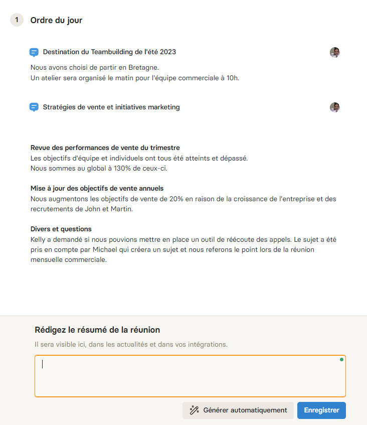
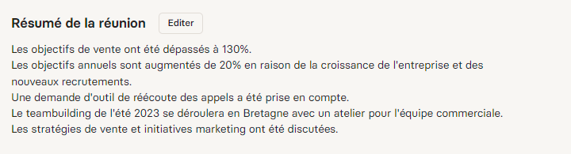

Meeting minutes are an essential part of organizational management and communication in any company. These documents serve as the official record of discussions and decisions, playing a crucial role in preserving continuity and clarity within the organization. They ensure that all stakeholders, whether or not they attended the meeting, have access to the same information and understand the agreed-upon actions.

In this article, we will show you how to write effective meeting minutes and, even better, how to do it without spending any additional time.

## The Vital Role of Meeting Minutes: Quick Access to Information

### The role of internal documentation

Meeting minutes are extremely important for internal documentation. They can serve as a resource for onboarding new employees and as a reference for audits or process reviews.

Meeting minutes go well beyond onboarding new employees, although that remains a key application. They also serve as a valuable resource in many other contexts within a company. For example, when an employee takes an extended leave or permanently leaves the organization, these documents provide a complete history of discussions and decisions that were made, enabling a smooth transition and continuity for ongoing projects.

Additionally, meeting minutes provide a reliable foundation for decision-making and strategic planning. They allow leaders and managers to track the evolution of ideas and strategies over time, making it easier to evaluate performance and make informed decisions. When disagreements or confusion arise about a direction taken by the team, meeting minutes serve as an objective reference to clarify misunderstandings and confirm commitments.

Meeting minutes also play a crucial role in corporate governance. During audits or process reviews, they provide documented evidence of the company's actions and decisions, which is essential for demonstrating compliance with regulations and industry best practices.

Furthermore, these documents help keep the entire team informed and engaged. They ensure that even members who could not attend a specific meeting are aware of recent developments and can contribute meaningfully to future discussions and initiatives.

### The Case for Hybrid and Fully Remote Companies

In hybrid and fully remote companies, meeting minutes take on critical importance, playing a crucial role in maintaining communication, consistency, and productivity. In these environments where in-person interactions are limited or nonexistent, meeting minutes serve as essential bridges to ensure that all team members, whether in the office or remote, stay informed and aligned on common goals.

Quick access to information is essential but often hindered by deep work blocks where interruptions are minimized.

This is where meeting minutes become truly important. They provide quick, self-service access to key information without having to interrupt a colleague.

An information archiving system facilitates autonomy in decision-making and rapid implementation of ideas. It helps overcome the challenges of asynchronous communication typical of hybrid and fully remote environments, ensuring that team members can progress efficiently even without immediate responses from their colleagues.

Conversely, slow access to information can cause an idea to be abandoned or postponed rather than implemented right away. That would be a missed opportunity.

Meeting minutes thus become a vital tool for maintaining momentum and efficiency within geographically dispersed teams.

### Spreading Information to Combat the Silo Effect

Meeting minutes play a crucial role in combating the silo effect in companies. By making valuable information available across different aspects of a project, they promote cross-functional collaboration between departments. These documents help break down information barriers, allowing each team to understand their own contribution and how their work fits into the broader organizational picture.

By facilitating access to crucial information, meeting minutes contribute to a better understanding of overall objectives and strategies. This becomes particularly relevant in contexts where teams work in isolation or remotely. With a well-structured set of minutes, every team member can easily follow the project's progress, understand the decisions made, and identify next steps, without relying on additional meetings or informal communications.

Moreover, in situations where decisions need to be reassessed or errors corrected, meeting minutes provide a factual basis for analyzing what was previously decided. They serve as a reference point for course correction, process optimization, and better decision-making going forward.

In summary, meeting minutes are a powerful tool for promoting a corporate culture where information flows freely and efficiently. By breaking down communication barriers and offering a clear, shared vision, they play an essential role in creating more integrated, transparent, and efficient work environments.

## How to Write Effective Meeting Minutes

Writing effective meeting minutes is essential to ensuring their usefulness. Here is how to write relevant and actionable minutes.

### Understanding the Purpose of Meeting Minutes

Good meeting minutes should capture the essence of discussions, decisions made, and actions to be taken. Their purpose is to provide a clear and concise summary that can serve as a reference for attendees, absentees, and future stakeholders.

#### Before the Meeting: Preparation

1. **Know the Agenda**: Before the meeting, familiarize yourself with the agenda. This will help you understand the topics to cover and structure your notes accordingly.
2. **Choose the Right Format**: Decide whether you will use a structured format (with predefined sections) or a more free-form format. This will often depend on the type of meeting and your organization's preferences.

#### During the Meeting: Effective Note-Taking

1. **Note Key Points**: Focus on main ideas, decisions made, and assigned actions. There is no need to transcribe everything word for word.
2. **Identify Speakers**: Note who said what, especially when it comes to decisions or important comments.
3. **Clarify Doubts**: Feel free to ask for clarification if a point is unclear.

#### After the Meeting: Writing the Minutes

1. **Structure the Document**: Start with the header (company name, date, time, location, attendees), followed by the agenda, discussion points, decisions made, and actions to be taken.
2. **Clarity and Conciseness**: Be clear and concise. Use short, direct sentences for easy comprehension.
3. **Actions and Responsibilities**: Highlight assigned tasks and deadlines. Clearly indicate who is responsible for what.
4. **Review and Correction**: Reread the minutes to correct errors and ensure that all important information is included.

#### Additional Tips

- **Use Bullet Points**: For greater clarity, organize information as bulleted lists.
- **Include Appendices**: If documents or presentations were shared during the meeting, reference or attach them to the minutes.
- **Distribute Quickly**: Send the minutes to attendees and absentees as soon as possible after the meeting.

#### The Importance of Follow-Up

- **Action Follow-Up**: Ensure that the actions described in the minutes are followed through. This may involve collaborating with project managers or team leads.

Good meeting minutes are an essential communication tool. They ensure that all participants, present and absent, are on the same page and aware of decisions made and actions to be taken. By following these steps and tips, you can write meeting minutes that are informative and facilitate project management and tracking within your organization.

## Archiving and Managing Meeting Minutes: Best Practices for Easy Retrieval

Effective archiving and management of meeting minutes are crucial for any organization. They ensure that information is easily accessible for future reference while keeping it secure and organized. Here are best practices for archiving and managing meeting minutes effectively.

### Understanding the Importance of Archiving

Proper archiving of meeting minutes allows you to quickly find key information, supports informed decision-making, and ensures compliance with governance and audit standards. It also facilitates knowledge transfer within the company.

#### Preparation and Organization

1. **Standardize Formats**: Use a standard format for all meeting minutes to ensure consistency. This simplifies searching and comparing documents.
2. **Name Files Logically**: Adopt a clear naming system, for example, "MeetingMinutes_Sales_20230321".
3. **Use Metadata**: Including metadata such as date, subject, participants, and keywords can greatly facilitate searching for specific documents.

#### Choosing a Storage System

- **Cloud vs Local Systems**: Choose between cloud storage (such as Google Drive, SharePoint, or Notion) and local storage based on your organization's security and accessibility needs.
- **Access and Security**: Ensure that meeting minutes are accessible to the relevant people while maintaining data security.

#### Archiving Process

- **Archive After the Meeting**: Archive the minutes immediately after the meeting to avoid losses or oversights.
- **Categorization and Indexing**: Categorize and index minutes by project, department, or meeting type for quick access.

#### Accessibility and Sharing

- **Sharing Policy**: Define a clear policy for sharing meeting minutes. Who can view them? Who can edit them?
- **Integration with Work Tools**: Integrate access to meeting minutes into daily work tools to make them easy to consult.

#### Training and Awareness

- Train employees on the importance of archiving and best practices to ensure effective management.

#### Regular Reviews and Audits

- Conduct regular audits to ensure that archiving practices remain adequate and that information is up to date.

## A Turnkey Solution for Your Meeting Minutes

Implementing new processes always requires some effort from both leaders and the entire company.

A process that goes unadopted generates no value. On the contrary, it creates frustration from the failure of its implementation.

### Simplifying Meeting Rituals and Automatically Building Documentation

To effectively build your documentation with meeting minutes, as you have seen, you need to check several boxes.

Today, on Notion, Google Drive, or SharePoint, it is impossible to be omniscient, and a significant number of documents end up orphaned, hidden in a workspace where the people who need them cannot easily find them.

If you think about it, when you have to ask one or more people where to find information, your documentation management is falling short.

With Rolebase, each meeting is structured around a flexible agenda, collaborative exchanges, and summaries. Each topic benefits from a dedicated discussion that can be integrated into the deliberations.

The goal of this architecture is to simplify processes as much as possible, valuing team members' time and encouraging them to focus on their area of expertise.

### Artificial Intelligence to Save You Time

With Rolebase, it is extremely simple to set up meeting minutes without requiring any extra time (everything is already built into the meeting).

Why write your meeting minutes when AI can do it for you?

Once the meeting is over and participants have taken their notes, simply press the "auto-generate" button to produce meeting minutes with AI!

Here are the minutes generated for the meeting above.

You can edit them to add or remove information.

Then they will be easy to find using Rolebase search.

**In summary, Rolebase is the simple and intuitive solution that lets you build a company-wide writing culture where everyone can find all the information they need to carry out their work!**

[Request a free consultation with an expert](https://www.rolebase.io/demande-demo)
