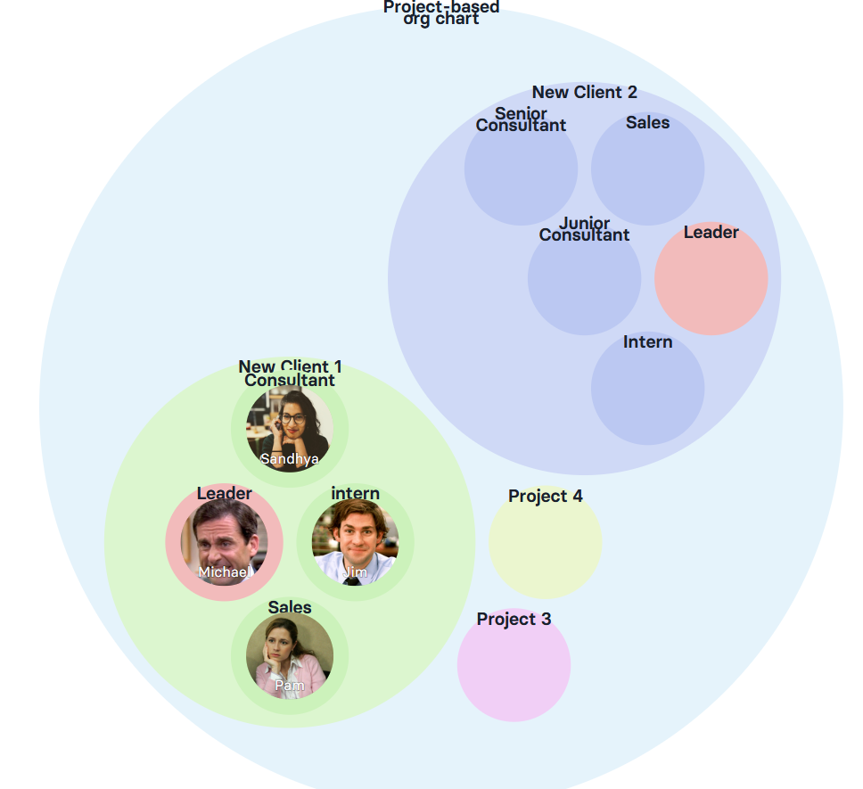

We speak to a lot of businesses who struggle with the following issue :  

Teams, when taken individually, are well-oiled.

Every one of them has their own tech stack, their own systems and processes that they've optimised to reflect their workflow.

Let's take a very concrete example.

The sales team manages its pipeline via a sales CRM tool like Pipedrive. The sales process is carefully mapped out, the metrics dashboard is set up, the sales team is doing a great job engaging with leads and closing them.

But then once the sale is closed, a handover to the operations team needs to happen. This involves a handover to the Customer Service or Consultant team. 

The consultant team is also a very well oiled machine, but their core functions are very different from the sales team.

What they're concerned about is making sure they're fulfilling exactly what was sold to the client, in the time alloted to the project.

They have their own tools to track their projects with each client and their time spent per project : their tech stack might include tools like Airtable for instance.
### The passing of the baton ... or not so much

Both the sales team and fulfillment team **need a high level of coordination** for a good handover to happen.

And this is typically where things go haywire.

Very often, both teams need to start coordinating even **before** the client has been signed on : sometimes the client already needs information on things like schedule and the project roadmap to finalise the contract. 

So an **efficient**, **well coordinated** handover process is key.

But it often gets messed up big time as this requires a high level of coordination between 2 teams who don't necessarily speak the same language.

Problems like the following arise : 

- The salesperson doesn't involve the consultant **soon enough** in the discussion and ends up selling something that the consultant finds difficult to fulfill 

- The consultant doesn't have enough information about the client at the moment of hand-off and **time and energy are lost** in back and forths between the salesperson and the consultant

- The sales and consultant team feel like they're working against one another; this builds up **resentment** and **degrades** the overall work experience for both teams 

If this feels familiar to you, fear no more. Rolebase has your back.
### How to get teams to collaborate better

Here's a proposed workflow, in Rolebase, for how to create a **smooth** and **efficient** handover process  between the sales and consultant teams. 

1) As soon as a prospect reaches a certain step in the sales pipeline, the salesperson can create a **new project** within Rolebase that involves the right people across the teams needed. 

In this case, project New_Client 1 has 4 roles : 

     - A project lead

     - The salesperson

     - The consultant who will fulfill the project

     - An intern 

Different projects can have different roles depending on the nature of the project and the skills that it requires.

 

2) Each project can be defined with things like : 

     - Its scope or accountabilities

     - Its KPIs

     - Any checklist needed

     - Any external links to further information containing more details about the project (e.g. link to Pipedrive and Airtable)

3) The above information can be **further broken down** to the individual roles to get even more specific and clear on what each role actually needs to do.

4) Once the above information is clarified, Rolebase allows both teams to project-manage the handover seamlessly :  

      - Threads of discussions can be created to ease discussion between the project members. These threads can be updated with polls, to-dos, any decisions that have been taken.

      - A task list can be created and updated for all the roles

      - Meetings can be directly scheduled within each project, and the meeting notes available within the project so all discussions are kept in one place

      - Any decisions taken within the context of the project can be logged 

      - Once the project is done, it can be archived and the details still accessed later on if need be by doing a search within Rolebase.

Getting teams to work with one another is the crux of delivering a great experience to the client.

And Rolebase allows you to do it **effortlessly**.

<TellaVideo videoId="vid_cmlqg9hiz015f04l18ds53kyw" class="my-5" />

Give it a try yourself [here](https://rolebase.io/login).

Else, book your personalised demo [here](https://en.rolebase.io/demande-demo).
