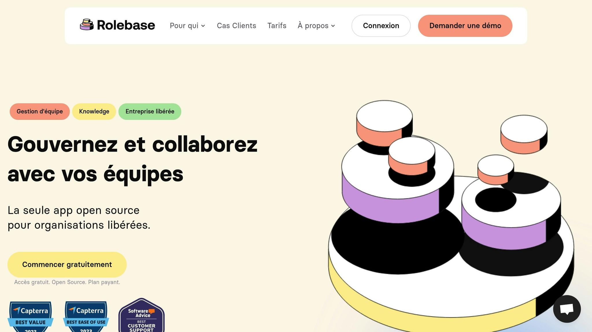

L’analyse de sentiment d’équipe est essentielle pour améliorer l’engagement, la satisfaction et la collaboration au sein des entreprises. Voici ce que vous devez savoir pour commencer :

**Pourquoi c'est important :**

- Améliore la productivité : Moins de temps en réunion, meilleure organisation.

- Renforce la communication : Rôles clairs et accès simplifié aux informations.

- Augmente l'engagement :[Onboarding fluide](https://www.rolebase.io/plateforme/onboarding-offboarding)et implication accrue.

- Favorise la collaboration : Échanges simplifiés et travail d’équipe renforcé.

**Étapes clés pour débuter :**

1. **Fixer des objectifs clairs**: Par exemple, mesurer l’engagement via la participation aux réunions.

2. **Collecter des données**: Utilisez des sondages anonymes, entretiens ou feedbacks collectifs.

3. **Choisir des outils adaptés**:[Rolebase](https://rolebase.io/)aide à visualiser les rôles, organiser les réunions et suivre l’engagement.

4. **Analyser les données**: Identifiez les tendances et transformez-les en actions concrètes.

5. **Mettre en œuvre des changements**: Planifiez, communiquez et suivez les améliorations.

**Outils recommandés :**

- **Rolebase**:[Visualisation des rôles](https://www.rolebase.io/plateforme/roles),[gestion des réunions](https://www.rolebase.io/plateforme/optimisation-des-temps-de-reunions), suivi des tâches et communication asynchrone.

**Défis et solutions :**

- **Confidentialité des données**: Anonymisez les données et respectez le[RGPD](https://fr.wikipedia.org/wiki/R%C3%A8glement_g%C3%A9n%C3%A9ral_sur_la_protection_des_donn%C3%A9es).

- **Biais d’interprétation**: Standardisez les critères d’analyse.

- **Participation irrégulière**: Formez les équipes et intégrez les outils au quotidien.

- **Diversité culturelle**: Adaptez les questionnaires et formez les managers.

Avec une méthode structurée et les bons outils, l’analyse de sentiment d’équipe peut transformer votre environnement de travail pour le rendre plus harmonieux et efficace.

## Comment augmenter la performance d'une entreprise ?

<Youtube videoId="3RltKyJLnTo" />

## 5 étapes pour lancer une analyse de sentiment d'équipe

Ce processus structuré vous aide à améliorer l'engagement et la performance de votre équipe de manière concrète et mesurable.

### 1. Définir vos objectifs

Commencez par fixer des objectifs clairs et mesurables, adaptés aux besoins de votre équipe. Voici quelques exemples :

| Objectif | Indicateur de mesure | Fréquence d'évaluation |
| --- | --- | --- |
| Engagement | Participation aux réunions | Hebdomadaire |
| Communication | Temps de réponse | Quotidienne |
| Satisfaction | Score de bien-être (1-10) | Mensuelle |
| Productivité | Tâches accomplies | Hebdomadaire |

### 2. Mettre en place la collecte de données

Pour obtenir des données fiables, mettez en place un système structuré de collecte. Voici quelques méthodes efficaces :

- Sondages anonymes réguliers

- Entretiens individuels mensuels

- Suivi quotidien des interactions au sein de l'équipe

- Sessions de feedback collectif

Assurez-vous d'être transparent sur la manière dont les données sont collectées afin de préserver la confiance de votre équipe.

### 3. Choisir vos outils

Le choix des outils est essentiel pour une analyse efficace. Rolebase, par exemple, propose des fonctionnalités utiles pour :

- Avoir une vue claire des rôles et responsabilités

- Simplifier l'organisation des réunions

- Suivre l'engagement des équipes

- Centraliser les informations essentielles

Une fois vos outils en place, passez à l'analyse des données.

### 4. Analyser vos données

Voici les étapes pour exploiter les données collectées :

1. **Compilation des données**: Regroupez toutes les informations dans un format cohérent.

2. **Identification des tendances**: Cherchez des schémas ou comportements récurrents.

3. **Élaboration des conclusions**: Transformez ces observations en actions concrètes.

Ces analyses vous donneront des pistes claires pour agir.

### 5. Mettre en œuvre les changements

Utilisez vos conclusions pour initier des actions concrètes. Voici un plan type :

| Phase | Action | Délai recommandé |
| --- | --- | --- |
| Planification | Définir les priorités d'action | 1 semaine |
| Communication | Partager le plan avec l'équipe | 2-3 jours |
| Implémentation | Mettre en place les changements | 2-4 semaines |
| Suivi | Évaluer l'impact des modifications | Mensuel |

Rolebase peut vous aider à :

- Suivre l'état d'avancement des actions

- Mesurer l'impact sur l'engagement

- Ajuster les processus en fonction des retours de l'équipe

Avec ces étapes, vous serez en mesure de transformer vos données en améliorations concrètes qui profitent à toute l'équipe.

###### sbb-itb-77d9745

## Outils Requis pour l'Analyse de Sentiment

Une fois vos objectifs définis et la collecte de données en place, il est essentiel de choisir des outils adaptés pour transformer ces données en actions concrètes.

### Fonctionnalités Clés des Outils

Pour une analyse de sentiment réussie, voici les principales fonctionnalités à considérer :

| Fonctionnalité | Description | Avantage |
| --- | --- | --- |
| Visualisation des rôles | Représentation claire de l'organisation | Compréhension des responsabilités |
| Gestion des réunions | Planification et suivi simplifiés | Amélioration des échanges |
| Suivi des tâches | Traçabilité des actions | Renforcement de la responsabilisation |
| Communication asynchrone | Échanges flexibles | Moins de pression sur les délais |
| Intégrations | Connexion aux outils existants | Adoption facilitée |

Une interface intuitive est indispensable pour encourager une adoption rapide par les équipes.

### [Rolebase](https://rolebase.io/) : Un Outil pour l'Analyse d'Équipe

Rolebase offre une solution intégrée pour analyser le sentiment au sein des équipes, en mettant en avant les rôles et responsabilités grâce à une visualisation en temps réel.

#### Points Forts de Rolebase

**Visualisation interactive**

- Organigramme interactif pour explorer les relations internes.

- Vue détaillée des responsabilités.

- Mises à jour en temps réel pour refléter les changements.

**Gestion des réunions et suivi simplifié**

> "Simple et efficace, Rolebase nous aide à appliquer les principes de l'holacratie avec fluidité. La vue en cercles permet de visualiser rapidement et clairement l'organisation."

**Suivi de l'engagement**

- Tableau de bord dédié aux interactions.

- Indicateurs de participation des membres.

- Outils pour mesurer l'implication au sein de l'équipe.

> "J'utilise Rolebase plusieurs fois par semaine pour nos réunions internes. L'interface est intuitive, fiable et fonctionne parfaitement. Les décisions sont archivées, ce qui évite les pertes d'information et fait gagner du temps sur les projets."

Dans la prochaine section, nous examinerons les défis courants et les solutions pour maximiser l'efficacité de ces outils.

## Problèmes et Solutions

### Principaux Obstacles

Analyser le sentiment d'une équipe peut se heurter à plusieurs difficultés importantes. Voici les principaux obstacles à prendre en compte :

| Obstacle | Impact | Risque |
| --- | --- | --- |
| Confidentialité des données | Protection des informations sensibles | Réticence des collaborateurs |
| Biais d'interprétation | Résultats déformés | Décisions mal adaptées |
| Diversité culturelle | Différences dans l'expression | Malentendus possibles |
| Participation irrégulière | Données incomplètes | Vision partielle de la situation |

En France, le RGPD impose des règles strictes sur la gestion des données sensibles, rendant indispensable l'utilisation d'outils conformes. De plus, les différences culturelles et professionnelles influencent fortement la perception et l'interprétation des données, exigeant une approche plus nuancée.

### Solutions Efficaces

Pour surmonter ces obstacles, voici des stratégies concrètes à mettre en place :

- **Gestion des données sécurisée et standardisée**
   - Définir des critères d'analyse clairs pour réduire les biais.
   - Anonymiser systématiquement les données collectées.
   - Assurer un stockage conforme au RGPD.
- **Augmentation de la participation**
   - Planifier des retours d'expérience réguliers.
   - Proposer une interface simple et intégrée aux outils utilisés au quotidien.
   - Former les équipes pour garantir une utilisation optimale.
- **Prise en compte des différences culturelles**
   - Adapter les questionnaires au contexte spécifique de chaque équipe.
   - Former les managers à mieux interpréter les données dans un cadre multiculturel.
   - Utiliser plusieurs canaux de communication pour atteindre tous les collaborateurs.

Ces approches permettent d'obtenir une analyse plus fiable et mieux adaptée aux particularités de chaque équipe. Rolebase propose un cadre structuré et respectueux des réglementations, conçu pour répondre aux besoins spécifiques de chaque organisation.

## Conclusion

L'analyse du sentiment d'équipe joue un rôle clé dans la création d'une culture d'entreprise saine et performante. Les entreprises qui intègrent cette pratique constatent souvent des améliorations notables dans la dynamique de leurs équipes et leur productivité.

L'exemple d'[Evea](https://evea-conseil.com/en) illustre bien comment une approche structurée peut contribuer à une amélioration continue des performances d'équipe. Pour réussir cette démarche, trois principes essentiels se démarquent :

- **Transparence**: Assurer une collecte et un traitement des données clairs et accessibles.

- **Régularité**: Réaliser des évaluations fréquentes pour suivre les évolutions.

- **Actions concrètes**: Mettre en place des mesures tangibles basées sur les retours obtenus.

Ces principes ont permis à de nombreuses organisations d'améliorer la communication, d'accroître l'engagement des collaborateurs et de booster la productivité.

L'analyse du sentiment d'équipe reflète un véritable engagement envers l'amélioration continue du cadre de travail. Avec les bons outils et une méthode bien définie, chaque entreprise peut transformer ses défis en opportunités pour progresser et se développer.
