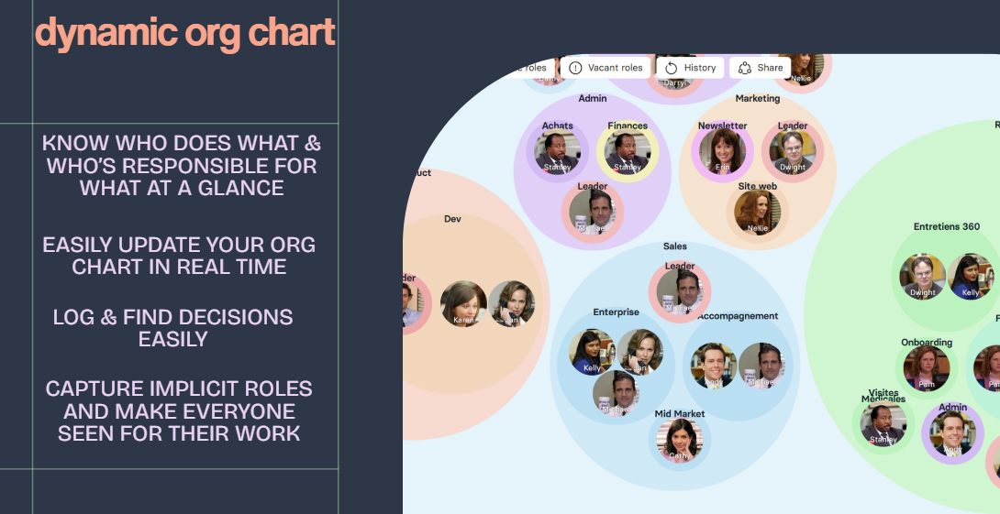
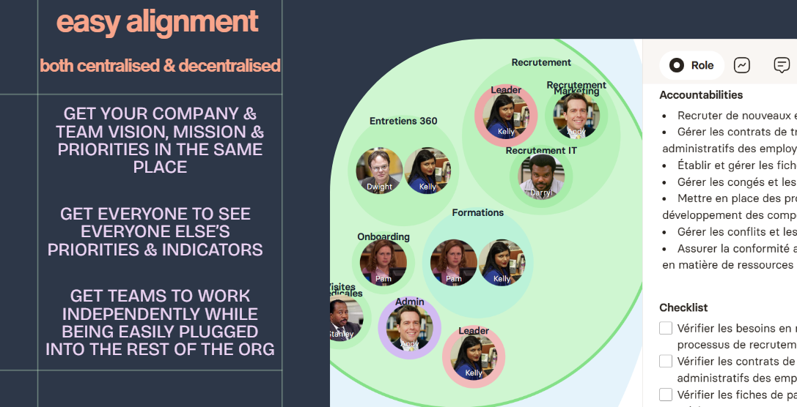
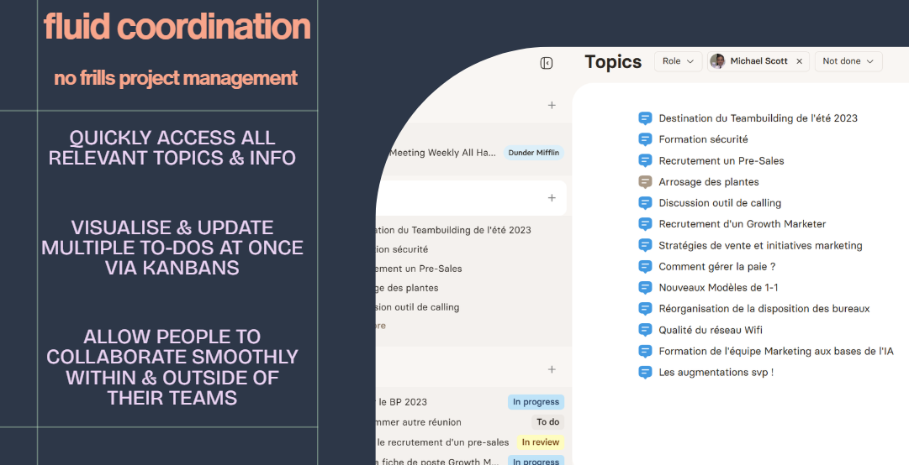
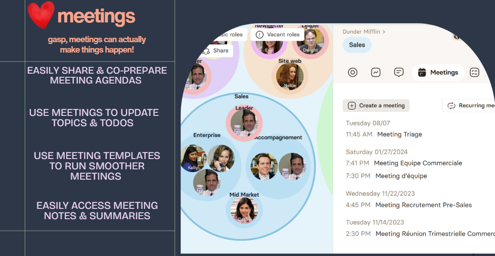

How many platforms does your team have open when they're working? 

I'm not even talking about Instagram or TikTok (unless you're a content creator for these platforms).

I'm taking about ACTUAL tools that the team needs just to be able to coordinate work.

I know teams that use at least 4 platforms at once, just to be able to navigate their teamwork in a given moment :

- Asana or some project management tool
- Slack
- Their email
- Notion

And we haven't even gotten to the platforms that are work-specific, ie. a sales CRM for the sales team or coding platform for the tech team.

With the promise of more efficient work, all of these platforms have instead rendered your team's work suboptimal. 

Having multiple tabs open constantly just **dilutes** people's concentration and capacity to do great work.

Each platform exacts its own **switching costs**; meaning as you're navigating from one platform to the next, you're having to undergo a mental context switching to reframe your mind to operate within that platform. Each time someone is going from one platform to the next, a little bit of their energy is being seeped. 

And this is happening hundreds, if not thousands of times, each day, for each team member.

Meetings are being affected too. 

I know teams who have all of their tabs open just to be able to run a good meeting. They're constantly navigating from one platform to the next to share information, distribute to-dos and update projects.
### Your workflow is causing everyone to lose energy

If you've gotten to a point where your team is having to open multiple platforms just to coordinate work, you need to step back and rethink your workflow.

Things have probably become a tad too complex. Especially if you're operating a small team where **simplicity should be the north star**.

Here's how Rolebase delivers on an internal communication, a backbone for your team that is simple, centralised, and that doesn't involve switching between multiple platforms : 
#### 1) Clarity, Clarity, Clarity : 

The crux of teamwork when you're organising knowledge work is to give everyone clarity on who does what, and to be able to update this information as and when needed.

With Rolebase's dynamic org chart, this becomes a piece of cake. Everyone's roles and responsibilities is centralised and easily updated. **Decisions are logged** with their proper context so information is up to date.

#### 
2) Get everyone rowing in the same direction :

Mission, Vision, values, goals and KPIs are what guide the team's daily action.

So this info needs to be in everyone's faces, at all times.

Often though, this critical info is sitting on a drive somewhere that no-one knows how to access. Sounds familiar?

If it does, then **no wonder your team is struggling to meet their goals**.

Rolebase puts all of that key information right where everyone needs it, i.e right under their nose.

Vision, goals, KPIs are all there : the big ones for the company and how they break down into smaller ones for each team, subteam and role.

Not only is each person aware of her own goals, accountabilities and KPIs, she gets to see what everyone else's are as well.

All of that in a couple of simple clicks.

#### 
3) No frills project management :

Here's the blatant truth : it takes work to keep things simple.

Most project management tools today are absolutely overkill. A lot of them are venture backed companies shipping features everyday just to capture more and more market share.

The result : software that is too complex than it needs to be.

If you're a small team, chances are you're paying the high price for project management software features that you don't need.

Rolebase helps you keep things simple.

Here's how : 

Rolebase has a simple group chat functionality that helps you organise discussions and projects easily. You can add to-dos, schedule meetings, add polls and close out those chats when they're done.

To-dos, both individual and collective, are accessible by everyone. You get to either organise your own work or get to gauge your team's workload by seeing who is working on what.

#### 
4) Turn meetings into your superpower :

Meetings are those spaces that are rarely questioned and where mediocrity usually festers. But done well, they can supercharge an entire company. Afterall you put a team together because you're convinced that together, you can go farther, right?

It's crucial to craft your team meetings in a way that actually makes the company leap forward each time.

Crafting effective team meetings is one of the core tenets of Rolebase, and we've written in more detail about how to design insanely productive meetings [here](https://en.rolebase.io/blog/how-to-craft-incredibly-productive-meetings).

In a nutshell, Rolebase allows you to : 

- prepare agenda items ahead of time, and easily share those with meeting participants
- update your discussions and to-dos directly in meetings on Rolebase itself so everything stays within one platform
- have recurring meetings? No problem : use meeting templates to make those recurring meetings efficient by replicating tried and tested formats
- use AI to summarise meetings and have all the meeting notes accessible to all once the meeting is done

Rolebase is designed to be the **backbone of your team** : a ONE stop shop where you can focus all of your team's communication efforts so context switching is minimised and the whole team can claim back their energy and focus.

Want to learn more about how Rolebase works? Sign up[ here](https://sandhya-from-rolebase.kit.com/85257aa046) to find out !
