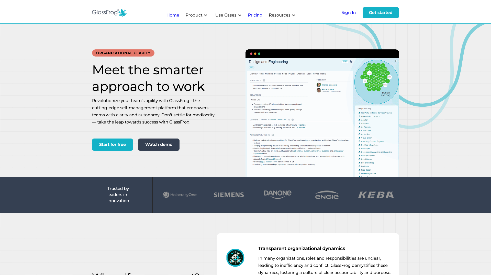
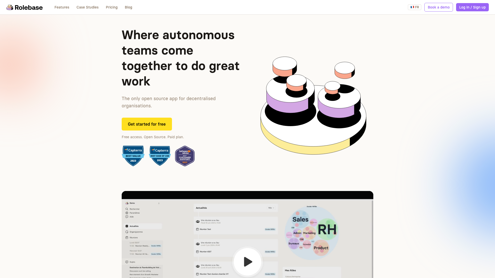

Si votre équipe pratique l'Holacratie, la sociocratie ou toute autre forme d'autogouvernance, vous avez probablement croisé GlassFrog. Développé par HolacracyOne, c'est depuis longtemps le logiciel de référence pour les organisations qui appliquent l'Holacratie. Mais à mesure que les pratiques d'autogouvernance évoluent et se diversifient, de nombreuses équipes recherchent des outils offrant plus de flexibilité, de meilleurs tarifs et une expérience utilisateur moderne. Rolebase est une plateforme open source conçue pour ces équipes : des organisations qui veulent la clarté d'une gouvernance par les rôles sans être enfermées dans un cadre unique.

GlassFrog mérite d'être salué pour son rôle dans l'adoption de l'Holacratie à grande échelle. C'est l'outil officiel des créateurs de l'Holacratie, et pour les organisations profondément engagées dans la constitution holacratique, il offre un environnement structuré avec des formats de réunion solides, des processus de gouvernance éprouvés et un compagnon IA (FrogBot) qui comprend les politiques de votre entreprise. Adopté par de grandes entreprises comme Siemens, Danone et Engie, GlassFrog a prouvé sa valeur pour la pratique de l'Holacratie en entreprise.

## Pourquoi les équipes cherchent des alternatives à GlassFrog

Malgré ses qualités, GlassFrog reçoit des retours réguliers de ses utilisateurs qui pointent plusieurs points de friction. Voici les raisons les plus fréquentes pour lesquelles les équipes commencent à explorer d'autres options (d'après les avis sur G2, Capterra et TrustRadius début 2026).

### Une courbe d'apprentissage liée à l'Holacratie

GlassFrog est construit autour de la constitution holacratique. Pour les équipes qui découvrent l'autogouvernance ou qui pratiquent une approche hybride, cela peut sembler intimidant. La navigation s'articule autour de concepts spécifiques à l'Holacratie (tensions, réunions de gouvernance, réunions tactiques), et les utilisateurs qui cherchent simplement à clarifier les rôles et améliorer leurs réunions trouvent souvent l'interface déroutante au départ.

### Des difficultés de navigation et de performance

Plusieurs utilisateurs mentionnent des difficultés à naviguer entre les cercles, en particulier dans les grandes organisations. Trouver un rôle ou une responsabilité spécifique peut demander plusieurs clics, et certains signalent des temps de chargement plus longs que prévu. La fonctionnalité "Inbox" pour remonter les tensions a été qualifiée de confuse, les utilisateurs s'attendant à la trouver sous un libellé "Tensions".

### Une personnalisation limitée des rôles et des structures

Les équipes qui souhaitent s'écarter des structures holacratiques strictes trouvent parfois GlassFrog rigide. L'impossibilité de personnaliser facilement les structures de rôles (par exemple, dans les organisations qui n'utilisent pas de rôle de secrétaire) a été citée comme une limite. Si votre modèle de gouvernance correspond peu au modèle holacratique, l'adaptation peut être laborieuse.

### Des tarifs qui augmentent avec les modules complémentaires

Le plan Premium de GlassFrog est à 7 $/utilisateur/mois, ce qui reste raisonnable en soi. Cependant, des fonctionnalités clés comme les OKR (1,50 $/utilisateur/mois) et le compagnon IA FrogBot (1,50 $/utilisateur/mois) sont facturés en supplément. Pour une équipe de 50 personnes souhaitant l'ensemble des fonctionnalités, le coût mensuel peut atteindre 500 $. De plus, il n'y a pas d'offre gratuite permanente au-delà de 10 utilisateurs.

### Code fermé et intégrations limitées

GlassFrog s'intègre avec Slack, Jira et Asana, mais la plateforme reste propriétaire. Les organisations qui ont besoin d'auditer leurs outils, d'auto-héberger pour des raisons de conformité ou de développer des intégrations sur mesure disposent d'options limitées. L'API est disponible mais limitée à 50 appels/heure sur le plan gratuit.

## Comment Rolebase fait les choses différemment

Rolebase a été conçu avec une philosophie différente : fournir la structure dont les équipes autogérées ont besoin tout en restant suffisamment flexible pour s'adapter à tout modèle de gouvernance. Voici comment les deux plateformes se distinguent en pratique.

### Open source et auto-hébergeable

Rolebase est entièrement open source sous licence MIT. L'intégralité du code source est disponible sur [GitHub](https://github.com/Godefroy/rolebase), ce qui permet à votre équipe d'auditer le code, de contribuer des améliorations ou de déployer votre propre instance sur vos serveurs. Pour les organisations ayant des exigences strictes en matière de souveraineté des données ou qui préfèrent simplement la transparence dans leurs outils, c'est un avantage significatif que GlassFrog n'offre pas.

### Une gouvernance indépendante de tout cadre méthodologique

Là où GlassFrog est conçu spécifiquement pour l'Holacratie, Rolebase fonctionne avec tout modèle de gouvernance. Vous pouvez implémenter l'Holacratie, la sociocratie ou votre propre cadre personnalisé. Les étapes de réunion sont configurables (tour de table, fils de discussion, checklist, indicateurs, tâches), et vous pouvez les réordonner, en ajouter ou en retirer pour correspondre au fonctionnement de votre équipe. Rolebase vous donne la structure sans imposer les règles.

### Une interface moderne et intuitive

Rolebase offre une expérience moderne et épurée, pensée pour la simplicité. L'organigramme interactif propose quatre vues différentes (Tous les rôles, Holarchie, Opérationnel et Membres uniquement), et vous pouvez cliquer sur n'importe quel rôle pour explorer son contenu. La collaboration en temps réel permet aux modifications d'apparaître instantanément pour tous les participants pendant les réunions ou ateliers. Le tableau de bord donne à chacun une vision claire de ses tâches, réunions à venir et activité récente.

### Des réunions conçues pour les vraies équipes

Les deux plateformes proposent des réunions structurées, mais Rolebase adopte une approche plus souple. Les réunions appartiennent à des rôles et suivent des séquences d'étapes personnalisables. Vous disposez d'un ordre du jour collaboratif, d'un minuteur intégré et de notes de réunion automatiques. Les réunions récurrentes et les modèles de réunion font gagner du temps pour les sessions régulières. La différence clé : Rolebase vous permet de construire le format de réunion adapté à votre équipe plutôt que d'exiger le suivi d'un format holacratique prescrit.

### Toutes les fonctionnalités incluses à chaque niveau de tarif

Rolebase inclut toutes les fonctionnalités dans chaque plan, du niveau gratuit aux plans payants. Il n'y a aucun supplément pour des fonctionnalités spécifiques. Fils de discussion, tâches, décisions, journal d'activité, synchronisation de calendrier, import de données, export de l'organigramme, notifications et gouvernance protégée sont tous disponibles dès le premier jour.

## Comparaison des fonctionnalités

Voici un aperçu des capacités des deux plateformes côte à côte (en date de mars 2026).

| Fonctionnalité | GlassFrog | Rolebase |
|---|---|---|
| Organigramme dynamique | Oui | Oui (4 vues) |
| Gouvernance par les rôles | Centrée sur l'Holacratie | Indépendante du cadre |
| Réunions structurées | Tactiques + Gouvernance | Étapes personnalisables |
| Modèles de réunion | Oui (bibliothèque Agile) | Oui |
| Tâches et projets | Oui (sous-projets en Premium) | Oui (inclus dans tous les plans) |
| Fils de discussion | Via la boîte de tensions | Fils dédiés par rôle |
| Suivi des décisions | Via la gouvernance | Oui, par rôle |
| OKR / Objectifs | 1,50 $/utilisateur/mois en supplément | Indisponible |
| Compagnon IA | FrogBot (1,50 $/utilisateur/mois en supplément) | Indisponible |
| Intégrations | Slack, Jira, Asana | Synchronisation calendrier (iCal), API |
| Import de données | Limité | Oui (y compris depuis Holaspirit) |
| Open source | Non | Oui (licence MIT) |
| Auto-hébergement | Non | Oui |
| Conformité RGPD | Oui | Oui (serveurs en Europe) |
| Accès API | Oui (limité en débit) | Oui (GraphQL) |
| Collaboration temps réel | Limitée | Oui |

GlassFrog a l'avantage sur les OKR et l'assistance par IA avec FrogBot, des fonctionnalités que Rolebase ne propose pas actuellement. GlassFrog dispose aussi d'intégrations tierces plus matures avec Slack, Jira et Asana. Rolebase se démarque par son ouverture, la transparence de ses tarifs et sa flexibilité en matière de modèle de gouvernance.

## Comparaison des tarifs

Comprendre le coût total de chaque plateforme aide à prendre une décision éclairée. Voici comment les tarifs se comparent en mars 2026.

**GlassFrog :**
- Plan gratuit : jusqu'à 10 utilisateurs, fonctionnalités de base
- Premium : 7 $/utilisateur/mois (ou 70 $/utilisateur/an)
- Module OKR : +1,50 $/utilisateur/mois
- Module FrogBot IA : +1,50 $/utilisateur/mois
- Entreprise : tarification sur mesure pour plus de 500 utilisateurs
- Comptes observateurs gratuits illimités en Premium

**Rolebase :**
- Small (Gratuit) : toutes les fonctionnalités, jusqu'à 5 membres actifs, membres inactifs illimités pour l'organigramme
- Startup : 5 euros/mois/utilisateur, jusqu'à 200 membres actifs, inclut 1h/mois de coaching et support prioritaire
- Entreprise : tarification sur mesure avec membres invités illimités et consulting personnalisé
- Réductions ou accès gratuit pour les associations et coopératives
- Auto-hébergement : gratuit (licence MIT), les frais de serveur restent à votre charge

Pour une équipe de 50 membres actifs souhaitant l'ensemble des fonctionnalités :
- GlassFrog Premium avec tous les modules : environ 500 $/mois (10 $/utilisateur)
- Rolebase Startup : 250 euros/mois (5 euros/utilisateur), coaching inclus

La tarification de Rolebase est limpide : un prix, toutes les fonctionnalités. Celle de GlassFrog peut devenir complexe à mesure que vous ajoutez les modules dont votre équipe a besoin.

## À qui s'adresse chaque outil ?

Les deux plateformes s'adressent aux organisations autogérées, mais elles ont été conçues pour des contextes différents.

**Choisissez GlassFrog si :**
- Votre organisation est profondément engagée dans la constitution holacratique et a besoin de l'outillage officiel
- Vous travaillez avec des coachs Holacratie et souhaitez le programme Habit Support
- Vous avez besoin d'un suivi des OKR intégré à votre outil de gouvernance
- Vous souhaitez une assistance IA pour naviguer dans les politiques de l'entreprise
- Vous êtes une grande entreprise (500+ utilisateurs) avec des workflows Jira/Asana/Slack existants

**Choisissez Rolebase si :**
- Vous pratiquez l'autogouvernance mais vous souhaitez de la flexibilité dans votre modèle
- L'open source et la transparence des données comptent pour votre organisation
- Vous avez besoin d'une solution auto-hébergée pour la conformité ou la souveraineté des données
- Vous voulez toutes les fonctionnalités incluses, sans supplément
- Vous êtes une équipe de petite ou moyenne taille à la recherche d'une solution abordable et intuitive
- Vous êtes une association ou coopérative à la recherche d'un accès à tarif réduit ou gratuit

Pour les équipes qui débutent dans le management horizontal, Rolebase propose un point d'entrée plus progressif. Vous pouvez construire votre modèle de gouvernance pas à pas, en commençant par des rôles simples et des réunions, puis en faisant évoluer votre structure à mesure que votre organisation gagne en maturité.

## Effectuer la transition

La migration de GlassFrog vers Rolebase est conçue pour être fluide. Rolebase prend en charge l'import de données pour vous aider à transférer votre structure organisationnelle. Vous pouvez importer rôles, membres et données structurelles pour éviter de tout reconstruire depuis zéro.

Le processus de transition se déroule généralement ainsi :

1. **Exportez vos données** depuis GlassFrog (disponible sur le plan Premium avec le téléchargement complet des données)
2. **Créez votre organisation** dans Rolebase et importez votre structure
3. **Invitez votre équipe** et attribuez les rôles
4. **Lancez une réunion pilote** pour que chacun se familiarise avec la nouvelle interface
5. **Effectuez la transition progressivement** en basculant votre gouvernance courante vers Rolebase

Comme Rolebase est gratuit pour commencer, vous pouvez faire fonctionner les deux plateformes en parallèle pendant une période de transition. Cela permet à votre équipe de comparer l'expérience directement avant de basculer complètement.

## Conclusion

GlassFrog a gagné sa place en tant qu'outil de référence pour les praticiens de l'Holacratie, et il reste le choix le plus solide pour les organisations qui suivent de près la constitution holacratique. Ses fonctionnalités d'IA et ses intégrations d'entreprise lui confèrent des avantages clairs dans des contextes spécifiques.

Pour les équipes qui souhaitent de la flexibilité dans leur modèle de gouvernance, une tarification transparente, du code open source et une expérience utilisateur moderne, Rolebase propose une alternative convaincante. La possibilité d'auto-héberger, l'ensemble complet de fonctionnalités à chaque niveau tarifaire et la conception indépendante de tout cadre méthodologique en font un outil adapté au nombre croissant d'organisations qui s'inspirent de plusieurs approches d'autogouvernance plutôt que de suivre une méthodologie unique.

La meilleure façon d'évaluer chaque plateforme est de l'essayer. Les deux offrent des options gratuites pour commencer, ce qui vous permet de constater les différences par vous-même et de choisir l'outil qui correspond vraiment au fonctionnement de votre équipe.
