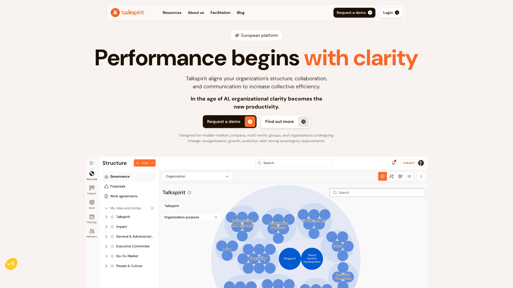
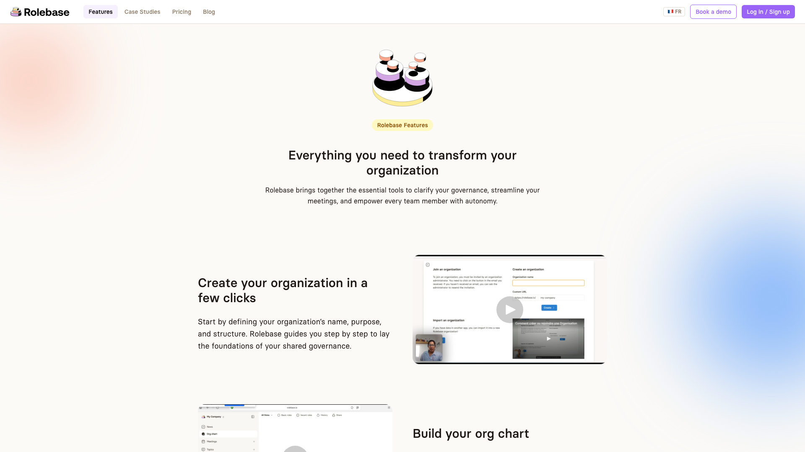
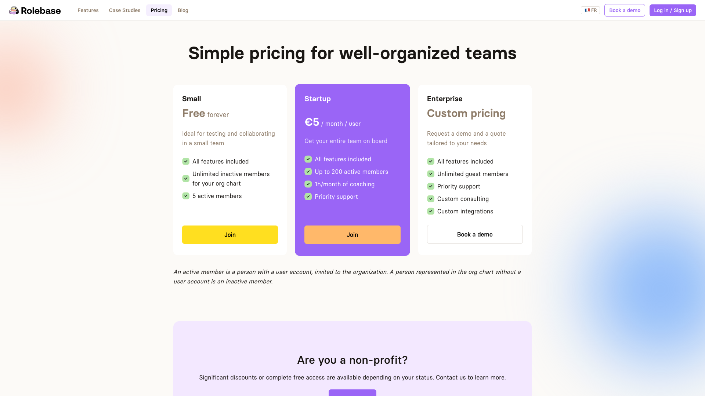

If you're reading this, you've probably used Holaspirit (now part of Talkspirit) or you're evaluating governance tools for your self-managed organization. Maybe you've noticed that Holaspirit's identity has shifted since its acquisition, or that pricing has become harder to understand, or that certain features you need are locked behind enterprise plans. Whatever the reason, you're looking for an alternative that fits your team better.

**Rolebase** is an open-source governance platform built specifically for organizations practicing Holacracy, Sociocracy, or any form of shared governance. It offers structured meetings, clear role definitions, async decision-making, and a transparent org chart, with a generous free tier and full source code transparency.

Let's take a closer look at why teams are exploring alternatives and how Rolebase compares.

## Holaspirit: a strong foundation, now in transition

Holaspirit has been a pioneer in the governance software space. Launched in France, it quickly became the go-to platform for Holacracy practitioners, offering role management, governance meetings, and OKR tracking. With support for 10 languages and a clean interface, it earned solid ratings (4.6/5 on Capterra) and built a loyal customer base.

In recent years, Holaspirit was acquired by Talkspirit and merged into a broader "European Organizational Operating System." While this brought new capabilities in communication and collaboration, it also changed the product's focus and raised questions for teams that valued Holaspirit's dedicated governance approach.

## Why teams look for Holaspirit alternatives

Based on user reviews from G2, Capterra, and community discussions, here are the most common reasons teams start exploring alternatives.

### Governance changes feel cumbersome

Several users report that reorganizing roles and circles in Holaspirit can be tedious. There's no drag-and-drop for structural changes, and moving roles between circles requires multiple steps. For organizations that frequently adapt their structure, this friction adds up quickly.

### Project management feels limited

Holaspirit's task and project tracking lacks features that many teams consider essential: no tags, no file attachments on tasks, limited commenting, no reminders or templates. Teams often end up maintaining a separate project management tool alongside Holaspirit, creating friction and context-switching.

### Integrations are sparse

Microsoft 365 integration has been a long-standing request. Jira integration was attempted but reportedly abandoned. The integrations that exist tend to be one-directional. For teams relying on a broader tool ecosystem, this creates information silos.

### API access requires premium plans

Developers who want to build custom integrations or automations find that API access is locked behind higher-tier plans. For technically-oriented organizations, this limits extensibility.

### Pricing has become opaque

Since the Talkspirit merger, Holaspirit's pricing page redirects to Talkspirit's site, where plans are not clearly displayed and require contacting sales. For small organizations evaluating tools, this lack of transparency is a significant friction point.

### No self-hosting option

Holaspirit is proprietary and cloud-only. Organizations with strict data sovereignty requirements or those who prefer to control their infrastructure have no option to self-host.

## How Rolebase approaches things differently

Rolebase was built from the ground up as an open-source governance platform. Here's where it diverges from Holaspirit in ways that matter.

### Open source and self-hostable

Rolebase's entire codebase is available under the MIT license on GitHub. This means:

- **Full transparency**: You can audit every line of code
- **Self-hosting**: Deploy on your own infrastructure if data sovereignty matters
- **No vendor lock-in**: Your data, your rules
- **Community-driven**: Contribute features, report bugs, or fork the project

For organizations that value independence and control, this is a fundamental difference. Holaspirit is proprietary with no option to inspect the code or run it on your own servers.

### A unified, flexible org chart

Rolebase uses a unified model where a circle is simply a role that contains sub-roles. This means any role can become a circle by adding sub-roles to it, without needing to create a separate entity. The result is a more intuitive and flexible structure that adapts naturally as your organization evolves.

Each role can include a Purpose, Domain, Accountabilities, Checklists, Indicators, and Notes. Changes can be made collaboratively in real-time, even during meetings, with drag-and-drop support.

### Structured meetings that actually work

Rolebase's meeting system uses a step-based workflow: check-in rounds, threaded discussions, checklist reviews, indicator tracking, and task management. Meetings follow customizable templates (Tactical, Governance, Quick Sync), and built-in timers help keep discussions focused.

Key features include:
- **Recurring meetings** with flexible scheduling
- **Calendar sync** with Google Calendar and Outlook
- **AI-generated summaries** after each meeting
- **Video conferencing integration** for remote teams
- **Private meetings** for sensitive topics

### Asynchronous decision-making with threads

Not everything needs a meeting. Rolebase's thread system supports structured asynchronous discussions with a clear lifecycle (Preparation, Active, Blocked, Closed). Threads include:

- Rich text messages with reactions
- Embedded polls for consent-based decisions (consent, object, stand aside)
- Multiple choice and points-based voting
- Anonymous voting options

This reduces meeting overload while keeping decisions transparent and traceable.

### Transparent, predictable pricing

Rolebase's pricing is simple and publicly displayed (as of March 2026):

| Plan | Price | What you get |
|------|-------|-------------|
| **Free** | $0 forever | All features, up to 5 active members |
| **Startup** | 5 EUR/month/user | Unlimited members, coaching, priority support |
| **Enterprise** | Custom | Unlimited guests, custom integrations, dedicated support |

The free plan includes all features with no artificial limitations beyond the member count. Nonprofits can get significant discounts or free access. Archived members don't count toward your seat limit.

### Direct import from Holaspirit

Switching shouldn't be painful. Rolebase offers a built-in Holaspirit import tool that maps your existing circles, roles, and properties directly into Rolebase's structure. Your governance data transfers cleanly, minimizing disruption during the transition.

## Feature comparison

Here's a side-by-side comparison of key features (as of March 2026). Features and pricing change over time; verify current offerings on each platform's website.

| Feature | Rolebase | Holaspirit (Talkspirit) |
|---------|----------|------------------------|
| **Governance frameworks** | Holacracy, Sociocracy, custom | Holacracy, Sociocracy 3.0, custom |
| **Org chart visualization** | Interactive, drag-and-drop | Visual circles view |
| **Structured meetings** | Step-based with templates | Governance & tactical meetings |
| **Async discussions** | Threads with polls & voting | Basic discussions |
| **Task management** | Kanban + list views, statuses | Basic task tracking |
| **OKR tracking** | Via indicators and checklists | Built-in OKR module |
| **Calendar integration** | Google Calendar, Outlook, iCal | Google Calendar |
| **AI features** | Role suggestions, meeting summaries | AI-assisted features |
| **API access** | GraphQL API (all plans) | API (premium plans only) |
| **Open source** | Yes (MIT license) | No |
| **Self-hosting** | Yes | No |
| **Free plan** | 5 members, all features | Limited free tier |
| **Mobile app** | Web-based (responsive) | No native mobile app |
| **Languages** | English, French | 10+ languages |

## Pricing comparison

Let's look at what each platform costs for a typical team.

**Holaspirit / Talkspirit** (as of March 2026): Pricing is no longer publicly displayed. Historical pricing ranged from 3.90 to 4.90 EUR/user/month for standard plans, with flat-rate options at 79 and 149 EUR/month. You now need to contact sales for a quote, which typically means higher prices and longer sales cycles.

**Rolebase**: Starts free for up to 5 active members with all features included. The Startup plan at 5 EUR/user/month supports unlimited members. Only active members count toward billing.

**For a team of 20 people:**
- Rolebase Startup: **100 EUR/month**
- Holaspirit (estimated): **78-149+ EUR/month** (depending on plan, if still available)

The key difference isn't just the sticker price. Rolebase's free tier lets you evaluate the full platform before committing, and the open-source option means you can self-host with zero licensing costs if you prefer.

## Who should choose which?

**Choose Holaspirit / Talkspirit if:**
- You need a comprehensive communication suite alongside governance (chat, drive, intranet)
- Multi-language support across 10+ languages is essential for your team
- You're already deeply invested in the Talkspirit ecosystem
- You need OKR tracking as a core feature

**Choose Rolebase if:**
- Open source and code transparency matter to your organization
- You want or need self-hosting for data sovereignty
- You prefer clear, public pricing without sales calls
- You want a platform focused specifically on governance without feature bloat
- You're a small team that benefits from a generous free plan
- You need API access without paying for premium plans
- You value async decision-making with structured threads and polls
- You're migrating from Holaspirit and want a smooth import

## Making the switch

If you decide to move from Holaspirit to Rolebase, here's what the transition looks like:

1. **Create your Rolebase organization** using the free plan to evaluate the platform
2. **Import from Holaspirit** using the built-in import tool, which maps your circles, roles, and properties
3. **Invite your team** and let them explore the structure before your first meeting
4. **Set up meeting templates** that match your current governance rhythm
5. **Archive your Holaspirit account** once your team is comfortable

The import process preserves your organizational structure, so you won't need to rebuild from scratch. Most teams complete the transition within a week.

## Conclusion

Holaspirit helped establish the governance software category and served many organizations well. But as it merges into the broader Talkspirit platform, teams focused specifically on governance and self-management may find that a more specialized, transparent tool fits their needs better.

Rolebase offers the governance depth that self-managed organizations need, with the openness and affordability that modern teams expect. Whether you're a 5-person startup exploring Holacracy or a large organization with strict data sovereignty requirements, Rolebase adapts to your context.