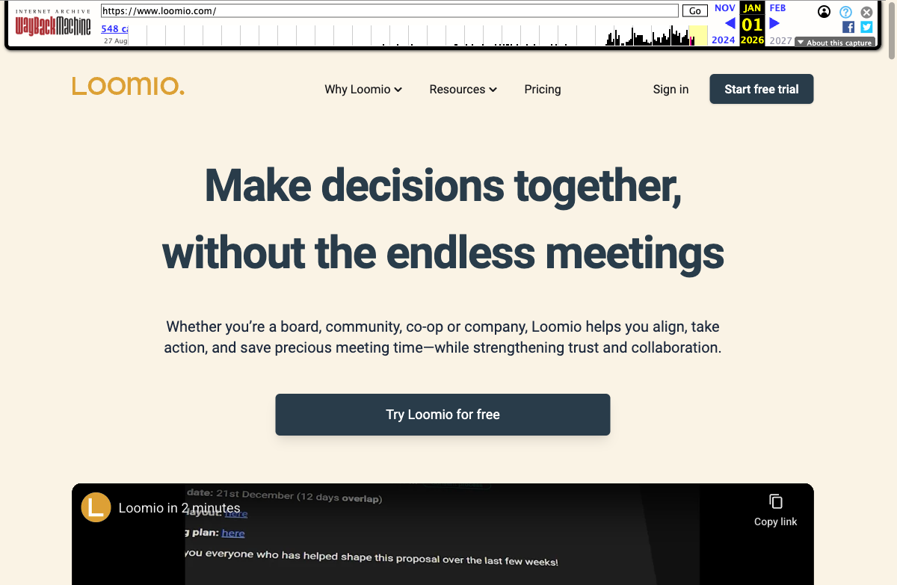

Si votre équipe pratique l'autogestion, la sociocratie ou l'holacratie, vous avez probablement entendu parler de Loomio. C'est une plateforme reconnue pour la prise de décision asynchrone, au service des coopératives, associations et organisations politiques depuis 2012. Mais la prise de décision représente seulement une partie de ce qu'implique la gestion d'une organisation autogouvernée. De nombreuses équipes finissent par réaliser qu'elles ont aussi besoin de clarté sur les rôles, de réunions structurées, d'un suivi des tâches et d'un organigramme visuel reflétant leur fonctionnement réel. C'est là que Rolebase intervient en tant que plateforme de gouvernance complète, allant bien au-delà du vote et des fils de discussion.

## Loomio mérite d'être salué

Loomio est un pionnier dans le domaine des logiciels de prise de décision collaborative. Créé en tant que coopérative en Nouvelle-Zélande, c'est l'un des premiers outils à avoir offert aux organisations distribuées un moyen structuré de discuter, voter et enregistrer des décisions en dehors des emails et du chat. Ses systèmes de vote (consensus, consentement, vote par classement, dot voting, et plus encore) restent parmi les plus flexibles du marché en mars 2026. Des organisations comme le World Resources Institute, OpenSSL et le Parti Vert d'Australie-Occidentale l'utilisent au quotidien. Loomio a gagné sa place dans l'écosystème de l'autogestion, et toute équipe dont le besoin principal est la formalisation de décisions collectives devrait sérieusement l'envisager.

## Pourquoi les équipes cherchent des alternatives à Loomio

Malgré ses qualités, certaines équipes constatent que Loomio couvre seulement une partie de leurs besoins. Voici les raisons les plus fréquentes qui poussent les organisations à explorer d'autres options.

### La prise de décision existe en vase clos

Loomio excelle dans le vote structuré et la discussion, mais il fonctionne comme un outil de décision autonome. Il n'inclut ni organigramme, ni définitions de rôles, ni gestion de réunions. Les équipes qui utilisent Loomio ont toujours besoin d'outils séparés pour savoir qui fait quoi, animer des réunions de gouvernance et suivre les tâches. Cela crée des flux de travail fragmentés où les décisions sont prises à un endroit et l'exécution se fait ailleurs.

Comme le soulignent certains utilisateurs sur Capterra : une fois la décision prise dans Loomio, il faut aller ailleurs pour attribuer les tâches, mettre à jour la structure organisationnelle et assurer le suivi. Pour les équipes autogouvernées où les décisions impactent directement les rôles et les redevabilités, cette déconnexion alourdit le fonctionnement au fil du temps.

### L'interface demande un temps d'adaptation significatif

Selon les avis sur Capterra et G2 (collectés entre 2025 et 2026), les utilisateurs mentionnent fréquemment que l'interface de Loomio est "peu intuitive" et nécessite un temps d'apprentissage. Quand les fils de discussion s'accumulent, la boîte de réception devient envahissante, et les nouveaux membres peinent à s'orienter. Pour les organisations qui valorisent la participation large, cette friction peut réduire l'engagement des personnes les plus concernées.

### Une expérience mobile limitée

Plusieurs utilisateurs ont noté que Loomio fonctionne principalement sur ordinateur. L'interface web mobile est difficile à utiliser sur les petits écrans, et il n'existe aucune application mobile dédiée. Pour les équipes dont les membres sont souvent en déplacement ou travaillent hors d'un bureau, cela peut constituer un véritable frein à la participation.

### Aucune visibilité sur la structure organisationnelle

Les groupes et sous-groupes de Loomio permettent d'organiser les discussions, mais ils ne représentent pas la structure réelle de votre organisation. Il est impossible de visualiser qui occupe quel rôle, quelle est la raison d'être de chaque équipe, ou comment l'organigramme s'articule. Pour les organisations autogouvernées où la clarté sur les rôles et les redevabilités est fondamentale, c'est un manque important.

### Des défis d'engagement à grande échelle

Quand un espace Loomio contient de nombreux fils actifs, la participation peut chuter. Les utilisateurs rapportent se sentir perdus quant à l'endroit où commencer, et des propositions importantes peuvent se retrouver enfouies sous les discussions courantes. Le tableau de bord de la boîte de réception, bien que fonctionnel, peut devenir écrasant lorsque des dizaines de fils sont actifs simultanément.

Sans le contexte structurel des rôles et des réunions, il devient plus difficile de maintenir l'alignement de tous à mesure que l'organisation grandit. Un membre qui occupe trois rôles différents n'a aucun moyen de filtrer les fils Loomio par le rôle auquel ils se rapportent. Tout arrive dans le même flux, rendant difficile la priorisation de ce qui nécessite une attention immédiate.

## Comment Rolebase aborde les choses différemment

Rolebase a été conçu dès le départ pour les organisations autogouvernées qui ont besoin de bien plus qu'un outil de prise de décision. Il réunit gouvernance, réunions, discussions, tâches et organigramme sur une seule plateforme.

### Un organigramme visuel qui apporte de la clarté

L'une des différences les plus marquantes est l'organigramme interactif de Rolebase. Chaque rôle de votre organisation est visible, avec sa raison d'être, son domaine et ses redevabilités clairement définis. Vous pouvez zoomer sur n'importe quelle équipe pour voir ses sous-rôles et ses membres. C'est bien plus qu'un schéma statique : c'est une représentation vivante du fonctionnement de votre organisation, mise à jour en temps réel au fil des décisions de gouvernance. Quatre vues différentes (Tous les rôles, Holarchie, Opérationnel et Membres uniquement) permettent à chacun de voir la structure sous l'angle qui lui convient.

Pour les nouveaux arrivants, l'organigramme sert d'outil d'intégration instantané. Plutôt que de demander autour de soi pour comprendre qui gère quoi, ils peuvent explorer la visualisation interactive et trouver la bonne personne ou la bonne équipe en quelques secondes. L'organigramme peut également être exporté en image PNG pour les présentations ou les documents internes.

### Des réunions qui suivent votre processus de gouvernance

Rolebase intègre un moteur de réunion complet avec des étapes structurées : tour d'inclusion, checklists, indicateurs, revue des tâches et fils de discussion. Les réunions suivent par défaut le format tactique et de gouvernance holacratique, mais vous pouvez personnaliser l'ordre des étapes selon votre pratique. Un minuteur intégré maintient le focus, la prise de notes collaborative se fait en temps réel, et les comptes-rendus sont automatiquement générés et archivés. Au lieu de transférer les décisions de Loomio vers un outil de réunion séparé, tout vit au même endroit.

Vous pouvez planifier des réunions récurrentes, créer des modèles réutilisables et synchroniser le tout avec votre agenda via iCal (compatible Google Calendar, Outlook, et autres). Après chaque réunion, un compte-rendu consultable est archivé pour retrouver facilement ce qui a été discuté, décidé et attribué. Cela s'avère particulièrement précieux pour les équipes qui animent des réunions tactiques hebdomadaires ou des sessions de gouvernance mensuelles.

### Des fils de discussion et sondages rattachés aux rôles

Comme Loomio, Rolebase prend en charge les fils de discussion asynchrones avec mise en forme enrichie et sondages. La différence essentielle est que chaque fil appartient à un rôle spécifique, ce qui lui donne un contexte organisationnel. En ouvrant un rôle dans Rolebase, vous voyez tous ses fils de discussion, tâches, décisions et réunions au même endroit. Les discussions sont ainsi automatiquement organisées par la partie de l'organisation qu'elles concernent.

Les sondages prennent en charge le choix multiple, la répartition de points, le vote anonyme et l'ordre aléatoire des options. Ils fonctionnent bien pour la prise de décision par consentement : vous pouvez créer un sondage avec des options comme "Consentement", "Objection" et "Se retirer" pour mener des tours de consentement formels directement dans un fil.

Les fils progressent à travers des statuts clairs (Préparation, Actif, Bloqué, Fermé) et peuvent inclure des membres supplémentaires d'autres rôles pour la collaboration inter-équipes. Ils sont abordés lors de l'étape Discussions des réunions de rôle, créant un pont naturel entre discussion asynchrone et prise de décision synchrone. Cette intégration garantit que les sujets discutés de manière asynchrone pendant la semaine sont automatiquement revus lors de la prochaine réunion, évitant que des points importants passent à la trappe.

### Des décisions avec une traçabilité de gouvernance

Dans Rolebase, les décisions formelles sont enregistrées au sein du rôle où elles ont été prises. Elles incluent le contexte, la justification et la portée de ce qui a été décidé. Cela crée un journal de gouvernance vérifiable que les nouveaux membres peuvent consulter pour comprendre pourquoi l'organisation est structurée ainsi. Lorsque la gouvernance protégée est activée, les modifications structurelles peuvent être réservées aux leaders de rôle, garantissant que le registre des décisions correspond bien à l'organigramme réel.

### Un tableau de bord et un fil d'actualité pour garder la vue d'ensemble

Rolebase offre à chaque membre un tableau de bord personnel qui affiche les prochaines réunions, les tâches en cours et l'activité récente de ses rôles. Le fil d'actualité de l'organisation remonte les nouvelles décisions, les mises à jour des discussions et les changements de structure, pour que tout le monde reste informé sans devoir consulter chaque rôle individuellement. Les résumés de notifications configurables (quotidiens ou hebdomadaires) permettent de rester dans la boucle sans être submergé par les alertes en temps réel.

### Open source et auto-hébergeable

Loomio et Rolebase sont tous les deux open source, ce qui constitue un avantage considérable par rapport aux alternatives propriétaires. Le code source de Rolebase est disponible sous licence MIT sur GitHub. Vous pouvez l'auditer, le modifier ou l'héberger sur votre propre infrastructure. Pour les organisations qui ont besoin d'un contrôle total sur leurs données, cette flexibilité est essentielle. Les données de Rolebase sont hébergées en Europe (via Nhost), et la plateforme est conforme au RGPD, sans transfert de données en dehors du territoire européen.

## Comparaison des fonctionnalités

Cette comparaison reflète l'état des deux plateformes en mars 2026. Les fonctionnalités peuvent évoluer dans le temps.

| Fonctionnalité | Loomio | Rolebase |
| --- | --- | --- |
| Fils de discussion asynchrones | Oui, avec texte enrichi et chronologie | Oui, avec texte enrichi et contexte de rôle |
| Votes et sondages | Très complet (consensus, classement, dot voting, score, pouce levé) | Choix multiple, répartition de points, anonyme, ordre aléatoire |
| Organigramme visuel | Non | Oui, interactif avec 4 vues |
| Définition des rôles (raison d'être, domaine, redevabilités) | Non | Oui |
| Réunions structurées | Non | Oui, avec déroulé personnalisable par étapes |
| Gestion des tâches | Non | Oui, liées aux rôles et revues en réunion |
| Registre des décisions | Via les résultats de fils | Journal formel de décisions au sein des rôles |
| Intégration calendrier | Sondages de disponibilité | Synchronisation iCal avec Google Calendar, Outlook |
| Collaboration en temps réel | Non | Oui, en réunion et lors de l'édition |
| Open source | Oui (AGPL) | Oui (MIT) |
| Auto-hébergement | Oui | Oui |
| Régions d'hébergement | USA, UE, Australie/NZ | UE (via Nhost) |
| Expérience mobile | Application web optimisée desktop | Application web responsive |
| Notifications | Emails et résumé | Emails de résumé configurables (quotidien/hebdomadaire) |
| Multilingue | 30+ langues avec traduction en ligne | Français et anglais |
| Intégrations chat | Slack, Mattermost, Matrix | Notifications email/Slack pour les tâches |
| Export de données | CSV, HTML, JSON | Organigramme PNG, calendriers iCal |

## Comparaison des tarifs

La question des tarifs est importante, en particulier pour les associations et coopératives qui constituent une grande partie de la base d'utilisateurs des deux plateformes.

**Loomio** (en mars 2026) facture par groupe sur un modèle forfaitaire :

- Starter : 399 $/an (jusqu'à 30 membres)
- Pro : 999 $/an (membres illimités)
- Private Host : tarif sur mesure
- Les associations bénéficient de 25 à 50 % de réduction
- Essai gratuit de 14 jours, aucun plan gratuit permanent

**Rolebase** utilise un modèle par utilisateur :

- Small : Gratuit pour toujours (toutes les fonctionnalités, 5 membres actifs, membres inactifs illimités pour l'organigramme)
- Startup : 5 EUR/mois par utilisateur (jusqu'à 200 membres actifs, 1h/mois de coaching, support prioritaire)
- Enterprise : tarif sur mesure
- Les associations peuvent bénéficier de réductions significatives ou d'un accès gratuit

Le coût total dépend de la taille de votre équipe. Pour une équipe de 30 personnes, le plan Starter de Loomio coûte 399 $/an tandis que le plan Startup de Rolebase reviendrait à environ 1 800 EUR/an (5 EUR x 30 x 12). En revanche, Rolebase remplace plusieurs outils (organigramme, gestion de réunions, suivi des tâches) que les équipes utilisant Loomio doivent généralement payer séparément. En comptant le coût d'un outil de réunion, d'un gestionnaire de tâches et d'une plateforme d'organigramme en plus de Loomio, le tarif par utilisateur de Rolebase représente souvent un coût total de possession inférieur.

Pour les petites équipes qui souhaitent tester, le plan gratuit permanent de Rolebase constitue un avantage concret par rapport à l'essai de 14 jours de Loomio.

## Qui devrait choisir quoi ?

Le bon choix dépend des besoins réels de votre organisation.

**Choisissez Loomio si :**

- Votre besoin principal est le vote formalisé avec des méthodes avancées (classement, dot voting, score)
- Vous êtes une grande organisation de membres (des centaines ou milliers) où l'interaction principale est le vote asynchrone sur des propositions
- Vous disposez déjà d'outils séparés pour les réunions, la gestion des tâches et la structure organisationnelle qui fonctionnent bien
- Vous avez besoin d'un hébergement en Australie ou en Nouvelle-Zélande

**Choisissez Rolebase si :**

- Vous pratiquez l'holacratie, la sociocratie ou une autre forme d'autogestion et avez besoin d'une plateforme couvrant gouvernance, réunions, rôles et tâches ensemble
- La clarté sur qui fait quoi (rôles, redevabilités, organigramme) est aussi importante que la manière dont vous prenez vos décisions
- Vous souhaitez des réunions structurées avec agendas collaboratifs, minuteur et notes automatiques
- Vous avez besoin d'un plan gratuit permanent pour démarrer sans limite de temps
- Vous préférez une solution open source sous licence MIT

**Envisagez d'utiliser les deux si :**

- Vous avez besoin des méthodes de vote avancées de Loomio pour les grandes décisions organisationnelles en complément de la gouvernance quotidienne et de la gestion de réunions de Rolebase

## Effectuer la transition

Si vous utilisez actuellement Loomio et envisagez de passer à Rolebase, la transition est simple. Voici une approche pratique :

1. **Cartographiez votre structure.** Commencez par lister les groupes et sous-groupes que vous utilisez dans Loomio. Ils correspondent généralement aux équipes ou cercles de votre organisation. Dans Rolebase, créez-les en tant que rôles dans l'organigramme, en définissant la raison d'être et les redevabilités de chacun.

2. **Exportez votre historique de décisions.** Loomio permet d'exporter vos données en CSV, HTML ou JSON. Téléchargez cette archive pour pouvoir consulter les décisions passées tout en construisant votre journal de gouvernance dans Rolebase.

3. **Invitez votre équipe.** Ajoutez vos membres dans Rolebase et attribuez-leur les rôles appropriés. Tout le monde verra immédiatement ses responsabilités et celles de ses collègues.

4. **Configurez vos réunions.** Créez des modèles de réunion correspondant à vos pratiques actuelles (réunions tactiques, réunions de gouvernance ou formats personnalisés). Planifiez les récurrences et connectez-les à vos agendas.

5. **Utilisez les fils de discussion.** Migrez vos discussions en cours de Loomio vers les fils Rolebase, en les rattachant aux rôles concernés. Chaque conversation gagne ainsi un contexte organisationnel qu'elle n'avait peut-être pas auparavant.

La plupart des équipes réalisent cette mise en place en un seul après-midi. Rolebase propose également un accompagnement au démarrage : une session de coaching est disponible pour vous aider à structurer votre organisation sur la plateforme, et le plan Startup inclut du temps de coaching mensuel. Vous pouvez aussi importer des structures organisationnelles depuis des outils comme Holaspirit si vous migrez depuis plusieurs plateformes simultanément.

## Conclusion

Loomio et Rolebase répondent à des besoins qui se recoupent en partie tout en étant distincts. Loomio reste un excellent choix pour les organisations dont le défi principal est le vote asynchrone structuré, en particulier les grandes organisations de membres qui ont besoin de méthodes de sondage avancées. Rolebase est conçu pour les équipes qui ont besoin d'une plateforme de gouvernance unifiée où rôles, réunions, discussions, tâches et décisions sont interconnectés au sein d'une structure organisationnelle claire.

Pour les organisations autogouvernées qui ont dépassé les limites d'un outil dédié uniquement à la décision, ou pour les équipes qui débutent leur parcours de gouvernance et cherchent une plateforme unique pour bien faire les choses dès le départ, Rolebase offre une approche complète qui centralise tout au même endroit. Le plan gratuit permanent permet de démarrer sans engagement, et la licence open source garantit que vous gardez toujours le contrôle.
