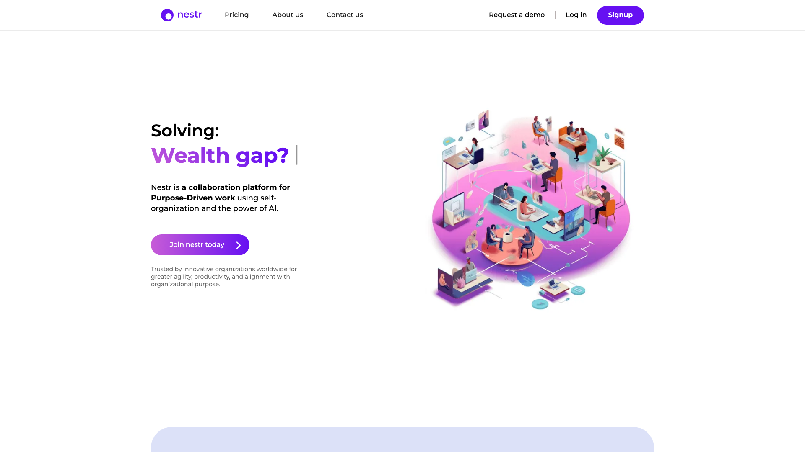

If you are running a self-managed organization and looking for software to support your governance, you have probably come across Nestr. Nestr is a solid platform for purpose-driven teams practicing holacracy, sociocracy, or teal management. But depending on your priorities around transparency, simplicity, pricing, or open source values, it may not be the best fit for your team.

Choosing the right governance tool is a significant decision. It shapes how your team communicates, makes decisions, and evolves its structure over time. The wrong tool can slow adoption, create frustration, and ultimately undermine the very self-management practices you are trying to establish. This article offers an honest comparison between Nestr and [Rolebase](/), so you can make an informed decision based on your team's actual needs.

## What Nestr does well

Nestr deserves recognition for the work they have put into supporting decentralized organizations. Founded in 2016 by Joost Schouten in New Zealand, with Thomas Thomison (co-founder of Holacracy) as a strategic advisor, Nestr provides a comprehensive platform that covers circles, roles, governance proposals, meeting facilitation, project management, and even built-in chat. Their recent investment in AI features and MCP integrations shows genuine ambition to push the self-management tooling space forward. Teams that have adopted Nestr appreciate its broad scope and the depth of its holacracy-specific workflows.

## Why teams look for alternatives to Nestr

Even with its strengths, several patterns emerge among teams exploring other options. Here are some of the most common reasons organizations consider moving away from Nestr.

### A platform that tries to replace everything

Nestr positions itself as a replacement for Slack, Trello, Asana, and other collaboration tools. For some teams, this all-in-one approach creates friction rather than reducing it. Organizations that already have established workflows with tools they love may find themselves forced to adopt Nestr's chat and project management features just to access the governance layer. When a platform tries to do everything, it often means each individual feature receives less attention than a dedicated tool would provide.

This is especially true for teams that have already invested time configuring their existing project management and communication tools. Migrating everything to a single platform means retraining the entire team, losing customizations, and potentially disrupting workflows that were already functioning well. Many self-managed organizations find that the best approach is a focused governance tool that complements their existing stack rather than attempting to replace it.

### Limited ecosystem and community size

As a bootstrapped product with a small team, Nestr has a smaller user community compared to more established alternatives. This means fewer templates, fewer community resources, and a smaller pool of coaches and consultants familiar with the platform. For organizations that want to learn from peers or find external support, a more widely adopted tool can be a significant advantage.

### Closed source and vendor dependency

Nestr is proprietary software. You cannot audit the code, host it yourself, or contribute improvements. For organizations that value transparency as a core principle (which many self-managed organizations do), this creates a philosophical tension. If Nestr changes direction, raises prices, or shuts down, your organizational data and processes are entirely dependent on their decisions.

This matters more than it might seem at first. Your governance tool holds your organizational structure, your meeting history, your decisions, and the accountability framework that your team relies on daily. Being locked into a proprietary platform means trusting a single vendor with some of the most sensitive operational data your organization produces.

### Pricing that scales quickly

While Nestr offers a free tier for up to 5 users, the jump to $6/user/month (Starter) or $10/user/month (Pro) can add up for growing organizations. Features like OKRs, peer feedback, and advanced insights are locked behind the Pro tier. For a 50-person organization, that represents $500/month on the Pro plan, a meaningful budget line for many purpose-driven teams and nonprofits.

### Learning curve for non-holacracy teams

Nestr's roots in holacracy mean the platform's vocabulary and workflows are deeply tied to that specific framework. Teams practicing sociocracy, teal, or their own flavor of horizontal management may find the interface assumes knowledge of holacratic concepts that do not map perfectly to their practice.

## How Rolebase approaches things differently

Rolebase was built with a different philosophy. Instead of trying to replace your entire tool stack, it focuses on doing a few things exceptionally well: org chart visualization, role clarity, structured meetings, and governance.

### Open source transparency

Rolebase is fully [open source under the MIT license](https://github.com/Godefroy/rolebase). This is a fundamental difference that touches everything else. You can read every line of code, verify how your data is handled, contribute improvements, and even self-host your own instance if you prefer. For organizations that practice transparency internally, using a tool that embodies that same value externally feels consistent. Open source also means that if the company behind Rolebase were to disappear tomorrow, your tool and your data would still be yours.

### Simplicity that encourages adoption

One of the biggest challenges when introducing governance software is getting everyone on the team to actually use it. Rolebase takes a deliberate approach to simplicity: a clean interface, intuitive navigation, and features that stay out of your way. Users on Capterra consistently rate Rolebase 4.9/5 for ease of use. Rather than bundling in chat, project boards, and OKR tracking, Rolebase integrates with the tools your team already uses (calendar apps via iCal, email notifications, Slack reminders) and lets you focus the platform on what matters most: who does what, and how decisions are made.

### A dynamic, visual org chart

The org chart in Rolebase is more than a static diagram. It offers four distinct views (All Roles, Holarchy, Operational, and Members only) that let you explore your organization from different angles. You can click into any role to zoom in and see sub-roles, drag to navigate, and switch views instantly. This visual approach makes the organizational structure immediately understandable for every team member, from the newest hire to the most seasoned facilitator.

The "All Roles" view displays the full hierarchy with role sizes reflecting the number of sub-roles and members they contain, giving you a proportional sense of where complexity lives. The "Holarchy" view shows sub-roles at the same size with their members, ideal for holacracy practitioners. The "Operational" view flattens the hierarchy to show all roles at the same level, perfect for cross-functional visibility. And the "Members only" view lets you explore the organization from a people-centric perspective. You can export the org chart as a PNG image for presentations or internal documents, making it easy to share outside the platform.

### Framework-agnostic design

While Nestr leans heavily into holacracy-specific workflows, Rolebase takes a more flexible approach. It provides the building blocks (roles, accountabilities, circles, meetings, decisions) without enforcing a specific methodology. Whether your team practices holacracy, sociocracy, or a custom blend of self-management principles, Rolebase adapts to your way of working rather than requiring you to adapt to its framework. As stated in their FAQ: "We believe a good tool should make life easier without being too restrictive."

This matters because many organizations evolve their governance practices over time. A team might start with elements of sociocracy, gradually incorporate holacratic meeting formats, and develop their own unique decision-making processes. A tool that locks you into one framework becomes a constraint rather than an enabler as your practices mature. Rolebase gives you the freedom to experiment and iterate on your governance model without outgrowing the platform.

### Structured meetings with real-time collaboration

Meetings in Rolebase follow a step-based flow with customizable stages: check-in rounds, thread discussions, checklists, indicators, and more. The built-in timer keeps meetings on track, and collaborative notes update in real time for all participants. Meeting summaries are automatically generated and stored, creating an accessible archive of decisions. Templates let you standardize recurring meetings so preparation time drops to near zero.

Each step type serves a specific purpose. The Tour step allows everyone to share a brief check-in or set intentions. The Threads step lets the team review and discuss active topics with status updates. The Checklist step provides accountability by confirming recurring items since the last meeting. And the Indicators step gives visibility into key metrics. This structured approach means meetings stay focused and productive, which is especially valuable for teams transitioning away from the unstructured meeting culture that often plagues traditional organizations.

Rolebase also integrates with calendar applications through iCal subscription links, so your meetings appear in Google Calendar, Outlook, or any compatible calendar without manual entry. Configurable email digests (daily or weekly) keep everyone informed about upcoming meetings, assigned tasks, and recent activity without requiring them to log into the platform constantly.

## Feature comparison

Here is a side-by-side comparison of key features. This information is accurate as of March 2026 and may change as both platforms evolve.

| Feature | Rolebase | Nestr |
| --- | --- | --- |
| **Org chart visualization** | Dynamic, 4 views, zoomable | Circle/role map |
| **Roles and accountabilities** | Yes, with purpose and domain | Yes, with policies |
| **Governance proposals** | Decisions recorded per circle | Formal proposal workflow |
| **Meeting facilitation** | Step-based with timer and templates | Structured meeting formats |
| **Real-time collaboration** | Yes, during meetings and editing | Yes |
| **Task management** | Tasks linked to roles and circles | Project boards and todo lists |
| **Built-in chat** | No (integrates with Slack) | Yes, circle-based chat |
| **OKRs and KPIs** | No | Pro plan only |
| **Peer feedback** | No | Pro plan only |
| **AI features** | No | AI structure generation, MCP server |
| **Calendar integration** | iCal sync with any calendar app | Yes |
| **Data import** | Yes, including from Holaspirit | Yes |
| **Open source** | Yes, MIT license | No |
| **Self-hosting option** | Yes | No |
| **API access** | GraphQL API | Full API |
| **GDPR compliance** | Yes, EU-hosted servers | Yes |

## Pricing comparison

Pricing as of March 2026. Both platforms may adjust their plans over time.

**Nestr:**
- Personal (Free): Up to 5 users, basic features, todo lists, project boards
- Starter ($6/user/month): Governance proposals, meeting facilitation, circle-based chat, metric tracking
- Pro ($10/user/month): OKRs, peer feedback, insights, SAML, dedicated account manager

**Rolebase:**
- Small (Free forever): All features included, unlimited inactive members for your org chart, up to 5 active members
- Startup (5 EUR/user/month): All features, up to 200 active members, 1h/month coaching, priority support
- Enterprise (Custom): Unlimited guest members, custom consulting, custom integrations

A key difference in the pricing model: Rolebase includes all features at every tier. The only variable is the number of active members and the level of support. You never hit a paywall for a specific feature. Nestr, by contrast, gates several features (OKRs, peer feedback, insights, SAML) behind the Pro tier.

To illustrate the total cost of ownership, consider a 30-person organization:
- **Nestr Starter**: $180/month ($6 x 30), but without OKRs, peer feedback, or advanced insights
- **Nestr Pro**: $300/month ($10 x 30), with all features unlocked
- **Rolebase Startup**: 150 EUR/month (5 EUR x 30), with all features and 1h/month coaching included

Rolebase also distinguishes between active and inactive members. An inactive member is someone represented in the org chart without a user account. This means you can map your entire organizational structure, including roles held by people who rarely need to log in, without paying for their seats. This is particularly valuable for organizations with large volunteer bases, advisory boards, or part-time contributors.

For nonprofits, both platforms offer discounts. Rolebase offers significant discounts or completely free access depending on your status.

The open source option adds another dimension to the comparison. If your organization has technical resources, you can self-host Rolebase at no software cost, paying only for your own infrastructure.

## Who should choose which?

**Choose Nestr if:**
- You want an all-in-one platform that replaces your chat, project management, and governance tools
- Your team follows strict holacracy and you value built-in governance proposal workflows
- You need AI-powered features like automatic organizational structure generation
- OKRs and peer feedback are important to your workflow
- DAO integrations are relevant to your organization

**Choose Rolebase if:**
- Open source and transparency are core values for your organization
- You want a focused governance tool that integrates with your existing tool stack
- Simplicity and fast team adoption matter more than feature count
- You need a framework-agnostic platform that works for holacracy, sociocracy, or custom approaches
- Budget is a concern and you want all features available at every pricing tier
- You want the option to self-host
- Your data must stay in Europe (Rolebase servers are EU-based)

## Making the switch

If you are currently using Nestr and considering a move to Rolebase, the transition is straightforward. Rolebase supports data import from various tools, including Holaspirit and other governance platforms, and its structure (roles, circles, members) maps naturally to Nestr's organizational model. You can start by creating a free account, setting up your org chart, and inviting a small pilot group to test the experience before migrating your full team.

A practical migration path looks like this: start by recreating your organizational structure in Rolebase's free tier. Map your circles, define roles with their purpose, domain, and accountabilities, and assign members. Then invite a pilot circle to run their next few meetings in Rolebase. Once that circle is comfortable, expand to the rest of the organization. This incremental approach minimizes disruption and lets you validate the fit before fully committing.

The biggest adjustment will likely be around features Nestr bundles that Rolebase intentionally leaves to other tools. If your team relies heavily on Nestr's built-in chat, you will want to ensure your Slack or other messaging setup is ready. If you use Nestr's project boards extensively, consider how your team will handle task management (Rolebase offers task tracking linked to roles and circles, which covers many use cases).

## Conclusion

Both Nestr and Rolebase are serious tools built by teams that care about self-management. The choice between them comes down to what your organization values most. Nestr offers breadth, with an ambitious vision of replacing your entire collaboration stack. Rolebase offers depth, clarity, and openness, with a focused approach to governance and a commitment to open source principles.

For teams that prioritize transparency, simplicity, and the ability to own their tools, Rolebase provides a compelling foundation. Its active user community, strong Capterra ratings (4.9/5 for ease of use, 5.0/5 for value for money), and growing ecosystem of organizations ranging from 35-person agencies to 150-person cooperatives demonstrate its viability for real-world self-management.

The best way to decide is to try both. Rolebase is free to start with no credit card required, and the open source codebase means you can evaluate it as thoroughly as you like before committing.
