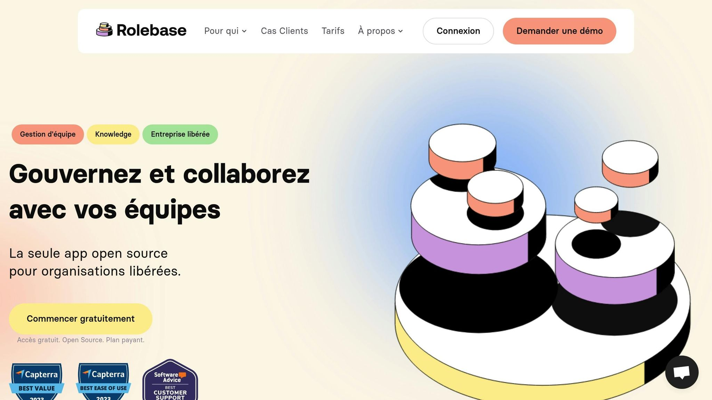

**Consent-Based Decision Making (CBDM)** is a collective decision-making method that finds fast, workable solutions acceptable to everyone, without requiring full unanimity. Here are the key points to understand and apply this approach:

- **Core principle**: A decision is validated as long as no significant objection is raised by participants.

- **Benefits**: Combines speed, inclusion, and active participation from all members.

- **Main steps**:
  - Write a clear proposal (context, need, solution, impact).
  - Gather questions to clarify the proposal.
  - Collect reactions and identify objections.
  - Address objections and turn them into improvement opportunities.
  - Document each decision to ensure transparency.
- **Required roles**: Facilitator, secretary, proposer, circle members.

- **Recommended tools**: Meeting space, whiteboard, timer, collaborative platforms such as **[Rolebase](https://rolebase.io/)**.

### Quick Comparison of Decision-Making Methods:

| Method        | Strengths            | Limitations                |
| ------------- | -------------------- | -------------------------- |
| Autocracy     | Fast decisions       | Limited participation      |
| Majority vote | Partial involvement  | Possible exclusion (49.9%) |
| Consensus     | Highly participatory | Slow and complex at scale  |
| CBDM          | Fast and inclusive   | Requires initial training  |

CBDM is particularly well-suited for modern organizations seeking to balance efficiency and collaboration.

## Sociocracy: Consent-Based Decision Making

<Youtube videoId="2ZEpkukhCq8" />

## Getting Started

A solid preparation is essential to get started with CBDM. Here are the fundamentals to keep in mind.

### Required Team Roles

The success of CBDM relies on well-defined roles that ensure a smooth and efficient process:

| **Role**       | **Responsibilities**                                   | **Required Skills**                |
| -------------- | ------------------------------------------------------ | ---------------------------------- |
| Facilitator    | Manage discussions and guide the process               | Active listening, impartiality     |
| Secretary      | Record decisions and track objections                  | Organization, rigor                |
| Proposer       | Present and clarify proposals                          | Clear and concise communication    |
| Circle members | Actively participate and raise constructive objections | Critical and collaborative mindset |

### Equipment and Software

To run effective meetings, it is important to have the right tools:

- **A meeting space**: whether physical or virtual, it should be comfortable and functional.

- **A whiteboard** or a digital alternative to visualize ideas.

- **A timer**: essential for keeping within allotted time.

- **A collaborative platform**: to centralize decision tracking and exchanges.

A solution like **Rolebase** can prove invaluable. It offers specific features for:

- managing roles dynamically,

- tracking proposals and objections,

- documenting decisions,

- facilitating meetings, whether in-person or remote.

These tools will help you build a solid foundation for productive exchanges.

### Defining Team Objectives

Setting clear objectives is a key step for ensuring the effectiveness of CBDM. Here is how to proceed:

- **Alignment with the mission**: Start by analyzing your organization's strategic direction.

- **SMART formulation**: Make sure your objectives are:
  - _Specific_
  - _Measurable_
  - _Achievable_
  - _Relevant_
  - _Time-bound_
- **Collective commitment**: Involve all team members in this process. Active participation strengthens their buy-in and motivation.

> "Consent is a principle, not a process. Like the informed consent practiced in the doctor-patient relationship, it is based on respect for autonomy, transparency, and the right to self-determination." - Circle Forward

To go further, define precise and measurable key performance indicators (KPIs). For example, instead of aiming for a vague goal like "improve communication," set a concrete target: **"reduce average decision-making time from 5 days to 2 days over the next quarter"**. This allows you to track progress in a tangible and motivating way.

## The Steps of the Consent Process

The Consent-Based Decision Making (CBDM) method follows a well-defined structure, allowing every voice to be heard. Here is how it works.

### Writing the Proposal

A clear and precise proposal forms the foundation of the process. Here are the elements to include:

| Element             | Description        | Concrete Example                                   |
| ------------------- | ------------------ | -------------------------------------------------- |
| **Current context** | Starting situation | "Our average decision-making time is 5 days."      |
| **Need**            | Problem to solve   | "We need to speed up the decision-making process." |
| **Solution**        | Proposed action    | "Organize weekly CBDM meetings."                   |
| **Impact**          | Expected results   | "Reduce decision-making time to 2 days."           |

Once this step is complete, the group moves to the question round to ensure everyone understands the proposal.

### Question Round

In this phase, participants ask questions to clarify the proposal, without entering into debate. The facilitator can guide by asking, for example: _"What information is needed to fully understand this proposal?"_

### Collecting Reactions

Participants' reactions are then gathered to identify diverse perspectives. A few simple rules frame this step:

- Contributions should remain short (no more than five sentences).

- No debate is allowed at this point.

- All reactions are noted without judgment.

This feedback prepares the ground for discussing any objections.

### Handling Objections

Objections are examined to identify potential blockers. An objection is considered valid if it:

- Highlights possible negative consequences.

- Is directly related to the organization's objectives.

- Is supported by factual, concrete arguments.

This structured process helps resolve disagreements quickly while ensuring collective involvement.

### Recording Decisions

Every decision made must be documented accurately. Here are the essential elements to include:

- The final adopted proposal.

- The objections raised and the solutions provided.

- The date scheduled for a potential review.

- The list of participants present during the decision.

Organizations like [Buurtzorg](https://www.buurtzorg.com/), a home care network in the Netherlands with 14,000 employees, have been applying this method for nearly twenty years. Similarly, the 2015 Paris Climate Agreement, signed by 195 countries, was developed following a consent-based process.

> "With consensus, I have to convince you that I am right; with consent, you ask yourself whether you can live with the decision."
>
> - Reijmer, Co-founder of [Sociocratisch Centrum](https://sociocratie.nl/)

## Context for French Companies

In France, companies must integrate CBDM principles while respecting the specificities of their hierarchical and regulatory structures. This requires an adaptation that aligns with the traditional organizational model while encouraging a collaborative approach.

### Working with Existing Hierarchies

To successfully implement CBDM, it is essential to account for traditional hierarchical structures while introducing practices that foster collaboration.

| Aspect              | Traditional Approach   | Adaptation with CBDM                               |
| ------------------- | ---------------------- | -------------------------------------------------- |
| **Communication**   | Top-down               | Structured two-way exchange                        |
| **Decision-making** | Centralized by leaders | Collaborative process with hierarchical validation |
| **Roles**           | Fixed and rigid        | Flexible while respecting established positions    |
| **Documentation**   | Strictly formal        | Formal with shared traceability                    |

Involving senior leaders from the earliest stages is crucial to facilitate this transition. Once this dynamic is in place, it is essential to ensure that all processes comply with French regulations.

### French Standards and Regulations

Integrating CBDM goes beyond internal reorganization. It must also fit within the French legal framework, particularly regarding [data protection](https://www.rolebase.io/privacy) and regulatory compliance.

**Data Protection**

- Comply with the French Data Protection Act (Loi Informatique et Libertés).

- Adhere to the GDPR as well as Law No. 2024-449 of May 21, 2024.

- Appoint a Data Protection Officer (DPO).

**Decision Documentation**

- Ensure secure archiving of meeting minutes.

- Retain documents in compliance with legally mandated retention periods.

During collaborative decision-making processes, personal data must be protected with the utmost rigor. Companies found in breach risk penalties of up to 20 million euros or 4% of their annual global revenue.

For a successful adoption of CBDM, it is recommended to:

- Maintain a high level of formalism in exchanges.

- Allocate sufficient time for analysis and reflection.

- Document every step of the process.

- Train teams in participatory governance methods.

The transition to CBDM takes time and determination. Building strong professional relationships remains a fundamental pillar for ensuring the success of this approach.

## Examples and Results

After laying the foundations of Consent-Based Decision Making (CBDM), let us look at how this method has played out in various professional settings.

### Industry Examples

CBDM has proven effective across various sectors. Take the example of **Buurtzorg**, a Dutch healthcare organization. By adopting CBDM, Buurtzorg managed to increase nurse satisfaction while reducing operational costs, without compromising care quality.

In France, **[Dailymotion](https://www.dailymotion.com/fr)** also demonstrated the value of this method. When 300 employees suddenly shifted to remote work in March 2020, the company successfully adapted its decision-making processes through CBDM. Karine Aubry, Dailymotion's HR Director, summarizes this transition:

> "Dailymotion is no stranger to remote work. We already allow occasional, temporary, and in some cases permanent remote work. But it's like comparing occasional swimming to crossing the English Channel."

These examples show that CBDM can be a powerful tool for tackling a wide range of organizational challenges, including remote work.

### Remote Work Policy Example

The company **[Alan](https://alan.com/en/tags/company-culture/page/2)** illustrates how CBDM can transform remote work management. Alexandre Gerlic, software engineer at Alan, shares his experience:

> "From the start, Alan's decision-making process has been closely tied to two of our company values: radical transparency and distributed ownership. For example, anyone can open a GitHub issue to make a proposal and drive change in an asynchronous and transparent way."

Here are some concrete elements of the work framework established at Alan:

| Aspect                   | Implementation                     |
| ------------------------ | ---------------------------------- |
| **Working hours**        | 35 hours per week with flexibility |
| **Right to disconnect**  | Time slots defined collectively    |
| **Technical support**    | Monthly equipment allowance        |
| **Performance tracking** | Objective-based evaluations        |

This structure fosters a balanced and productive work environment while encouraging collaborative decision-making.

### Measuring Success with [Rolebase](https://rolebase.io/)

Organizations using **Rolebase** to track the impact of CBDM have observed impressive results:

- A **21% increase in profitability** for engaged teams

- A **30% improvement in operational efficiency**

These results rest on three key elements: precise performance indicators, a regular feedback system, and analytical dashboards. These tools allow teams to clearly visualize progress and identify areas for improvement.

The dashboards offered by Rolebase play a central role in the continuous improvement of decision-making practices. They enable teams to track how decisions evolve and guide them toward increasingly effective solutions.

###### sbb-itb-77d9745

## Summary

After an in-depth exploration of the mechanisms and benefits of CBDM, here is a recap of the key points of this collective method, designed to combine transparency and autonomy. The goal is to strike a balance between efficiency and participation, while avoiding the pitfalls of traditional decision-making systems.

### Key Steps for Successful Implementation

- **Preparation**: Before any meeting, it is crucial to present a clear and understandable proposal, respecting the principles of autonomy and transparency.

- **Decision-making process**: The focus is on identifying objections rather than seeking absolute consensus. A proposal is validated when it is deemed sufficient and safe enough to try.

- **Handling objections**: Objections are not seen as obstacles but as opportunities for improvement. Here is how to distinguish and address them:

| Type          | Definition                           | Action                      |
| ------------- | ------------------------------------ | --------------------------- |
| **Objection** | Argument highlighting risks to avoid | To examine as a priority    |
| **Concern**   | Hypothesis without concrete evidence | To note for later follow-up |

### Five Principles for Success

1. Train the team to understand and adopt the method.

2. Start with simple decisions to get familiar with the process.

3. Bring in an experienced facilitator to guide discussions.

4. Establish clear and transparent communication.

5. Conduct regular evaluations to adjust and improve the system.

CBDM is built on a dynamic of continuous improvement, where each objection becomes an opportunity to refine decisions and strengthen team cohesion.

## FAQs

### What are the main advantages of Consent-Based Decision Making compared to traditional corporate decision-making methods?

## The Advantages of Consent-Based Decision Making

The Consent-Based Decision Making method offers several strengths that set it apart from traditional approaches:

- **Involvement of all members**: Every participant has the opportunity to share their objections, making the process more open and collaborative. This ensures every voice is heard.

- **Faster process**: Rather than aiming for absolute consensus, this method focuses on handling objections, which allows decisions to be made more quickly.

- **Collective accountability**: By sharing responsibility for choices made, participants take greater ownership of decisions, strengthening their commitment and involvement.

This method successfully combines productivity with respect for individual opinions, making it a smart choice for teams seeking to blend efficiency with collaboration.

### How can objections be turned into improvement opportunities in Consent-Based Decision Making?

## Consent-Based Decision Making: Turning Objections into Opportunities

In Consent-Based Decision Making, objections are not roadblocks but rather opportunities to improve a proposal. To achieve this, it is crucial to adopt a constructive approach, treating each objection as a valuable contribution. Invite participants to share their concerns clearly and concisely. This helps better understand the issues at hand and, if necessary, adjust the proposal accordingly.

Another key point is knowing how to distinguish relevant objections from those that are not. Concerns that bring real added value should be taken into account to enrich the collective decision. On the other hand, those that lack substance or do not offer a concrete solution can be set aside after discussion. This process creates a [collaborative environment](https://www.rolebase.io/plateforme/diffusion-de-linformation) where everyone feels heard and involved, reinforcing the group's commitment to the final decision.

### What collaborative tools can be used to effectively apply the Consent-Based Decision Making method in an organization?

## Tools for Applying the Consent-Based Decision Making Method

To implement the Consent-Based Decision Making method effectively, it is important to rely on collaborative tools that encourage participation and ensure full transparency. Here are some essential solutions:

- **[Trello](https://trello.com/)** and **[Asana](https://asana.com/)**: These project management tools help structure tasks, track progress, and keep a record of decisions in real time. Their intuitive interface makes team coordination easier.

- **[Miro](https://miro.com/)**: Ideal for visual brainstorming, this tool helps organize and visualize group ideas, making discussions more dynamic and productive.

- **[Loomio](https://www.loomio.com/)**: Specifically designed for collective decision-making, Loomio provides a dedicated space for discussions and votes, simplifying the consent process.

To go further, the resources offered by the **[Université du Nous](http://universite-du-nous.org/)** are an excellent option for deepening your knowledge of shared governance practices.

Integrating these tools into your team can transform your decision-making processes by making them more participatory and fluid, while strengthening the spirit of collaboration within your organization.
