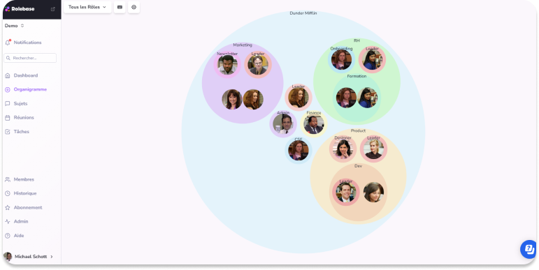

Dans le monde des affaires en constante évolution, il est essentiel pour les entreprises de rester organisées et bien structurées. Un moyen efficace de réaliser cela est de créer un organigramme, également connu sous le nom d'organigramme de l'entreprise. Un organigramme est une représentation visuelle de la structure de l'entreprise, montrant les différents niveaux hiérarchiques, les liens fonctionnels et les rôles et responsabilités de chaque employé. Dans cet article, nous explorerons l'importance d'un organigramme pour votre entreprise et les étapes nécessaires pour en créer un efficace.

## Comprendre l'Importance d'un Organigramme

Avant de plonger dans les détails, il est crucial de comprendre pourquoi votre entreprise a besoin d'un organigramme. Un organigramme offre une vue d'ensemble claire de la structure organisationnelle de votre entreprise, permettant aux employés de comprendre comment ils s'insèrent dans le système et comment leurs contributions contribuent à la réalisation des objectifs de l'entreprise. Voici quelques raisons pour lesquelles un organigramme est si important:

### Pourquoi votre entreprise a-t-elle besoin d'un organigramme?

Un organigramme permet de visualiser la hiérarchie et les fonctions de chaque membre de l'entreprise, ce qui facilite la communication et la collaboration. Il fournit également une structure claire pour le développement des carrières, en permettant aux employés de comprendre les possibilités de promotion et de croissance. De plus, un organigramme aide à maximiser l'efficacité opérationnelle en répartissant les responsabilités de manière équilibrée et en évitant les doubles emplois.

### Les avantages d'un organigramme bien structuré

Un organigramme bien structuré offre de nombreux avantages. Premièrement, il clarifie les responsabilités et rend les employés plus responsables de leurs tâches. Il permet également d'établir des lignes de communication claires, ce qui améliore la coordination et réduit les conflits interdépartementaux. De plus, un organigramme bien conçu aide les nouveaux employés à s'acclimater plus rapidement à l'entreprise en fournissant un aperçu détaillé de la structure de l'organisation. Enfin, il facilite la prise de décision et l'affectation des ressources en identifiant rapidement les personnes compétentes pour chaque tâche.

Un autre avantage d'un organigramme bien structuré est qu'il permet de mieux gérer la croissance de l'entreprise. Lorsque votre entreprise se développe, il est essentiel d'avoir une structure organisationnelle claire pour éviter la confusion et le désordre. Un organigramme vous permet de voir comment chaque département ou équipe s'insère dans l'ensemble de l'entreprise, ce qui facilite la gestion des ressources et des projets.

De plus, un organigramme bien conçu favorise la transparence au sein de l'entreprise. En affichant clairement la hiérarchie et les responsabilités de chaque membre de l'équipe, vous créez un environnement de travail où chacun sait ce qui est attendu de lui. Cela favorise la confiance et la collaboration, car les employés savent à qui s'adresser pour obtenir des réponses ou résoudre des problèmes.

Enfin, un organigramme peut également être un outil précieux pour les processus de planification et de prise de décision. En comprenant la structure organisationnelle de votre entreprise, vous pouvez identifier les lacunes ou les points faibles qui pourraient nécessiter une attention particulière. Cela vous permet de mettre en place des stratégies et des actions correctives pour améliorer l'efficacité et la productivité de votre entreprise.

## Les Éléments Clés d'un Organigramme

Maintenant que vous comprenez l'importance d'un organigramme, il est temps d'examiner les éléments clés qui le composent. Un organigramme efficace doit comporter deux principaux éléments:

### Définir les rôles et responsabilités

Chaque membre de votre entreprise devrait avoir un rôle bien défini et des responsabilités claires. Un organigramme bien structuré doit refléter cela en indiquant les différents postes et en précisant les tâches et les fonctions de chaque employé. Cela permet de réduire les malentendus et d'améliorer la productivité en évitant les chevauchements et les conflits de responsabilités.

Par exemple, dans une entreprise de fabrication de meubles, l'organigramme pourrait montrer que le chef d'atelier est responsable de la supervision de la production, tandis que le responsable des achats est chargé de s'approvisionner en matériaux de qualité. Chaque employé sait ainsi exactement quelles sont ses responsabilités et à qui il doit rendre des comptes.

### Identifier les relations hiérarchiques

Un autre élément clé d'un organigramme efficace est l'identification des relations hiérarchiques. Cela signifie indiquer clairement les niveaux de gestion et les liens de subordination entre les différents postes de l'entreprise. Cela permet aux employés de comprendre leur place dans la chaîne de commandement et de savoir à qui rendre compte.

Prenons l'exemple d'une entreprise de marketing. L'organigramme pourrait montrer que le directeur général est en tête de la hiérarchie, suivi des directeurs des départements de marketing, de vente et de communication. Chaque département est ensuite composé de chefs d'équipe et de membres du personnel. Cette structure hiérarchique claire permet à chaque employé de connaître son supérieur direct et de savoir à qui s'adresser en cas de besoin.

En résumé, un organigramme bien conçu doit définir les rôles et responsabilités de chaque membre de l'entreprise, ainsi que les relations hiérarchiques entre les différents postes. Cela favorise la clarté, la communication et la productivité au sein de l'organisation.

## Étapes pour Créer un Organigramme Efficace

Créer un organigramme efficace pour votre entreprise est un processus qui comporte plusieurs étapes. Suivez ces étapes pour créer un organigramme qui répond aux besoins de votre entreprise:

### Collecter les informations nécessaires

La première étape pour créer un organigramme efficace est de collecter toutes les informations nécessaires. Cela inclut les noms et les fonctions de chaque employé, ainsi que les informations sur les relations hiérarchiques existantes. Vous pouvez utiliser des questionnaires ou des entretiens individuels pour collecter ces informations de manière organisée.

Pour collecter les informations nécessaires, il est important de prendre en compte tous les départements de votre entreprise. Assurez-vous de recueillir les informations de chaque équipe, y compris les employés à temps plein et à temps partiel. Cela garantira que votre organigramme est complet et reflète la structure organisationnelle de votre entreprise de manière précise.

### Choisir le format d'organigramme approprié

Une fois que vous avez toutes les informations requises, vous devez choisir le format d'organigramme approprié pour votre entreprise. Il existe plusieurs types d'organigrammes, tels que les organigrammes en arbre, les organigrammes matriciels et les organigrammes fonctionnels. Choisissez celui qui convient le mieux à votre structure organisationnelle et aux besoins de votre entreprise.

Pour choisir le format d'organigramme approprié, vous devez prendre en compte plusieurs facteurs. Pensez à la taille de votre entreprise, à sa complexité et à la manière dont les informations doivent être présentées. Par exemple, si votre entreprise compte de nombreux départements interconnectés, un organigramme matriciel pourrait être plus adapté. Si votre entreprise est plus petite et a une hiérarchie plus simple, un organigramme en arbre pourrait être suffisant.

### Dessiner l'organigramme

La dernière étape consiste à dessiner l'organigramme. Vous pouvez utiliser des outils de création d'organigrammes spécialisés ou des logiciels de conception graphique pour ce faire. Veillez à ce que votre organigramme soit clair, propre et facile à comprendre. Utilisez des formes et des couleurs pour distinguer différents niveaux hiérarchiques et fonctions.

Lorsque vous dessinez votre organigramme, prenez le temps de réfléchir à la disposition des éléments. Assurez-vous que les relations hiérarchiques sont clairement représentées et que les connexions entre les différents départements sont visuellement évidentes. N'hésitez pas à demander des commentaires à vos collègues ou à d'autres membres de l'équipe pour vous assurer que votre organigramme est facilement compréhensible pour tous.

En conclusion, créer un organigramme efficace pour votre entreprise nécessite de collecter les bonnes informations, de choisir le bon format et de dessiner soigneusement l'organigramme. Suivez ces étapes et vous aurez un outil précieux pour visualiser la structure de votre entreprise et faciliter la communication interne.

## Utiliser des Outils de Création d'Organigrammes

La création d'un organigramme efficace nécessite souvent l'utilisation d'outils spécialisés. Voici quelques outils populaires que vous pouvez utiliser:

### Outils généralistes

Vous pouvez réaliser un organigramme avec Word, Whimsical, Figma, par n'importe quel moyen graphique ou dans certains SIRH. Cependant celui-ci ne sera pas interactif et sa mise à jour sera souvent centralisée vers une seule personne.
Cela constitue un frein pour l'appropriation de celui-ci par vos équipes

### Outil spécialiste

Rolebase a été imaginé comme l'outil facilitant le Role Based Management, l'organigramme et les rôles au sein de votre structure en sont sa clé de voute.

Définissez une raison d'être, un domaine, des indicateurs, redevabilités.

Software engiquoi ? Grâce à ces différents éléments chaque collaborateur peut comprendre le rôle d'un métier ou d'une équipe.

Nous ne voulons pas surcharger vos managers, nos fonctionnalités d'IA leur permettent de gagner un temps précieux pour décrire les différents fonctions de votre entreprise.

Organigramme réalisé avec Rolebase

## Maintenir et Mettre à Jour Votre Organigramme

Un organigramme n'est pas un document statique, mais plutôt un outil évolutif qui doit être maintenu et mis à jour régulièrement. Voici quelques conseils pour maintenir votre organigramme à jour:

### Quand et comment mettre à jour votre organigramme

Mettez à jour votre organigramme chaque fois qu'il y a des changements significatifs dans la structure de l'entreprise, tels que des promotions, des départs ou des nouveaux recrutements. Assurez-vous de communiquer ces changements à tous les employés concernés et de mettre à jour l'organigramme sur les canaux de communication internes de l'entreprise.

### Gérer les changements dans l'organigramme

Lorsque vous apportez des changements à votre organigramme, assurez-vous de tenir compte des implications sur les rôles, les responsabilités et la dynamique d'équipe. Communiquez clairement ces changements aux membres de l'entreprise et fournissez-leur l'assistance nécessaire pour s'adapter aux nouvelles structures ou aux nouvelles responsabilités.

En conclusion, un organigramme bien conçu peut améliorer l'efficacité et la productivité de votre entreprise en clarifiant les responsabilités, en favorisant la communication et en facilitant la prise de décision. Suivez les étapes décrites dans cet article pour créer et maintenir un organigramme efficace pour votre entreprise. Avec un organigramme clair et à jour, vos employés auront une meilleure compréhension de leur rôle et de leur contribution au succès de l'entreprise.

### Créez gratuitement votre organigramme aujourd'hui

Vous pouvez créer gratuitement votre organigramme dynamique avec rolebase !

Pour cela rien de plus simple, il suffit de créer votre espace d'entreprise et en quelques clics vous donnerez forme à celui-ci.

[Je crée gratuitement mon organigramme](https://rolebase.io/signup)
