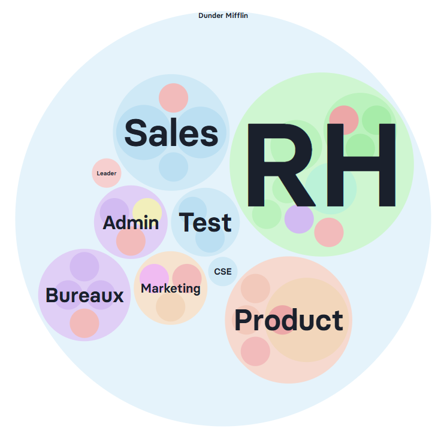

Let's dive into a big piece of what makes self-organised businesses run : its dynamic org chart.

But before we do that, let's look at the things you, as a founder or business owner, want in a high performing organisation :

1. To know YOUR place and where you bring the most value. This means not being sucked into day-to-day operations but focused on setting the vision, being the creative architect and perhaps face of the company, and playing up to your strengths while other people in your team play up to THEIR strengths;This demands clarity on role descriptions for everyone, including you !
2. The entire team to intimately know the company vision and current goals and priorities => you want to keep the team aligned so everyone is rowing in the same direction at all times;
3. At the same time, you want a team that's reactive and even proactive; a team that's able to move around quickly, that can swiftly add new responsibilities, remove old ones, shift people around, disband teams and recreate more relevant ones as the needs arise. You want to be able to set a clear vision, strategy and goals, but also leave the door open for adjustments along the way;
4. Those changes to be communicated instantly so people are acting from the same level of information, and not on outdated info.
5. Information to travel to the right place quickly. Typical information flow in a company tends to be up and down chains of command. This is ineffective and communicates often distorted information;
6. A business that acts on important signals quickly, however weak or strong the signal. This means giving people ownership of their work, i.e. defining and communicating clear decision making perimeters for every role and team;
7. With AI and more and more specialised tools, generalists are becoming more valuable than specialists. So you want a team that's able to be cross-functional, get the big picture quickly and implement wholesome solutions that bring together departments rather than pit them against one another.

A typical hierarchy doesn't satisfy these conditions, and we've written about why that is [​here​](/en/blog/hierarchy-problems).

## The living org chart

Self-organised teams have tackled these very questions by organising themselves not in a top-down or matrix-like way, but in **circles**.

This is inspired from the natural world with each cell, molecule, tissue, organ, being self-organised and self-contained while at the very same time being part of a bigger whole.

So it’s about creating autonomous teams that function symbiotically together to create something that's bigger than the sum of its parts.

Below is what a software business could look like on Rolebase : a series of circles and sub-circles embedded within one another to represent teams and subteams, much like cells embed within molecules and so on.

A SaaS business org chart in Rolebase

## How does this org chart resolve the points above?

1. Teams, sub-teams and roles create**clarity**by expliciting :

- The purpose for why they exist
- Their decision-making perimeter (called domain)
- What they’re accountable for
- Any relevant checklist
- Key indicators they’re responsible for

- Self-managed businesses don't settle for ONE company vision, but allows teams, subteams and even roles to break down that bigger vision into their own sub-vision. This**aligns**the teams towards the common, bigger vision by bringing it closer to the teams and roles.
- The org chart is fully**dynamic**and allows teams and subteams to quickly add, remove or update information as and when they come up. This is done in a couple of clicks.
- Any information that’s been updated is**instantly available**for everyone to see; so people have access to the updated version at any given time.
- This level of clarity on who does what allows team members, especially new ones, to know immediately who to speak to for what. So information flows directly to the right people and helps new people to**onboard quickly**.
- You can define the 'Domain', or decision-making perimeter of each team, sub-team and roles. Rolebase also allows you to**track decisions**: what has been decided on, by whom, when, and in which context.
- In real life, we wear multiple hats : we’re parents, siblings, children, neighbours… Self-organised businesses allow people to have multiple roles across teams. They can thus show up in the places where they add value. This creates a team that understands multiple departments and can develop cross-functional capabilities. It also allows for**unseen work to be seen**by making it visible directly on the org chart.

Here's how it works in practice :

<TellaVideo videoId="vid_cmkntb2pw00qi04lbeypib18x" class="my-5" />

## How to get started

This might seem like a lot to put in place, but the reality it that it can be quite simple.

1. You can start with exactly how your team is now :

- Each team becomes a circle
- Each sub-team becomes a sub-circle

2. Then, you can start filling out what you feel is the most important aspects of your business right now. Our users like to start with filling out the accountabilities of the teams, sub-teams and roles as this clarity that's provided by doing this can be a game-changer. Again, you don't have to fill in all the details. Start with :

- In the accountabilities section : list out the things that the teams, sub-teams and roles are currently doing that are reccurring. You don't have to capture every single detail. Just make sure the rest of the business knows what to expect from the different teams and roles
- Then you can move on to the KPIs for each team, sub-team and roles as this is tied to performance and needs to be visible for all to see
- The domains can be filled out in teams, sub-teams and roles where it's already clear what their decision-making perimeter is. For instance, in the tech team, you can put in the tech stack there. This means that only the tech team can ultimately decide on which tech stack they're using. This doesn't mean they cannot consult other teams when making their decision. It just means that when it comes time to decide, then they're the ones having to make the call.

As you see, you can start small and fill it out as the information gets clearer.

Let us know if you have any questions ! You can go ahead and try rolebase right away, it's free forever for teams of 5 or less, so perfect for a little trial run before you decide to go all in !
