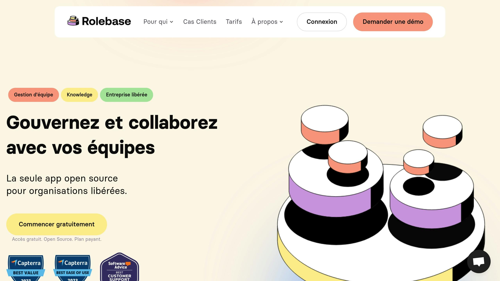
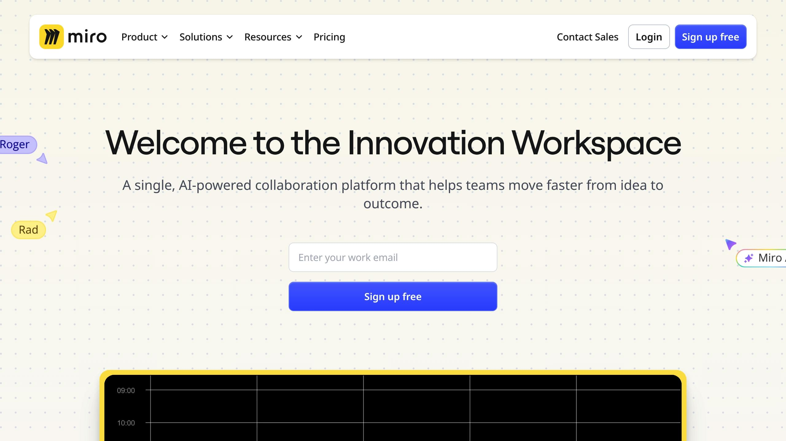
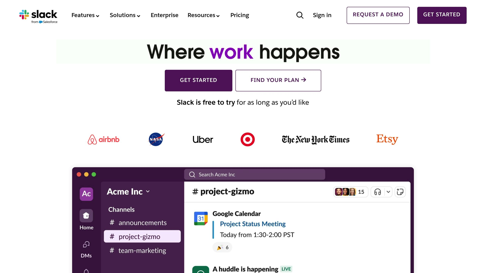
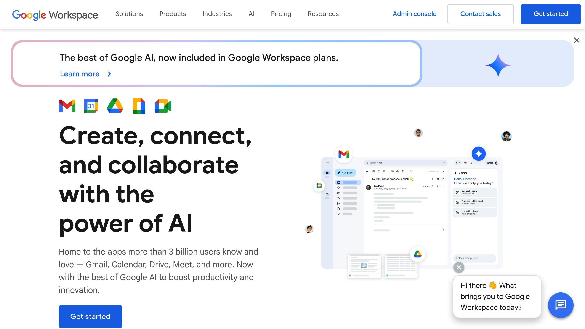
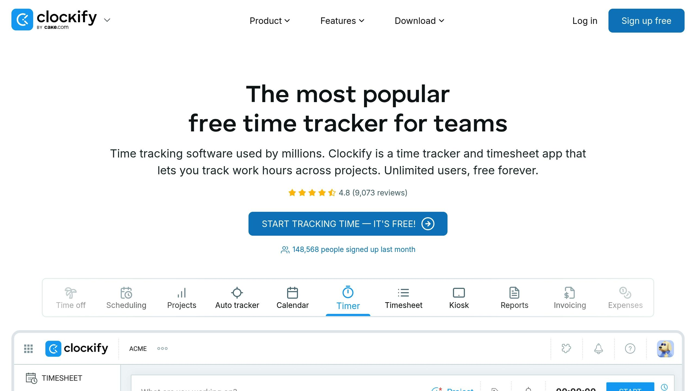

Horizontal teams are increasingly popular for encouraging collaboration and autonomy. But without a traditional hierarchy, they require specific tools to function effectively. Here are the 7 best tools for improving communication, coordination, and decision-making in these teams:

1. **[Rolebase](/)**: An open-source platform for organizing roles, planning meetings, and clarifying responsibilities.

2. **[Trello](https://www.atlassian.com/software/trello)**: A visual board for managing projects through an intuitive kanban interface.

3. **[Miro](https://miro.com/)**: An online whiteboard for brainstorming and visual collaboration.

4. **[Slack](https://slack.com/)**: An instant messaging platform for streamlining communication and structuring discussions.

5. **[Confluence](https://www.atlassian.com/software/confluence)**: A centralized space for documenting knowledge and simplifying sharing.

6. **[Google Workspace](https://workspace.google.com/)**: A collaborative suite for working simultaneously on documents, spreadsheets, and presentations.

7. **[Clockify](https://clockify.me/)**: A time tracking tool for ensuring transparency and organization.

### Quick Tool Comparison

| Tool                 | Primary Function       | Key Strengths              | Starting Price         |
| -------------------- | ---------------------- | -------------------------- | ---------------------- |
| **Rolebase**         | Role organization      | Open-source, free          | Free or premium        |
| **Trello**           | Project management     | Simple visual interface    | Free, from $5/month    |
| **Miro**             | Visual collaboration   | Ideal for brainstorming    | Free, from $8/month    |
| **Slack**            | Instant communication  | Multiple integrations      | Free, from $7.25/month |
| **Confluence**       | Shared documentation   | Centralized information    | Free, from $5.75/month |
| **Google Workspace** | Document collaboration | Real-time editing          | From $6/month          |
| **Clockify**         | Time tracking          | Full-featured free version | Free, from $3.99/month |

These tools are essential for optimizing horizontal team management and boosting their efficiency.

## Collaborative Management with a Horizontal Organization

<Youtube videoId="V2cuOD2h_Oc" />

## 1. [Rolebase](/): Open-Source Platform for Team Organization

Rolebase is an open-source platform that helps organizations adopt a horizontal management approach. It brings together the tools needed for seamless collaboration within teams that operate without a traditional hierarchy. Here are three key features that illustrate its approach.

- **Dynamic Circular Org Charts**

  Teams can visualize their structure through circular org charts, making it easy to quickly understand roles and responsibilities.

- **Role and Responsibility Management**

  Each member has a detailed profile describing their missions, which improves autonomy and ensures a clear distribution of tasks.

- **Meeting Enhancement**

  The platform simplifies meeting planning, decision tracking, and sharing of meeting notes.

Users such as Maxime M. and Dylann C. have highlighted Rolebase's usefulness for clarifying competencies, centralizing decisions, and improving collaborative governance.

Reviews on GetApp confirm the platform's quality with the following ratings:

| Criterion        | Rating |
| ---------------- | ------ |
| Ease of use      | 4.9/5  |
| Features         | 4.9/5  |
| Value for money  | 5.0/5  |
| Customer support | 5.0/5  |

Rolebase offers three options:

- A free version with basic tools

- A guided onboarding plan to get started

- A premium offering that includes personalized coaching

## 2. [Trello](https://www.atlassian.com/software/trello): Visual Project Management Board

Used by more than two million teams, Trello offers an intuitive kanban interface for managing collaborative projects. With its boards, automations, and integrations, it facilitates information sharing and coordination for teams working in a horizontal structure.

**An Intuitive Visual Interface**

Columns represent project stages, and cards can be moved by drag and drop. This simple, visual method allows every team member to quickly understand the status of projects.

**Tools Designed for Teams**

| Feature        | Key Benefit                                       |
| -------------- | ------------------------------------------------- |
| Dashboard View | Balanced task distribution                        |
| Automations    | Elimination of repetitive tasks, automatic alerts |
| Multiple Views | Options like Timeline, Calendar, or Table         |
| Integrations   | Compatible with Slack, Google Drive, Confluence   |

These tools deliver tangible results: 74% of users report better communication within their team, and 75% of organizations see positive effects within the first month.

**User Feedback**

> "Whether employees are in the office, working remotely, or at a client's site, everyone can share context and information through Trello."
>
> - Sumeet Moghe, Product Manager at ThoughtWorks

Jefferson Scomacao, Development Director at IKEA/PTC, shares his experience:

> "We used Trello to clarify stages, requirements, and procedures. It was very useful for communicating with teams that had significant cultural and linguistic differences."

With these testimonials and features, Trello offers pricing options to meet different needs:

**Pricing Options**

- **Free**: up to 10 collaborators per workspace

- **Standard**: $5 per user/month (annual billing)

- **Premium**: $10 per user/month (annual billing)

- **Enterprise**: $17.50 per user/month (annual billing)

## 3. [Miro](https://miro.com/): Online Collaborative Whiteboard

After Trello, here is a tool designed to stimulate creativity and improve visual exchange within teams.

Miro is a visual collaboration platform used by more than **90 million users** and **250,000 organizations** worldwide. It offers a limitless workspace, perfect for encouraging idea sharing and collaboration in teams where hierarchies are less prominent.

### **A Space for Effective Collaboration**

Miro offers a range of visual tools to meet various collaborative needs:

| Feature              | Use Case                                        |
| -------------------- | ----------------------------------------------- |
| Virtual sticky notes | For brainstorming and organizing ideas          |
| Interactive diagrams | For representing complex processes              |
| Pre-built templates  | For design thinking workshops or planning       |
| Voting tools         | For quick collective decisions                  |
| Built-in timer       | For managing collaborative sessions effectively |

### **Faster Decisions**

For teams working horizontally, Miro helps reduce decision timelines. For example, [PepsiCo](https://en.wikipedia.org/wiki/PepsiCo) managed to shorten the time from brief to launch, going from 3 years to just 10 months.

### **Practical Integrations**

Miro connects to more than **160 tools**, such as Google Workspace, Microsoft 365, Confluence, and Jira. These integrations enable real-time synchronization, making teamwork even smoother.

### **Real User Feedback**

> "We use Miro for whiteboarding during meetings, to visualize complex architectures and landscapes, and to collaborate. During meetings where some or all participants are working remotely, Miro provides the best replacement for a real whiteboard that I've found."
>
> - Edward Rousseau, Senior Manager, Deloitte

### **Tips for Getting the Most Out of Miro**

Here are some tips for using Miro effectively:

- Divide the board into well-defined sections.

- Send the agenda before the meeting.

- Encourage participation through different means (audio, chat, drawing).

- Select templates suited to your session's objectives.

With this approach, teams can centralize all information and better understand the choices made. An essential methodology for organizations that favor a horizontal structure.

###### sbb-itb-77d9745

## 4. [Slack](https://slack.com/): Communication and Team Chat Hub

Let's explore Slack, a platform that enhances communication within teams.

### Simplified Communication

Teams using Slack see a 47% increase in their productivity. Thanks to instant messaging, each team member saves an average of **32 minutes per day**. This streamlines exchanges and accelerates decision-making.

### Organized Conversations

Slack provides a clear structure for organizing conversations:

| Channel Type        | Recommended Use                                      |
| ------------------- | ---------------------------------------------------- |
| **Public channels** | Team discussions, announcements, projects            |
| **Direct messages** | Private conversations, sensitive topics              |
| **Topic channels**  | Specific subjects, industry news, social discussions |
| **Slack Connect**   | Collaboration with external partners                 |

This organization encourages transparent and effective communication, essential for teams without a strict hierarchy.

### Key Figures

Slack proves its effectiveness in addressing the challenges of horizontal organizations:

- **700 million** messages exchanged every day

- **87%** of users say Slack improves collaboration

- **90%** feel more connected to their colleagues

### Integrations and Automation

Slack connects to more than **2,600 applications**, such as Google Drive and Office 365. Additionally, its artificial intelligence features save **97 minutes per week** through tools like automatic summaries, advanced search, and automated note-taking.

### Practical Tips

- **Organize your channels**: Create dedicated spaces by project or team for better transparency.

- **Manage your notifications**: Enable "Do Not Disturb" mode to stay focused during important tasks.

### Impact on Company Culture

According to a TINYpulse study, **80% of employees** want to better understand decision-making processes. Jay Vasquez, CIO of [Marriott International Hotels](https://en.wikipedia.org/wiki/Marriott_International), summarizes the importance of Slack:

> "The central notification layer that powers up our teams."

## 5. [Confluence](https://www.atlassian.com/software/confluence): Collaborative Knowledge Base

### A Single Source of Truth

Confluence is an ideal solution for centralizing team knowledge. Did you know that only 4% of companies systematically document their processes? This platform provides a centralized space where all information is accessible by default, simplifying collaboration.

### Clear and Effective Organization

With Confluence, you can structure your knowledge by creating dedicated spaces for each team, department, or project. This organization makes it easier to find information and avoids duplication.

### A Direct Impact on Productivity

Confluence plays a key role in optimizing collaborative work. In fact, 96% of users appreciate its numerous integrations. These features save time and improve coordination between teams.

### User Testimonial

> "Confluence has given us a centralized place for all teams and departments to document, track, and collaborate within and across Nextiva."
>
> - Josh Costella, SR Solutions Specialist, Nextiva

### Tips for Optimal Use

Here are some tips to get the most out of Confluence:

- Set up well-structured spaces and use labels to organize your content.

- Use the 'Expand' option to keep pages lightweight while maintaining important information accessible.

### Practical Integrations

Confluence integrates seamlessly with tools like Microsoft Teams. For example, teams can receive real-time notifications about page changes or new comments, improving responsiveness.

### Expert Recommendation

> "Keep it simple, keep it beautiful! You may think that when it comes to your Confluence pages, the design is not a big deal. I'll reveal the secret: the design is a big deal. Give users a clean, easy-to-navigate view and they will embrace it right away."
>
> - Teodora V, Atlassian Community Leader

## 6. [Google Workspace](https://workspace.google.com/): Document Collaboration Suite

### A Centralized Platform for Working Together

Google Workspace provides an integrated work environment that simplifies collaboration between teams. With tools like Google Docs, Sheets, and Slides, up to 100 people can work simultaneously on the same document.

### Practical Collaborative Tools

With Smart Canvas, collaboration becomes even smoother thanks to features like:

- @ mentions

- Integrated task lists

- File sharing directly in context

These tools enable better coordination within teams while adapting to horizontal work structures.

### Access Control and Enhanced Security

Google Workspace offers detailed options for managing access rights. Users can define who can edit, comment, download, or simply view a document. This level of control ensures secure and effective collaboration.

### Hybrid Work and Online Meetings

According to a recent study, 72% of professionals believe that virtual meetings promote better inclusion and participation. This highlights the importance of planning these meetings well to optimize their impact.

| Plan                     | Monthly Price per User\* | Storage per User |
| ------------------------ | ------------------------ | ---------------- |
| Business Starter         | $6                       | 30 GB            |
| Business Standard        | $12                      | 2 TB             |
| Business Plus            | $18                      | 5 TB             |
| Enterprise               | Custom pricing           | Pooled storage   |
| \*with annual commitment |                          |                  |

### Expert Opinion

> "Written communication is essential for us, and we use Google Docs extensively. For example, we create highly structured documents for meetings, which allows everyone to collaborate and add notes in real time." - Dave Stott, Chief Information Officer, OXA

### Connections with Other Tools

Google Workspace integrates easily with complementary solutions. For example, its combination with Happeo can increase suite adoption by 13%. This creates a complete digital environment, ideal for collaborative teams.

### Tips for Effective Collaboration

To maximize the benefits of Google Workspace, prioritize asynchronous collaboration for tasks that do not require immediate responses. Also use shared calendars in Google Calendar to align expectations before, during, and after each meeting.

## 7. [Clockify](https://clockify.me/): Time Tracking for Teams

### A Clear Solution for Time Tracking

Clockify offers a comprehensive tool for tracking the working hours of horizontally structured teams. With a 95% customer satisfaction rate and an average rating of 4.8/5 based on more than 9,000 reviews, this tool has established itself as a reference for effective team time management.

### Practical Tools for Horizontal Teams

The **Team Dashboard** provides a real-time view of each member's activities. This fosters total transparency, encouraging accountability and self-organization, which are key factors in this type of structure.

| Feature          | Description                           |
| ---------------- | ------------------------------------- |
| Time tracking    | Real-time tracking or manual entry    |
| Timesheets       | Weekly view of hours worked           |
| Activity reports | Detailed analyses by project and user |
| Leave management | Absence tracking and request approval |

### Affordable Pricing

Clockify offers a generous free version, ideal for getting started, as well as paid plans starting at $3.99 per user per month (annual billing). This allows teams of all sizes to easily access professional tools.

### Multiple Integrations

The platform integrates with more than 80 popular web applications, including:

- **Project management tools**: Trello, Asana, Jira

- **Collaborative platforms**: Slack, Microsoft Teams

- **Office suites**: Google Workspace

### User Testimonial

> "Clockify has been an essential tool for our team in daily time tracking." - Camille Ang, Entrepreneur

### Tips for Optimal Use

To get the most out of Clockify, schedule weekly check-ins where each member can share their progress. This helps maintain good momentum and strengthens collaboration within the team.

### Security and Access Management

Clockify offers advanced options for controlling access rights, such as:

- Creating custom roles

- Setting up separate work groups

- Managing project-specific permissions

- Ensuring the accuracy of tracked data

These features enable secure usage tailored to the varied needs of organizations.

## Conclusion

The right tools play a key role in the success of horizontal teams. With the digital transformation of organizations, it is crucial to have solutions that facilitate collaboration and encourage collective engagement.

### Impact on Productivity

The numbers speak for themselves: teams using Slack save an average of **97 minutes per week**, contributing to a **47% improvement in their performance**.

### How to Choose the Right Tools?

To select the most suitable tools, three main criteria stand out:

| Criterion         | Importance | Impact                                                                                  |
| ----------------- | ---------- | --------------------------------------------------------------------------------------- |
| **Communication** | Essential  | Reduction in time spent on emails, which account for approximately 28% of working hours |
| **Collaboration** | Critical   | 87% of users report better collaboration                                                |
| **Transparency**  | Vital      | Improved information sharing and organizational clarity                                 |

These criteria also help structure effective implementation practices.

### Tips for a Successful Rollout

> "Holacracy is a system that supports accountability and cooperation, serving the organization's purpose." - Bernard-Marie Chiquet, founder of iGi

To succeed in transitioning to horizontal management, encourage autonomy and initiative within teams.

### An Inspiring Example

Take Google: through tools like Google Meet and Chat, the company has managed to **accelerate decision-making** and **strengthen collaboration across departments**.

### A Vision for the Future

A centralized document can become a strategic asset. It allows you to track and regularly adjust processes to ensure continuous improvement. This ensures your teams are always moving in the right direction.
