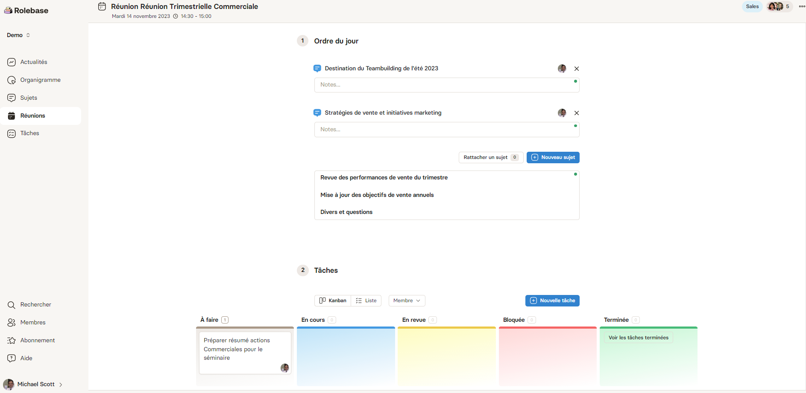

Les comptes rendus de réunions dans les entreprises sont un élément essentiel de la gestion et de la communication organisationnelles. Ces documents servent de registre officiel des discussions et des décisions prises, jouant un rôle crucial dans la préservation de la continuité et de la clarté au sein de l'entreprise. Ils garantissent que toutes les parties prenantes, qu'elles aient assisté ou non à la réunion, ont accès aux mêmes informations et comprennent les actions convenues.

Dans cet article nous allons vous montrer comment rédiger des comptes-rendus de réunions efficaces et mieux encore : comment faire pour que cela ne vous prenne pas de temps additionnel.

## Le Rôle Vital des Comptes Rendus de Réunions : Un accès rapide à l'information

### Le rôle de documentation interne

Les comptes-rendus de réunions sont extrêments importants pour la documentation interne. Ils peuvent servir de ressource pour l'onboarding des nouveaux employés et comme référence pour les audits ou revues de processus.

En effet, les comptes rendus de réunions ne se limitent pas seulement à l'onboarding des nouveaux employés, bien que cela représente une application clé. Ils servent également de ressource précieuse dans de nombreux autres contextes au sein d'une entreprise. Par exemple, lorsqu'un employé doit s'absenter pour une période prolongée ou quitter définitivement l'organisation, ces documents fournissent un historique complet des discussions et des décisions qui ont été prises, permettant ainsi une transition et une continuité fluides des projets en cours.

En outre, les comptes rendus offrent une base fiable pour la prise de décision et la planification stratégique. Ils permettent aux dirigeants et aux gestionnaires de suivre l'évolution des idées et des stratégies au fil du temps, facilitant ainsi l'évaluation des performances et la prise de décisions éclairées. De plus, en cas de désaccord ou de confusion sur une direction prise par l'équipe, le compte rendu sert de référence objective pour clarifier les malentendus et confirmer les engagements.

Les comptes rendus de réunions jouent aussi un rôle crucial en matière de gouvernance d'entreprise. Lors des audits ou des revues de processus, ils fournissent une preuve documentée des actions et décisions de l'entreprise, ce qui est essentiel pour démontrer la conformité aux réglementations et aux meilleures pratiques de l'industrie.

De plus, ces documents aident à maintenir l'ensemble de l'équipe informée et engagée. Ils garantissent que même les membres qui n'ont pas pu assister à une réunion spécifique sont au courant des développements récents et peuvent contribuer de manière significative aux discussions et aux initiatives futures.

### Le cas des entreprises Hybrides et Full Remote

Dans les entreprises hybrides et full remote, les comptes rendus de réunions revêtent une importance capitale, jouant un rôle crucial dans le maintien de la communication, de la cohérence et de la productivité. Dans ces environnements où les interactions en personne sont limitées ou inexistantes, les comptes rendus servent de ponts essentiels pour assurer que tous les membres de l'équipe, qu'ils soient au bureau ou à distance, restent informés et alignés sur les objectifs communs.

La rapidité de l'accès à l'information est essentielle, mais souvent entravée par des créneaux de travail profond où les interruptions sont minimisées.

C'est là que les comptes rendus de réunions prennent toute leur importance. Ils permettent d'accéder rapidement et de manière autonome aux informations clés sans avoir à interrompre un collègue.

Un système d'archivage d'informations facilite l'autonomie dans la prise de décision et la mise en œuvre rapide des idées. Il aide à surmonter les défis liés à la communication asynchrone typique des environnements hybrides et full remote, assurant que les membres de l'équipe peuvent progresser efficacement, même en l'absence de réponses immédiates de leurs collègues.

A l'inverse, un accès lent à l'information peut pousser une idée à être abandonnée ou repoussée plutôt que d'être directement mise en place. Ce serait dommage.

Ainsi, les comptes rendus deviennent un outil vital pour maintenir la dynamique et l'efficacité au sein des équipes dispersées géographiquement.

### La diffusion de l'information contre l'effet silo

Les comptes rendus de réunions jouent un rôle crucial dans la lutte contre l'effet silo dans les entreprises. En mettant à disposition des informations précieuses sur les différents aspects d'un projet, ils favorisent la transversalité et la collaboration entre les départements. Ces documents aident à décloisonner l'information, permettant à chaque équipe de comprendre non seulement leur contribution mais aussi comment leur travail s'intègre dans le cadre plus large de l'organisation.

En facilitant l'accès aux informations cruciales, les comptes rendus contribuent à une meilleure compréhension des objectifs et des stratégies globales. Cela devient particulièrement pertinent dans des contextes où les équipes travaillent de manière isolée ou à distance. En disposant d'un compte rendu bien structuré, chaque membre de l'équipe peut facilement suivre l'évolution du projet, comprendre les décisions prises et identifier les prochaines étapes, sans dépendre de réunions supplémentaires ou de communications informelles.

De plus, dans les situations où des décisions doivent être réévaluées ou des erreurs corrigées, les comptes rendus fournissent une base factuelle pour analyser ce qui a été décidé précédemment. Ils servent alors de point de référence pour rectifier le tir, optimiser les processus et prendre de meilleures décisions à l'avenir.

En résumé, les comptes rendus de réunions sont un outil puissant pour promouvoir une culture d'entreprise où l'information circule librement et efficacement. En brisant les barrières de communication et en offrant une vision claire et partagée, ils jouent un rôle essentiel dans la création d'environnements de travail plus intégrés, transparents et efficaces.

## Comment rédiger un bon compte rendu de réunion

La rédaction d'un bon compte rendu de réunion est un élément essentiel pour assurer son utilité. Voici comment s'y prendre pour rédiger un compte rendu pertinent et actionnable.

### Comprendre l'Objectif du Compte Rendu

Un bon compte rendu de réunion doit capturer l'essence des discussions, les décisions prises, et les actions à entreprendre. Son but est de fournir un résumé clair et concis qui puisse servir de référence pour les participants, absents et futurs partie-prenantes.

#### Avant la Réunion: Préparation

1. **Connaître l'Ordre du Jour**: Avant la réunion, familiarisez-vous avec l'ordre du jour. Cela vous aidera à comprendre les sujets à couvrir et à structurer vos notes en conséquence.
2. **Choisir le Bon Format**: Décidez si vous utiliserez un format structuré (avec des sections prédéfinies) ou un format plus libre. Cela dépendra souvent du type de réunion et des préférences de votre organisation.

#### Pendant la Réunion: Prise de Notes Efficace

1. **Notez les Points Clés**: Concentrez-vous sur les idées principales, les décisions prises, et les actions assignées. Il n'est pas nécessaire de retranscrire mot pour mot.
2. **Identifier les Intervenants**: Notez qui a dit quoi, surtout lorsqu'il s'agit de décisions ou de commentaires importants.
3. **Clarifier les Doutes**: N'hésitez pas à demander des éclaircissements si un point n'est pas clair.

#### Après la Réunion: Rédaction du Compte Rendu

1. **Structurez le Document**: Commencez par l'en-tête (nom de l'entreprise, date, heure, lieu, participants), suivi de l'ordre du jour, des points discutés, des décisions prises, et des actions à entreprendre.
2. **Clarté et Concision**: Soyez clair et concis. Utilisez des phrases courtes et directes pour faciliter la compréhension.
3. **Actions et Responsabilités**: Mettez en évidence les tâches assignées et les échéances. Indiquez clairement qui est responsable de quoi.
4. **Vérification et Correction**: Relisez le compte rendu pour corriger les erreurs et vous assurer que toutes les informations importantes sont incluses.

#### Conseils Supplémentaires

- **Utilisez des Bullet Points**: Pour plus de clarté, organisez les informations sous forme de listes à puces.
- **Inclure des Annexes**: Si des documents ou présentations ont été partagés pendant la réunion, référencez-les ou joignez-les au compte rendu.
- **Diffusion Rapide**: Envoyez le compte rendu aux participants et aux absents dès que possible après la réunion.

#### L'Importance du Suivi

- **Suivi des Actions**: Assurez-vous que les actions décrites dans le compte rendu sont suivies. Cela peut impliquer de collaborer avec les gestionnaires de projet ou les chefs d'équipe.

Un bon compte rendu de réunion est un outil de communication essentiel. Il garantit que tous les participants, présents et absents, sont sur la même longueur d'onde et conscients des décisions prises et des actions à entreprendre. En suivant ces étapes et conseils, vous pouvez rédiger des comptes rendus de réunion qui sont non seulement informatifs mais aussi facilitent la gestion et le suivi des projets au sein de votre organisation.

## L'Archivage et la Gestion des Comptes Rendus : Bonnes pratiques pour bien les retrouver

L'archivage et la gestion efficaces des comptes rendus de réunions sont cruciaux pour toute organisation. Ils garantissent non seulement que les informations sont facilement accessibles pour référence future, mais aussi qu'elles sont sécurisées et organisées. Voici des bonnes pratiques pour archiver et gérer les comptes rendus de manière efficace.

### Comprendre l'Importance de l'Archivage

Un archivage adéquat des comptes rendus permet de retrouver rapidement des informations clés, aide à la prise de décision informée, et assure la conformité aux normes de gouvernance et d'audit. Il facilite également le transfert de connaissances au sein de l'entreprise.

#### Préparation et Organisation

1. **Standardisation des Formats**: Utilisez un format standard pour tous les comptes rendus pour assurer la cohérence. Cela simplifie la recherche et la comparaison des documents.
2. **Nommer les Fichiers de Manière Logique**: Adoptez un système de nommage clair, par exemple, "CompteRendu_Reunion_Ventes_20230321".
3. **Utilisation de Métadonnées**: Inclure des métadonnées telles que la date, le sujet, les participants, et les mots-clés peut grandement faciliter la recherche de documents spécifiques.

#### Choix d'un Système de Stockage

- **Systèmes Cloud vs Locaux**: Choisissez entre un stockage cloud (comme Google Drive, SharePoint ou Notion) et un stockage local en fonction des besoins en sécurité et accessibilité de votre organisation.
- **Accès et Sécurité**: Assurez-vous que les comptes rendus sont accessibles aux personnes concernées tout en garantissant la sécurité des données.

#### Processus d'Archivage

- **Archivage après la Réunion**: Archivez le compte rendu immédiatement après la réunion pour éviter les pertes ou les oublis.
- **Catégorisation et Indexation**: Catégorisez et indexez les comptes rendus par projet, département ou type de réunion pour un accès rapide.

#### Accessibilité et Partage

- **Politique de Partage**: Définissez une politique claire pour le partage des comptes rendus. Qui peut les consulter ? Qui peut les modifier ?
- **Intégration aux Outils de Travail**: Intégrez l'accès aux comptes rendus dans les outils de travail quotidiens pour faciliter leur consultation.

#### Formation et Sensibilisation

- Formez les employés sur l'importance de l'archivage et les meilleures pratiques pour assurer une gestion efficace.

#### Révisions et Audits Réguliers

- Effectuez des audits réguliers pour s'assurer que les pratiques d'archivage sont toujours adéquates et que les informations sont à jour.

## Une solution clé en main pour vos comptes rendus de réunions

La mise en place de nouveaux process demande toujours un certain effort à la fois de la part des leaders ainsi que de l'ensemble de l'entreprise.

En effet, un process non adopté ne génère aucune valeur. Au contraire il génère des frustrations vis-à-vis de l'échec de son implémentation.

### Simplification du rituel de réunion & nourrir automatiquement la documentation

Pour nourrir efficacement sa documentation avec des comptes-rendus de réunion vous l'avez vu il faut cocher un certain nombre de cases.

Aujourd'hui sur Notion, Google Drive ou Sharepoint il est impossible d'être omniscient et un nombre conséquent de documents se retrouvent donc orphelins caché dans un espace sans que les personnes en ayant besoin puissent les trouver facilement.

Si l'on y réfléchi, si l'on doit demander à une ou plusieurs personnes où trouver une information. La gestion de la documentation n'est pas efficace.

Avec Rolebase chaque réunion est structuré autour d'un ordre du jour modulable, d'échanges collaboratifs et de synthèses. Les thématiques bénéficient d'une discussion spécifique, pouvant être intégrée aux délibérations.

L'objectif de cette architecture est de simplifier au maximum les process afin de valoriser le temps des équipes, les encourageant à se focaliser sur leur domaine de prédilection.

### L'Intelligence Artificielle pour vous faire gagner du temps

Avec Rolebase il est extrêmement simple de mettre en place des comptes-rendus de réunion sans nécessiter de temps supplémentaire (tout est déjà intégré à la réunion).

Pourquoi rédiger vos comptes-rendus quand l'IA peut le faire pour vous ?

Une fois la réunion terminée avec les notes prise par ses participants, il vous suffit d'appuyer sur le bouton "générer automatiquement" afin de produire un compte rendu de réunion avec l'IA !

Voici le compte-rendu généré pour la réunion ci-dessus.

Vous pouvez l'éditer pour y ajouter ou enlever des informations.

Ensuite celui-ci sera facilement trouvable avec la recherche Rolebase.

**En résumé Rolebase est la solution simple et intuitive vous permettant de mettre en place une culture de l'écrit globale où chacun peut retrouver tous les éléments l'aidant à effectuer ses missions !**

[Je demande une consultation gratuite avec un expert](/fr/contact)
