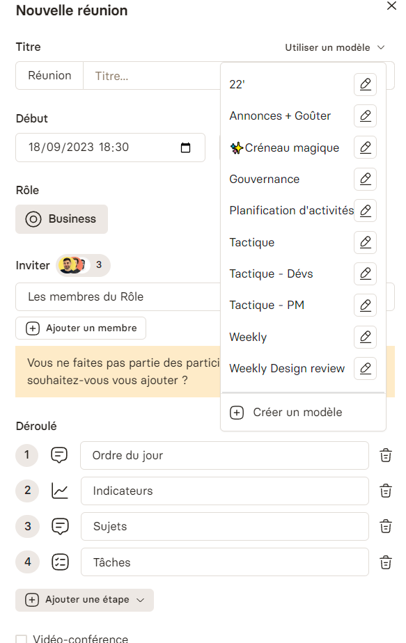

La réunionite est un problème qui afflige de nombreuses entreprises aujourd'hui. Si vous avez déjà vécu une semaine ponctuée de plus de 20 heures de réunions, vous comprenez à quel point cela peut devenir un véritable cauchemar, en particulier lorsque vous cherchez à vous immerger dans des tâches nécessitant de la concentration.

Il est prouvé qu'il faut en moyenne 23 minutes pour se reconcentrer après une distraction, ce qui rend les interruptions fréquentes des réunions encore plus préoccupantes.

Dans cet article, nous explorerons en profondeur la réunionite, d'où elle puise ses sources en entreprise, pourquoi les entreprises doivent aménager intelligemment contre et nous vous donnerons nos cinq conseils pratiques pour la combattre.

## Le Fléau de la Réunionite

La réunionite, un fléau qui peut sembler mineur à première vue, est en réalité un problème considérable dans de nombreuses entreprises. Elle est le reflet d'une surabondance de réunions non productives qui ont tendance à devenir la norme dans de nombreux environnements de travail. Cela peut sembler anodin, mais les coûts associés à ce phénomène sont tout sauf négligeables.

Philippe Silberzahn, chercheur à l'École polytechnique et spécialiste des transformations d'entreprises confrontées à l'incertitude et à la rupture, a apporté une lumière bienvenue sur l'ampleur de la réunionite. [Ses recherches et observations ont mis en évidence](https://philippesilberzahn.com/2022/10/03/comment-ne-pas-lutter-contre-la-reunionnite/) à quel point de nombreuses entreprises peinent à trouver des solutions efficaces pour atténuer ce fléau.

Ce problème revêt une importance encore plus significative lorsqu'on le considère sous l'angle des coûts associés. Il est directement lié à un centre de dépenses majeur au sein des organisations : les ressources humaines. Pour avoir une idée de l'impact financier de la réunionite, prenons un exemple concret : une entreprise avec 200 employés, où chaque employé passe en moyenne 2 heures en réunion chaque semaine. [Le coût de ces réunions inefficaces s'élève à plus d'un million d'euros pour l'entreprise à la fin de l'année](https://www.welcometothejungle.com/fr/articles/chiffres-chocs-reunion). Imaginez ce que cette somme pourrait représenter si elle était investie de manière plus judicieuse dans des projets ou des initiatives bénéfiques à l'entreprise.

Il est essentiel de prendre conscience de l'ampleur des dépenses liées à la réunionite et de l'impact négatif qu'elle peut avoir sur la rentabilité et la productivité globale de l'entreprise. Ces coûts vont bien au-delà des heures passées en salle de réunion. Ils englobent également les opportunités perdues, les retards dans les projets, la frustration des employés, et la diminution de l'efficacité opérationnelle.

## Les Causes Profondes de la Réunionite

Philippe Silberzahn a identifié deux causes profondes qui alimentent la réunionite :

### 1. La Peur de l'Échec

La peur de l'échec est l'une des causes profondes les plus prégnantes de la réunionite en entreprise. Elle repose sur une idée en apparence rationnelle : les réunions sont un moyen de s'assurer que l'équipe communique suffisamment pour éviter de se lancer dans un projet qui pourrait potentiellement mener l'entreprise droit dans le mur. Dans cette optique, les membres de l'équipe se réunissent fréquemment pour discuter en détail des différentes facettes du projet et pour prendre des décisions collectives.

Cependant, cette approche, bien qu'intentionnée, peut avoir des effets pervers sur l'efficacité globale. En réalité, la surabondance de réunions peut ralentir les progrès et entraver la productivité. Voici pourquoi :

Tout d'abord, les réunions consomment un temps précieux. Les heures passées en réunion sont autant d'heures perdues pour effectuer des tâches réelles. Les interruptions fréquentes dues aux réunions fragmentent la journée de travail, ce qui nécessite des périodes plus longues pour se replonger efficacement dans des tâches complexes, comme l'[indique la recherche qui suggère qu'il faut en moyenne 23 minutes](https://www.ics.uci.edu/~gmark/chi08-mark.pdf) pour retrouver une concentration optimale après une distraction.

Ensuite, la multiplication des réunions peut entraîner une répartition inégale du temps et de l'attention. Les projets qui requièrent une attention particulière et une réflexion approfondie peuvent être relégués au second plan en faveur de réunions moins cruciales. Cela peut créer un déséquilibre dans la gestion du temps et de l'énergie, avec des conséquences néfastes sur la qualité du travail accompli.

De plus, les décisions prises lors de réunions peuvent parfois être influencées par des considérations politiques ou émotionnelles plutôt que par des critères strictement basés sur des données et des faits. Cette dynamique peut entraîner des prises de décisions sub-optimales ou faire avancer des projets dans la mauvaise direction.

Ce sentiment de frustration et de perte de temps généré par des réunions excessives peut avoir un impact négatif sur la motivation et l'engagement des employés. Ils peuvent se sentir moins valorisés et moins investis dans leur travail, ce qui peut entraîner une diminution de la productivité et de la satisfaction au travail.

Enfin la peur de l'échec, bien qu'elle puisse sembler une justification valable pour organiser des réunions fréquentes, peut avoir des conséquences délétères sur l'efficacité et la productivité en entreprise. Il est essentiel de trouver un équilibre entre la communication nécessaire pour éviter les erreurs et les méfaits de la réunionite. Les solutions doivent viser à maximiser le temps de travail productif, à favoriser une prise de décision éclairée et à maintenir la motivation des employés au plus haut niveau.

### 2. Le Besoin de Protection

Le besoin de protection est une autre facette importante de la réunionite en entreprise. Il découle de la perception selon laquelle recevoir des retours de ses collègues en temps réel lors des réunions est souvent plus rassurant que d'attendre des commentaires asynchrones. Cette préférence pour les retours en temps réel s'explique par plusieurs facteurs.

Tout d'abord, la communication en personne est généralement perçue comme plus directe et personnelle. Lorsqu'un collègue donne un feedback en face-à-face, il peut s'exprimer de manière plus nuancée, expliquer ses points de vue et répondre immédiatement aux questions ou aux préoccupations. Cette interactivité immédiate crée un sentiment de proximité et de compréhension mutuelle qui peut être réconfortant pour ceux qui ont besoin de se sentir soutenus dans leur travail.

De plus, les feedbacks en temps réel permettent souvent de résoudre rapidement des problèmes ou des malentendus. Lorsque des questions ou des préoccupations surgissent pendant une réunion, elles peuvent être traitées immédiatement, évitant ainsi que des problèmes potentiels ne s'enveniment ou ne perturbent le travail ultérieur. Cette réactivité peut renforcer le sentiment de sécurité au sein de l'équipe.

Cependant, il est important de noter que la préférence pour les retours en temps réel peut également avoir des inconvénients. Elle peut encourager les interruptions fréquentes et la surabondance de réunions, ce qui peut entraîner des perturbations dans la concentration et la productivité. De plus, les réactions immédiates peuvent parfois être émotionnellement chargées, ce qui peut compliquer la communication en cas de désaccords ou de retours critiques.

Pour atténuer le besoin de protection tout en maintenant une communication efficace, il est essentiel de trouver un équilibre entre les retours en temps réel et les retours asynchrones. Les outils de communication numérique, tels que les plateformes de collaboration en ligne et les outils de gestion de projet, peuvent faciliter la communication asynchrone tout en permettant aux membres de l'équipe de prendre le temps nécessaire pour formuler des réponses réfléchies.

Ce besoin de protection, qui pousse à privilégier les retours en temps réel, est un autre facteur contribuant à la réunionite en entreprise. Bien que cette préférence puisse offrir un certain réconfort, elle peut également entraîner des perturbations et des inefficacités. Trouver le juste équilibre entre la communication en temps réel et asynchrone est essentiel pour maximiser la productivité tout en répondant aux besoins de ceux qui recherchent un soutien personnel dans leur travail.

## Nos 5 Solutions Pratiques contre la Réunionite

Pour combattre efficacement la réunionite, il est essentiel de s'attaquer aux problèmes de fond qui la sous-tendent. Voici cinq conseils pratiques pour y parvenir :

### 1. Repensez Votre Approche des Réunions

Repenser votre approche des réunions est une étape cruciale pour lutter efficacement contre la réunionite en entreprise. Au lieu de planifier des réunions par défaut, il est essentiel de se poser la question de leur réelle nécessité. Cette réflexion proactive peut entraîner des avantages significatifs pour votre organisation.

Une première étape consiste à considérer des alternatives aux réunions traditionnelles. Par exemple, pour les mises à jour de routine ou les communications simples, les messages écrits peuvent souvent suffire. Les outils de messagerie instantanée, les courriels ou les plateformes de communication interne peuvent être utilisés pour partager des informations de manière efficace sans nécessiter une réunion en personne.

De plus, les appels rapides peuvent être une alternative précieuse aux réunions formelles. Si une discussion nécessite une clarification rapide ou une réponse immédiate, un appel téléphonique ou une visioconférence de courte durée peuvent être plus pertinents et moins chronophages qu'une réunion intégrant davantage de personnes.

Pour les projets, les outils de gestion de projets, tels que les systèmes de suivi des tâches et les plateformes de gestion de projet, peuvent jouer un rôle clé dans la réduction de la nécessité de réunions fréquentes. Les informations pertinentes peuvent être documentées et partagées via ces outils, ce qui permet aux membres de l'équipe de suivre les progrès et de collaborer de manière asynchrone.

Enfin, l'utilisation d'enregistrements vidéo, tels que Loom, peut également être une stratégie efficace pour partager des informations de manière visuelle et engageante. Ces enregistrements peuvent être consultés à tout moment par les membres de l'équipe, ce qui élimine la nécessité de coordonner des plages horaires pour des réunions en direct.

En adoptant ces approches alternatives, vous pouvez réduire le nombre de réunions non essentielles, ce qui permet à votre équipe de gagner du temps et de se concentrer sur des tâches plus productives. Cela contribuera à atténuer la réunionite et à améliorer l'efficacité globale de votre entreprise.

### 2. Établissez un agenda de réunion clair

Établir un agenda de réunion clair est une étape fondamentale pour rendre les réunions plus efficaces et combattre la réunionite. Lorsque vous prenez l'initiative d'organiser une réunion, il est essentiel de définir des objectifs clairs et spécifiques pour cette réunion particulière. Cette pratique permet d'orienter la discussion vers des résultats concrets et de garantir que chaque participant comprenne l'objectif global de la réunion.

- **Quel est l'ordre du jour ?**Énumérez les sujets ou les points à discuter pendant la réunion. Assurez-vous que chaque point est lié aux objectifs de la réunion
- **Quelles responsabilités ?**Indiquez clairement ce qui est attendu de chaque participant. Qui doit présenter des informations ? Qui est chargé de prendre des décisions ? Qui doit contribuer à la résolution de problèmes ?
- **Notifier des documents ou préparations nécessaires.**Si des documents ou des préparations spécifiques sont requis avant la réunion, assurez-vous que les participants en sont informés à l'avance pour qu'ils puissent se préparer adéquatement.

En partageant cet agenda avec les participants avant la réunion, vous permettez à chacun de se préparer adéquatement et d'apporter des contributions pertinentes. Cela réduit les risques de dérives de la discussion et de perte de temps en discussions non pertinentes.

En fin de compte, un agenda de réunion clair aide à maintenir la réunion sur la bonne voie, à maximiser son efficacité et à lutter efficacement contre la réunionite en veillant à ce que le temps passé en réunion soit utilisé de manière productive pour atteindre des objectifs précis.

C'est quelque chose que nous nous efforçons de rendre accessible avec Rolebase en donnant accès à des modèles de réunions :

Déroulé et modèles de réunions dans Rolebase

Nous souhaitions donner facilement aux équipes une trame à suivre afin de leur faciliter le plus possible leur organisation.

### 3. Limitez la Durée des Réunions

Limiter la durée des réunions est une pratique essentielle pour combattre la réunionite et favoriser la productivité en entreprise. Une réunion efficace n'a pas besoin de s'étendre inutilement sur une longue période. Au contraire, en fixant des limites de temps strictes, vous encouragez la concentration, la pertinence et l'efficacité au sein de l'équipe.

[Il faut 52 minutes en moyenne pour que les collaborateurs décrochent](https://www.ifop.com/wp-content/uploads/2018/10/CP-En-2018-les-cadres-passeront-plus-de-temps-en-r%C3%A9union-qu%E2%80%99en-vacances-WisemblyIFOP.pdf) d'une réunion et perdent tout concentration et se laissent distraire. Ceux-ci se retrouvent donc à répondre à leur messages asynchrones tout en étant à demi concentré. C'est le pire des deux mondes.

Il est important de reconnaître que le temps est une ressource précieuse pour tous les participants à une réunion. Chacune de leurs minutes est une ressource qui pourrait être utilisée pour accomplir des tâches, prendre des décisions ou avancer sur des projets. Par conséquent, respecter le temps de chacun est un signe de respect mutuel et de gestion efficace des ressources.

Lors de la planification de la réunion, évaluez soigneusement le contenu à discuter et déterminez le temps nécessaire pour aborder chaque point de manière adéquate. Si un sujet peut être traité en 30 minutes au lieu d'une heure, n'hésitez pas à réduire la durée de la réunion en conséquence. Assurez-vous que l'ordre du jour est clair et que les discussions restent concentrées sur les points essentiels.

Pour maintenir la discipline temporelle pendant la réunion, nommez un responsable du temps (nous l'appelons le facilitateur) ou utilisez un minuteur pour vous assurer que chaque point de discussion est traité dans le temps imparti. En fixant des limites de temps strictes, vous encouragez les participants à se concentrer sur les priorités, à éviter les digressions et à maximiser l'efficacité de la réunion.

Souvent lorsque l'on dépasse d'une réunion cela met en retard la suivante ce qui déclenche une sorte de phénomène de retard en boule de neige.

En fin de compte, limiter la durée des réunions permet de gagner du temps précieux, de maintenir l'engagement des participants et de réduire la frustration liée à des réunions interminables. Cette pratique favorise une culture du respect du temps au sein de l'organisation et contribue à lutter contre la réunionite en promouvant des réunions plus efficaces et ciblées.

### 4. N'invitez que les personnes pertinentes

L'invitation des personnes pertinentes à une réunion est une étape cruciale pour éviter la réunionite et garantir que chaque réunion soit productive. Il est essentiel de veiller à ce que seules les personnes dont la présence est nécessaire soient conviées, afin d'éviter le gaspillage de temps et de ressources.

Cependant, il peut être délicat de déterminer qui est pertinent pour un sujet donné, en particulier lorsque les domaines de compétence se chevauchent ou lorsque les besoins de contribution sont variables. Pour éviter d'exclure involontairement des parties prenantes importantes, il est utile d'établir une culture d'entreprise qui encourage la transparence et la flexibilité.

Il peut être bénéfique de créer des directives ou des politiques internes pour indiquer clairement qu'il est acceptable pour les participants de quitter une réunion s'ils estiment qu'ils n'apportent pas de valeur ajoutée à un sujet donné. Cela permet aux participants de prendre des décisions éclairées quant à leur présence et favorise une approche plus efficiente des réunions.

De plus, [la notion de cercles](https://www.rolebase.io/glossaire-rbm/cercle) et de leaders de cercles, comme mentionné, peut s'avérer précieuse. Cette approche permet de réunir spécifiquement les personnes impliquées dans un projet ou une initiative particulière, garantissant ainsi la pertinence de la présence de chaque participant. En évitant la planification de réunions inutiles et en optimisant la composition des équipes de travail, cette approche contribue grandement à la lutte contre la réunionite.

En fin de compte, l'invitation des personnes pertinentes à une réunion est un équilibre subtil à trouver, mais en instaurant des pratiques et une culture d'entreprise appropriées, il est possible de maximiser la valeur des réunions tout en évitant les désagréments liés à une présence non justifiée.

### 5. Désignez un facilitateur

Désigner un facilitateur est une stratégie efficace pour améliorer la gestion des réunions et lutter contre la réunionite. Le rôle du facilitateur est d'assurer que la réunion se déroule de manière fluide, efficace et dans le respect du temps imparti. Voici comment un facilitateur peut contribuer à des réunions plus productives :

1. **Gestion du temps :**Le facilitateur est chargé de surveiller le temps alloué à chaque point de l'ordre du jour. Il veille à ce que les discussions restent dans les limites de temps fixées, ce qui permet de maintenir la réunion sur la bonne voie et d'éviter les débordements qui peuvent entraîner des réunions interminables.
2. **Rappel de la préparation :**Le facilitateur peut rappeler aux participants les éléments nécessaires à la réunion, tels que les documents à apporter ou les préparations spécifiques à effectuer. Cela garantit que tout le monde est prêt à contribuer de manière significative.
3. **Gestion des interruptions :**En cas d'interruptions ou de déviations par rapport au sujet en cours, le facilitateur intervient pour ramener la discussion sur la bonne voie. Cela permet de prévenir les digressions inutiles et de maintenir la pertinence des échanges.
4. **Encouragement de la participation :**Le facilitateur peut également jouer un rôle actif pour encourager la participation de tous les membres de l'équipe. Il veille à ce que chacun ait l'opportunité de s'exprimer et de contribuer à la discussion, ce qui favorise des décisions plus éclairées.
5. **Récapitulation et actions à entreprendre :**À la fin de chaque point de l'ordre du jour, le facilitateur peut récapituler les décisions prises, les actions à entreprendre et les responsabilités assignées. Cela assure une clarté et une traçabilité des résultats de la réunion.

En désignant un facilitateur compétent, vous pouvez améliorer considérablement la gestion de vos réunions, réduire la réunionite et garantir que chaque réunion soit un investissement de temps productif pour tous les participants. Cette approche contribue à une meilleure utilisation des ressources de l'entreprise et à une culture de réunion plus efficace.

## La mise en place d'une culture contre la réunionite, pour les réunions qui apportent de la valeur

Le Role Based Management offre une approche innovante pour gérer les rôles, les responsabilités et la collaboration au sein de votre entreprise. En assignant des rôles clairement définis, en facilitant les réunions et en structurant les actions à entreprendre, le RBM favorise une gouvernance transparente et une prise de décision éclairée.

C'est une bonne façon d'accompagner le changement pour créer une structure organisationnelle où les collaborateurs se sentent à l'aise pour collaborer et utilisent les réunions stratégiquement pour créer de la valeur.

[Je demande une consultation gratuite avec un expert](https://www.rolebase.io/demande-demo)
