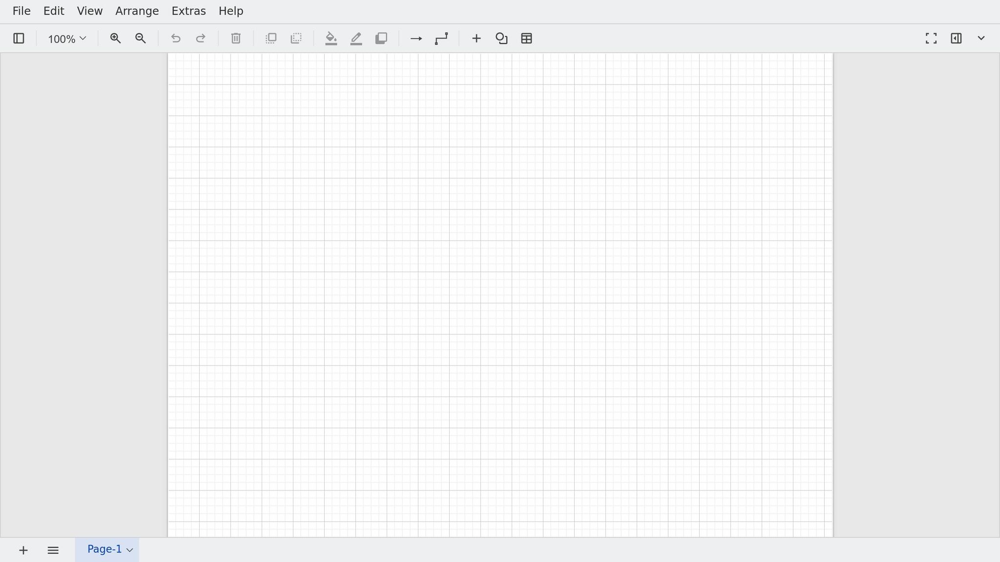
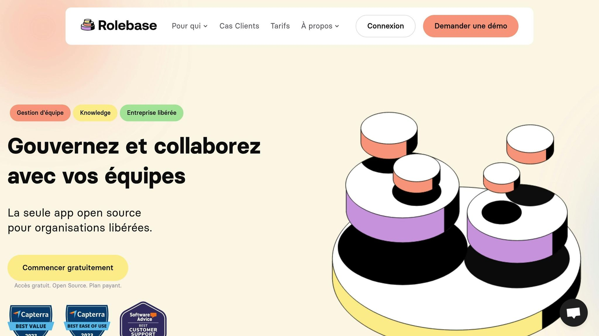
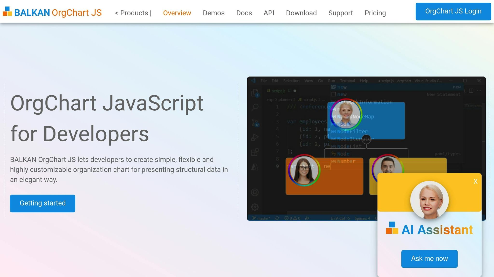
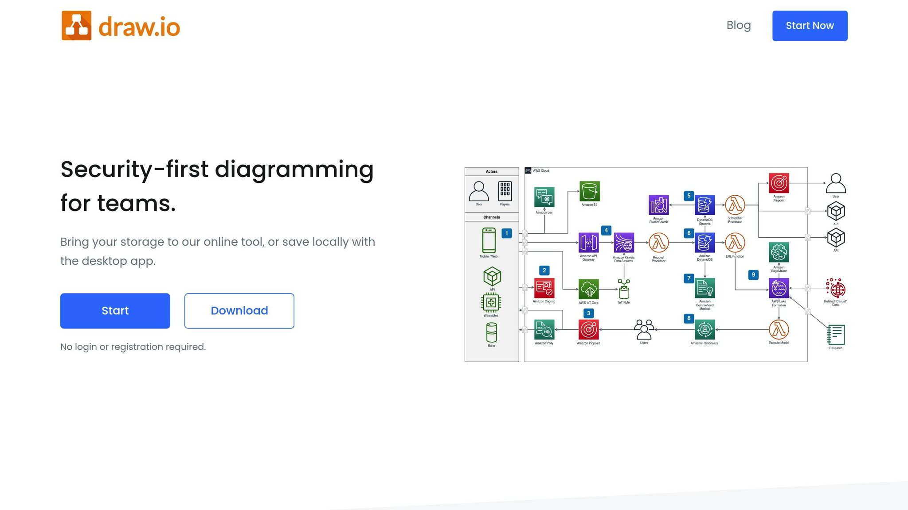
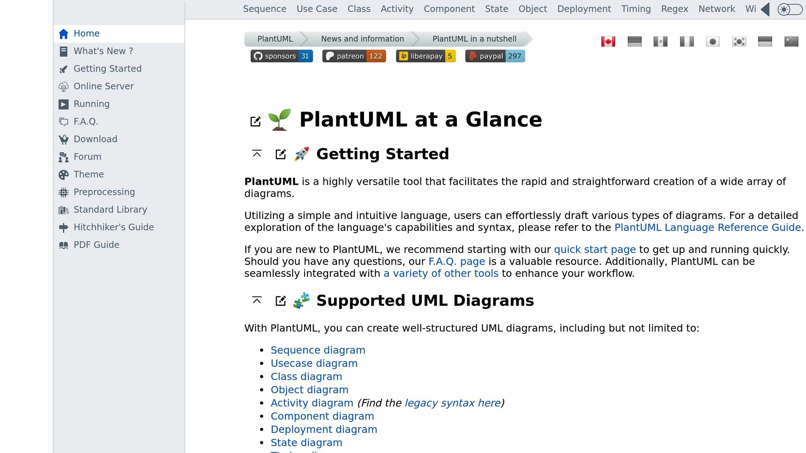

**Looking for a free and effective tool to design org charts?** Here is an overview of the 5 best open-source solutions that address different professional needs. These tools make it easy to visualize organizational structures while offering customization, collaboration, and integration options.

### Tool Summary:

- **[Rolebase](/)**: Ideal for organizations adopting horizontal management, with [dynamic org charts](/en/features) and seamless integrations (calendars, [Slack](https://slack.com/)).

- **[OrgChart.js](https://balkan.app/OrgChartJS)**: A JavaScript library for [interactive org charts](/en/blog/create-org-chart) that are highly customizable.

- **[Dia](http://dia-installer.de/)**: Simple software for creating various diagrams, with extensive customization and export options.

- **[Diagrams.net](https://app.diagrams.net/) ([Draw.io](https://www.drawio.com/))**: An intuitive online platform with real-time collaboration and multiple integrations ([Google Drive](https://www.google.com/drive/), [Microsoft 365](https://www.microsoft.com/en-us/microsoft-365)).

- **[PlantUML](https://plantuml.com/)**: Create org charts from text descriptions, perfect for developers and technical teams.

### Quick Feature Comparison

| Tool             | Customization       | Collaboration                                    | Integration                                                                                           | Export Formats      |
| ---------------- | ------------------- | ------------------------------------------------ | ----------------------------------------------------------------------------------------------------- | ------------------- |
| **Rolebase**     | Dynamic roles       | Asynchronous communication                       | Slack, external calendars                                                                             | PDF, synced agendas |
| **OrgChart.js**  | Flexible themes     | Drag-and-drop                                    | JavaScript frameworks                                                                                 | PDF, PNG, SVG       |
| **Dia**          | Custom shapes       | Simple sharing                                   | Python extensions                                                                                     | PNG, SVG, EPS       |
| **Diagrams.net** | Various layouts     | Live collaboration                               | Google Drive, [OneDrive](https://www.microsoft.com/en-us/microsoft-365/onedrive/online-cloud-storage) | PNG, SVG, PDF       |
| **PlantUML**     | Text-based commands | [Git](https://git-scm.com/) for version tracking | IDEs like IntelliJ, [GitLab](https://about.gitlab.com/)                                               | PNG, SVG, LaTeX     |

### Why Choose an Open-Source Solution?

- **Free of charge**: No licensing fees.

- **Flexibility**: Modifiable code to fit your needs.

- **Active communities**: Regular support and updates.

**Which tool best suits your needs?** Explore their features to optimize your org charts and improve your organization's visibility.

## [DIAGRAMS.NET](https://app.diagrams.net/): A GUIDE TO GETTING STARTED

<Youtube videoId="ntXJuN78aEo" />

## 1. [Rolebase](/)

Rolebase is an open-source platform designed to support organizations in adopting horizontal management models. It offers a modern and seamless way to design org charts, with a focus on [collaborative governance](/en/blog/sociocracy-intro) and more agile [team management](/en/features).

Thanks to its dynamic org charts, Rolebase allows you to track role and responsibility changes within an organization in real time. A true asset for structures where flexibility and clarity are essential.

### Tools for Optimal Collaboration

One of the most appreciated aspects of Rolebase is its collaboration-focused tools. The platform facilitates the organization of [productive meetings](/en/features), task tracking, and asynchronous communication, thereby strengthening team cohesion and efficiency.

> "Rolebase has become an essential tool for Evea, allowing teams to easily find out who does what and providing a real-time mapping of roles within the company. Rolebase simplifies onboarding, organizes efficient meetings and maintains focus, leading to rapid adoption and immediate productivity benefits." - Damien Delmotte, Communication & Brand Manager @ Evea and Frederic Faurennes, Founder & CEO.

### Seamless Integrations

Rolebase integrates seamlessly with the tools already in place within your organization. For example, it can send reminders via email or Slack for assigned tasks, ensuring effective follow-up. Additionally, the platform allows synchronization with external calendars, ensuring smooth coordination between the various tools in use. These integration features also come with export and sharing options, reinforcing transparency in decision-making.

### Simplified Export and Sharing

With Rolebase, teams can export and synchronize agendas, ensuring clear tracking of decisions made and upcoming actions. This feature also allows archiving and sharing information, offering valuable traceability in organizations where transparency plays a key role. This proves particularly useful in horizontal work environments, where every member needs a clear view of processes and objectives.

## 2. [OrgChart.js](https://balkan.app/OrgChartJS)

OrgChart.js is an open-source JavaScript library designed to create interactive org charts with great flexibility. It provides developers and teams with a powerful technical tool for visualizing organizational structures in a clear and customizable way.

### Advanced Customization

One of OrgChart.js's key strengths is its high level of customization. You can modify node appearance, adjust templates, and choose from eight different orientations, including horizontal, vertical, or mixed layouts. A major update, introduced in version 8.15 in March 2025, integrated an artificial intelligence feature that automates org chart design.

These customization options align perfectly with the needs of modern organizations, especially those adopting collaborative approaches or horizontal structures.

### Collaborative Features

OrgChart.js also stands out for its collaborative tools, which are essential in environments where teams work across departments. Through an intuitive interface, users can add, delete, or edit nodes directly. The drag-and-drop function further simplifies real-time restructuring, making updates quick and accessible to everyone.

The library also allows grouping multiple nodes into a single box or adding assistant nodes with different relationship types. These features are particularly useful for representing multidisciplinary teams or complex matrix structures.

### Simplified Export and Sharing

Finally, OrgChart.js shines with its varied export options. You can save your org charts in different formats, including PDF, PNG, SVG, CSV, JSON, and XML. A team-based PDF export function generates separate documents for each group, with customization options such as adding the company logo and formats suited to professional needs. These tools facilitate the distribution and archiving of org charts, meeting the expectations of organizations of all sizes.

## 3. [Dia](http://dia-installer.de/)

Dia is a free and open-source software designed for creating diagrams and effective org charts. Developed in C and enhanced with Python extensions, it offers more than 1,000 ready-to-use objects and supports over 30 different diagram types. Its ease of use makes it a reliable solution for teams seeking a stable and high-performing tool.

### Customization Options

Dia offers a wealth of options for adapting the interface and diagrams to users' specific needs. Settings are organized into four main categories: **User Interface**, **Default Diagram Settings**, **Default Display Settings**, and **Grid Lines**.

- **User Interface**: Users can customize object selection according to their preferences, such as enabling intersection-based selection during reverse dragging, or managing the recent documents list.

- **Diagram Settings**: Dia allows you to choose the orientation (portrait), paper type (A4, Letter), default background color, as well as dimensions and zoom level for new windows. Connection points can also be displayed automatically to simplify links between elements.

- **Grid**: The dynamic grid automatically adjusts its dimensions based on zoom level, and users can define custom spacing (in centimeters) between horizontal and vertical lines.

These options allow you to configure the software to meet the precise needs of each organization.

### Integration Capabilities

Dia integrates easily into development environments through its Python scripting support. This gives developers the ability to create custom extensions and automate specific tasks. The software also supports ATLAS Transformation Language (ATL) for generating diagrams from models, making it particularly useful in advanced development environments. Additionally, Dia offers a sheet and object editor capable of importing and updating shapes dynamically.

### Easy Export and Sharing

Dia supports a wide range of export formats, including EPS, SVG, DXF, CGM, WMF, PNG, JPEG, and VDX. These formats address various needs, whether for the web, presentations, or professional printing. For example:

- **SVG**: Preserves vector quality while remaining editable.

- **PNG and JPEG**: Ideal for digital documents.

- **EPS**: Perfect for high-quality printing.

These export options allow Dia to adapt to different workflows, whether for collaborative projects or professional presentations.

## 4. diagrams.net ([Draw.io](https://www.drawio.com/))

After discovering Rolebase, OrgChart.js, and Dia, let's move on to an online tool that stands out for its simplicity and effectiveness: **Diagrams.net** (also known as Draw.io). This open-source platform allows you to design professional org charts directly from a browser, and is suitable for both small teams and large organizations.

### Customization Options

Diagrams.net offers a wide range of possibilities for customizing your org charts. You can adjust shapes, connectors, and styles according to your preferences. The tool provides several automatic layouts such as horizontal, vertical, radial, fishbone, or single-column. These options simplify element organization, whether you need to manage spacing between parent and child nodes or manipulate branches (moving, collapsing, or expanding). For complex structures, container shapes automatically adjust based on the chosen layouts.

Advanced users will appreciate the ability to create custom libraries with their own icons and graphics. Moreover, it is possible to generate diagrams directly from text data or CSV files, making it a versatile and practical tool for varied needs.

### Collaboration Features

Real-time collaboration is one of Diagrams.net's key strengths, especially when files are stored on Google Drive or Microsoft OneDrive. Each collaborator is identified by a distinct color, which makes it easy to track contributions. To avoid distractions, it is also possible to hide other users' cursors during intensive work sessions.

### Compatibility with Other Tools

Diagrams.net integrates easily with collaborative tools like Google Drive, OneDrive, Google Docs, Sheets, Slides, Atlassian [Confluence](https://www.atlassian.com/software/confluence) Cloud, and [Nextcloud](https://nextcloud.com/). This compatibility allows you to embed org charts directly into your existing workflows. Furthermore, the platform ensures data security by storing no user information on its own servers.

### Simplified Export and Sharing

The tool supports a variety of export formats, including .drawio, .xml, .png, .svg, .jpeg, .webp, .html, and .pdf. You can also share your diagrams via URL links containing the data. These links allow access in viewing or editing mode. By default, data is embedded in the exported file, allowing other users to open and modify it. For privacy reasons, this embedding can be disabled.

In August 2024, a new feature was added: the ability to find and generate smart templates directly from the template library. By entering a text query in the "Generate" box, you can quickly create diagrams based on text descriptions, speeding up the design process.

## 5. [PlantUML](https://plantuml.com/)

**PlantUML** stands out with its original approach: creating diagrams from simple text descriptions. Unlike traditional graphical tools, it uses a clear and intuitive description language, similar to programming languages. This text-based method ensures precision and reproducibility that are ideal for technical teams. As part of the open-source tool ecosystem, PlantUML offers a complementary alternative to typical graphical interfaces.

### Customization Options

With PlantUML, customization is at the heart of the experience. Through commands integrated directly into the text code, you can adjust elements such as background colors, font styles and sizes, or apply various visual themes to your diagrams. The tool supports several diagram types, including **WBS diagrams** (Work Breakdown Structure), which are perfect for modeling complex organizational structures. These diagrams can be adapted with different notations, directions, colors, and styles. Additionally, PlantUML allows you to add hyperlinks, tooltips, rich text, emoticons, Unicode, and even icons.

### Collaboration Features

PlantUML's text-based approach fosters smooth collaboration within teams. By integrating diagram files into version control systems like Git, every modification is tracked in real time. [GitHub](https://github.com/), for example, automatically renders PlantUML diagrams found in Markdown files, simplifying content sharing and review.

A concrete example: in October 2024, Mibex Software used PlantUML to create a sequence diagram hosted on Bitbucket Cloud and embedded in a Confluence page. This diagram illustrated the workings of their "Include Bitbucket for Confluence" application and helped improve understanding and collaboration within their team.

### Integration Capabilities

PlantUML is designed to integrate seamlessly into various development environments. It is compatible with popular tools like **[IntelliJ IDEA](https://www.jetbrains.com/idea/)**, **[Eclipse](https://eclipseide.org/)**, and **[VS Code](https://code.visualstudio.com/)**, allowing developers to work directly on their diagrams from their preferred IDE. Version control platforms such as **Git**, **GitLab**, and **GitHub** also support PlantUML. For example, on GitLab, diagrams can be viewed directly in Markdown files within repositories or wikis. A simple configuration of a PlantUML server on a self-managed GitLab instance allows automatic conversion of plantuml blocks into HTML images.

Beyond that, PlantUML integrates with documentation tools like **Confluence**, **Markdown**, **Doxygen**, and **Sphinx**. Diagrams hosted on Git platforms can be added to Confluence pages, providing dynamic documentation that stays up to date as projects evolve.

### Easy Export and Sharing

PlantUML supports numerous export formats, including **PNG**, **SVG**, **LaTeX**, **EPS**, and **ASCII art**. This variety allows diagrams to be integrated into different types of documents, whether presentations or academic work. The tool uses several rendering engines, such as **Graphviz**, **Smetana**, **VizJs**, and **ELK**. For teams working in cloud environments, PlantUML is compatible with **[Docker](https://www.docker.com/)** and can be integrated into CI/CD pipelines.

Thanks to this text-based approach, PlantUML simplifies diagram sharing and reproduction, a valuable advantage for geographically distributed teams and projects requiring regularly updated documentation.

###### sbb-itb-77d9745

## Comparative Table of Tools

Here is a table highlighting the main characteristics of each solution, to help you make an informed choice.

| Tool                       | Customization Options                                                                                                                                                              | Collaboration Features                                                                                                                                      | Integration Capabilities                                                                               | Export Ease                           |
| -------------------------- | ---------------------------------------------------------------------------------------------------------------------------------------------------------------------------------- | ----------------------------------------------------------------------------------------------------------------------------------------------------------- | ------------------------------------------------------------------------------------------------------ | ------------------------------------- |
| **Rolebase**               | Dynamic org charts, [custom role management](/en/blog/role-based-management), adapted to horizontal structures | Real-time collaboration, asynchronous communication, [integrated meeting management](/en/features) | Synchronization with external calendars, API for custom integrations                                   | Exportable and synchronizable agendas |
| **OrgChart.js**            | Various visual themes, customizable colors, flexible layout                                                                                                                        | Integration with version control systems, web sharing                                                                                                       | Compatible with modern JavaScript frameworks, web application integration                              | SVG, PNG, PDF formats                 |
| **Dia**                    | Customizable shapes and connectors, custom object creation                                                                                                                         | File sharing via shared file systems                                                                                                                        | Plugins to extend functionality, Python scripts                                                        | PNG, SVG, EPS, PostScript formats     |
| **diagrams.net (Draw.io)** | **Over 100 integrations**, various themes and styles, extensive icon libraries                                                                                                     | **Real-time shared cursors**, collaborative comments                                                                                                        | **Google Workspace, SharePoint, OneDrive, Microsoft Teams, Jira, Confluence, GitHub, GitLab, Dropbox** | **PNG, JPG, SVG, HTML, PDF**          |
| **PlantUML**               | Visual themes, customizable colors, font styles, WBS diagrams                                                                                                                      | Integration with Git for version tracking, text-based collaboration                                                                                         | **IntelliJ IDEA, Eclipse, VS Code, Git, GitLab, GitHub, Confluence**                                   | **PNG, SVG, LaTeX, EPS, ASCII art**   |

### Key Points for Your Decision

This table allows you to quickly identify the tool that matches your needs. Here are a few things to keep in mind:

- **Customization**: All tools offer varied options, from dynamic org charts to visual themes and customizable colors. Rolebase, for example, adapts particularly well to non-traditional organizational structures.

- **Collaboration**: Real-time synchronization is a constant among these tools, fostering effective collaboration. Diagrams.net stands out with its shared cursors and collaborative commenting features.

- **Integration**: If you are looking for extensive compatibility, diagrams.net leads with its **over 100 integrations**. On the other hand, PlantUML excels in development environments with its integration into tools like IntelliJ IDEA or Git.

- **Export**: All tools support standard formats (PNG, SVG, PDF), but PlantUML offers additional options such as LaTeX and ASCII art, ideal for specific needs.

Ultimately, each solution addresses specific needs. Your choice will depend on your organization's priorities in terms of customization, collaboration, integration, and export formats.

## Conclusion

In a context where flexibility and decentralization are increasingly important, open-source tools for creating org charts bring real added value. They help structure and make roles visible within organizations while offering customization options tailored to specific business needs, all backed by active and engaged communities.

Each solution presented in this article has its own strengths. **Rolebase** stands out with its dynamic org charts, ideal for horizontal management. **OrgChart.js** shines with its ease of integration into web projects. **Dia** remains a solid choice for creating classic technical diagrams. **Diagrams.net** (or draw.io) is valued for its intuitive interface and collaborative features, such as real-time shared cursors. Finally, **PlantUML** excels in development environments thanks to its text-based approach, which appeals to technical teams.

To choose the right tool for you, start by evaluating your specific needs. Examine your internal processes, identify your challenges (lack of visibility, integration difficulties, restructuring needs), and determine the intended uses as well as the number of licenses required.

Remember to consider essential criteria such as the ability to scale with your organization, integration with your existing tools, security, compliance, and user experience.

These solutions offer total control and valuable adaptability to support the evolution of your org charts over time. With the backing of developer communities, they represent a wise and sustainable choice for structuring and visualizing your teams effectively.

## FAQs

### What are the advantages of open-source tools for creating org charts compared to proprietary software?

## The Advantages of Open-Source Tools for Creating Org Charts

Open-source tools for designing org charts offer several compelling advantages over proprietary software.

**First**, they allow for significant cost savings. With no licensing fees to pay, businesses can reduce their expenses while still accessing advanced features.

**Second**, they offer great freedom through their flexibility. With access to the source code, users can adapt these tools to their specific needs, an option rarely available with proprietary software.

Finally, open-source software benefits from the support of active developer communities. These communities play a key role by providing regular updates and integrating modern features, often in direct response to user requests. For businesses looking to evolve collaboratively and optimize their organization, these tools represent a particularly well-suited solution.

### How do you choose the best open-source tool for creating an org chart suited to your needs?

## How to Choose the Right Open-Source Tool for Your Org Charts

To select the open-source tool that perfectly meets your org chart needs, start by evaluating your priorities. Do you need an intuitive interface? Collaborative features for teamwork? Or advanced customization options to adapt diagrams to your specific requirements? These questions will guide your choice.

Also make sure the tool integrates well with the software you already use. This can prevent unnecessary complications and improve workflow efficiency. Additionally, compatibility with collaboration tools can be a major advantage if you work in a team.

Another key point: examine the documentation and community surrounding the tool. An active community and well-detailed guides can make all the difference in quickly resolving issues or learning to get the most out of the application.

Finally, try several solutions. Each tool has its strengths and weaknesses, and the key is to find the one that best adapts to your way of working and your expectations.

### How do the open-source tools presented in the article foster collaboration and integrate easily into an existing professional environment?

## Open-Source Solutions for Creating Org Charts

Open-source tools dedicated to creating org charts are transforming how teams collaborate. With features like real-time co-creation, integrated comments, and simultaneous editing, they provide a platform where everyone can actively participate. The result: increased transparency and better employee engagement in designing organizational structures.

These solutions also integrate smoothly into professional environments. Through options like data import and automatic org chart updates, they ensure that structures always remain up to date. This is a major asset for companies operating in constantly changing environments, where roles and teams shift regularly.
