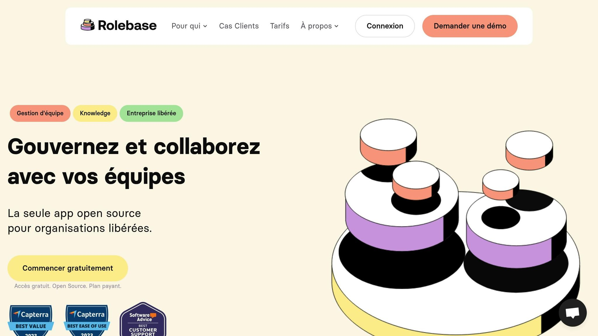
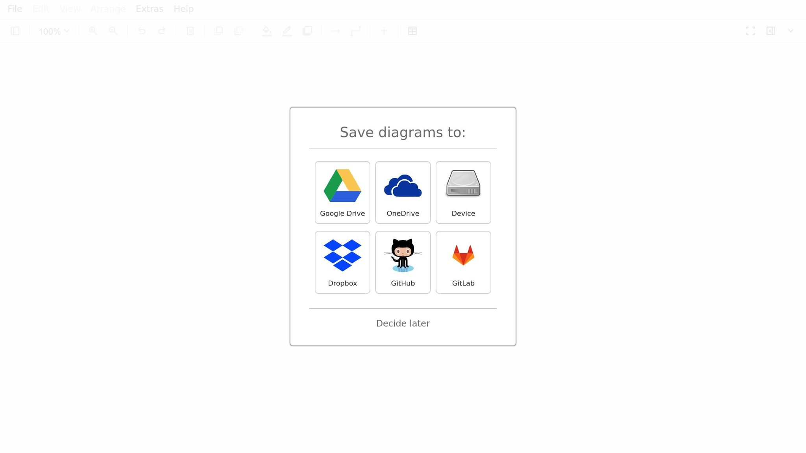
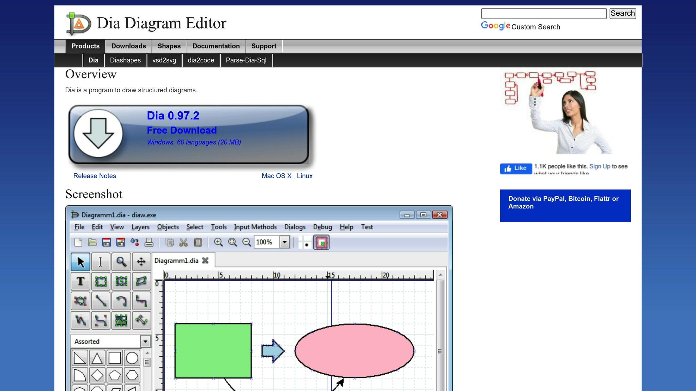
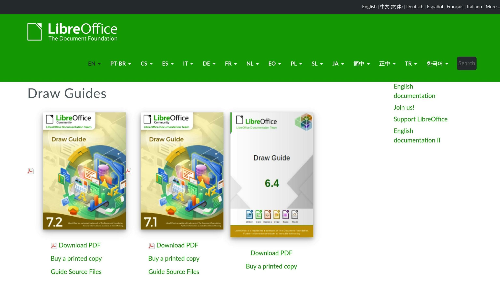

Les [organigrammes open source](https://www.rolebase.io/plateforme/organigramme) sont des outils puissants pour organiser et visualiser la structure d'une entreprise. Voici pourquoi ils peuvent vous être utiles :

- **Gratuité et Économies**: Pas de frais de licence, réduction des coûts.

- **Personnalisation**: Modifiez le code pour répondre à vos besoins spécifiques.

- **Collaboration**: Amélioration de la communication interne et de la transparence.

- **Intégration**: Compatible avec les systèmes RH et exportable en PDF, PNG, etc.

### Outils recommandés

- **[Dia](http://dia-installer.de/)**: Simple, export polyvalent.

- **[Draw.io](https://app.diagrams.net/)**: Accessible via navigateur, prise en charge de nombreux formats.

- **[LibreOffice Draw](https://documentation.libreoffice.org/en/english-documentation/draw/)**: Dessins vectoriels précis et intégration avec LibreOffice.

### Exemple pratique : [Rolebase](https://rolebase.io/)

- Mise à jour automatique des rôles.

- Outils pour suivre les tâches et [planifier les réunions](https://www.rolebase.io/plateforme/optimisation-des-temps-de-reunions).

- Plan gratuit ou options d'accompagnement personnalisé.

Un organigramme clair améliore la gestion et la collaboration. Choisissez l'outil adapté à vos besoins pour optimiser votre organisation.

## [DIAGRAMS.NET](https://app.diagrams.net/) : LE GUIDE POUR BIEN DÉBUTER

<Youtube videoId="ntXJuN78aEo" />

## Principaux Avantages des Organigrammes Open Source

Les organigrammes open source simplifient la gestion organisationnelle tout en offrant des avantages pratiques et économiques.

### Réduction des Coûts

- Pas de frais de licence à payer

- Maintenance assurée par la communauté de développeurs

- Permet de réaffecter le budget IT à d'autres projets

Par exemple, des outils comme **Rolebase** permettent de structurer une organisation sans nécessiter de gros investissements initiaux.

### Options de Personnalisation

- Possibilité de modifier le code pour ajouter des fonctionnalités spécifiques

- Ajustement de l'interface selon l'identité visuelle de l'entreprise

- Création de modèles adaptés à différents services ou départements

Ces options permettent d'améliorer la communication interne et d'adapter l'outil aux besoins spécifiques de l'organisation.

### Communication d'Équipe

- Centralisation des informations sur la structure organisationnelle

- Accès en temps réel aux données

- Simplification de l'intégration des nouveaux membres

En rendant les rôles et responsabilités plus clairs, des outils comme **Rolebase** favorisent une meilleure compréhension et augmentent la transparence.

### Connexions avec d'Autres Outils

L'intégration avec d'autres systèmes renforce l'efficacité, notamment grâce à :

- La compatibilité avec les systèmes RH existants

- La synchronisation avec les annuaires d'entreprise

- L'export des données dans différents formats (PDF, PNG, SVG)

## Outils Courants pour les Organigrammes Open Source

Passons en revue quelques outils populaires pour créer des organigrammes dans un environnement open source. Voici un aperçu des principales options disponibles.

### Fonctionnalités de [Dia](http://dia-installer.de/)

Dia est un logiciel conçu pour créer différents types de diagrammes, y compris les organigrammes. Voici ce qu'il propose :

- **Interface simple**: idéale pour les utilisateurs novices.

- **Modèles intégrés**: facilite la création rapide de diagrammes.

- **Exportation polyvalente**: prend en charge plusieurs formats.

- **Personnalisation complète**: adaptez les formes et connecteurs à vos besoins.

Il inclut également des outils comme des calques et des grilles, qui permettent de structurer vos diagrammes de manière claire.

### Capacités de Draw.io

Draw.io est une application web pratique pour concevoir des organigrammes et bien plus encore. Voici ses principales caractéristiques :

- **Compatibilité étendue**: supporte les formats .vsdx, Gliffy™ et Lucidchart™.

- **Outils avancés**: idéal pour des schémas complexes comme UML, BPMN ou encore des bases de données.

- **Accessibilité**: fonctionne directement dans un navigateur avec JavaScript activé.

| Fonctionnalité      | Description                                             |
| ------------------- | ------------------------------------------------------- |
| Import/Export       | Supporte divers formats (.vsdx, Gliffy™, Lucidchart™) |
| Types de diagrammes | Inclut organigrammes, UML, BPMN, circuits, etc.         |
| Environnement       | Application web nécessitant JavaScript                  |

### Outils [LibreOffice Draw](https://documentation.libreoffice.org/en/english-documentation/draw/)

LibreOffice Draw est un outil puissant pour créer des diagrammes vectoriels, y compris des organigrammes. Voici ce qu'il offre :

- **Dessin vectoriel précis**: parfait pour des schémas détaillés.

- **Intégration fluide**: fonctionne avec toute la suite LibreOffice.

- **Exportation flexible**: plusieurs formats disponibles.

- **Gestion des calques**: simplifie l'organisation des éléments.

C'est un choix solide pour ceux qui recherchent une solution robuste et bien intégrée à une suite bureautique complète.

Ces outils montrent bien la richesse et la flexibilité des solutions open source pour créer des organigrammes, répondant à des besoins variés et spécifiques.

###### sbb-itb-77d9745

## Utilisation Efficace des Organigrammes Open Source

### Définition des Objectifs

Créer un organigramme utile commence par définir des objectifs clairs :

| Objectif            | Description                                     | Indicateurs                                    |
| ------------------- | ----------------------------------------------- | ---------------------------------------------- |
| Clarté Structurelle | Montrer clairement les relations hiérarchiques  | Réduction des questions sur la structure       |
| Communication       | Améliorer les échanges entre services           | Meilleurs délais de réponse                    |
| Planification       | Soutenir les évolutions organisationnelles      | Mises à jour régulières des rôles              |
| Documentation       | Servir de référence pour les processus internes | Bonne intégration avec les documents existants |

Une fois vos objectifs définis, choisissez un outil qui répond à vos besoins spécifiques.

### Choix des Outils

Pour sélectionner le bon outil, prenez en compte ces éléments :

- **Taille de l'équipe**: Combien de personnes utiliseront l'outil ?

- **Compétences techniques**: Quel est le niveau de maîtrise informatique de vos équipes ?

- **Intégrations nécessaires**: Quels systèmes doivent être connectés à l'outil ?

- **Fréquence des mises à jour**: À quelle fréquence l'organigramme sera-t-il modifié ?

Après avoir choisi l'outil, il est essentiel de structurer le travail d'équipe pour garantir que l'organigramme reste à jour.

### Travail Collaboratif

- **Définissez un workflow clair**: Attribuez des responsabilités et fixez des délais pour les modifications.

- **Formez vos équipes**: Organisez des sessions de formation régulières et fournissez des guides pratiques.

- **Facilitez les échanges**: Mettez en place des canaux dédiés pour discuter des mises à jour.

Ces pratiques permettent de maintenir un organigramme pertinent et fonctionnel.

### Maintenance des Organigrammes

Pour que votre organigramme reste utile, adoptez des pratiques de maintenance régulières :

- **Révisions fréquentes**: Planifiez des vérifications pour garder la structure à jour.

- **Automatisation**: Activez des alertes pour signaler les mises à jour nécessaires.

- **Archivage**: Conservez un historique des versions pour référence.

- **Documentation**: Mettez à jour les guides et procédures associés.

Voici un exemple de calendrier pour gérer la maintenance :

| Fréquence     | Action                                    | Responsable         |
| ------------- | ----------------------------------------- | ------------------- |
| Hebdomadaire  | Vérification des ajustements mineurs      | Chef d'équipe       |
| Mensuelle     | Mise à jour des rôles et responsabilités  | Responsable RH      |
| Trimestrielle | Révision complète de la structure         | Direction           |
| Annuelle      | Audit global et planification stratégique | Comité de direction |

En suivant ces étapes, vous optimiserez l'utilisation des organigrammes open source, tout en assurant leur pertinence et leur efficacité à long terme.

## Présentation de la Plateforme Rolebase

### Organigrammes Automatisés

Rolebase met à jour automatiquement et en temps réel la structure organisationnelle grâce à une synchronisation des rôles et des relations hiérarchiques. Voici ce que cela inclut :

- Mise à jour continue et en temps réel

- Synchronisation des rôles et relations hiérarchiques

- Connexion fluide avec les outils de gestion existants

Avec cette automatisation, les équipes n'ont plus à se soucier des tâches de mise à jour manuelle et peuvent se concentrer sur leurs responsabilités principales.

### Outils de Gestion pour les Équipes

Rolebase propose des outils pensés pour améliorer la coordination et l'organisation au sein des équipes :

| Fonctionnalité                                                                                                          | Description                                    | Avantage                           |
| ----------------------------------------------------------------------------------------------------------------------- | ---------------------------------------------- | ---------------------------------- |
| [Gestion des rôles](https://www.rolebase.io/blog/introduction-au-role-based-management-votre-solution-contre-les-silos) | Suivi et attribution des responsabilités       | Meilleure clarté organisationnelle |
| Suivi des tâches                                                                                                        | Organisation et suivi des activités            | Amélioration de la productivité    |
| [Planification des réunions](https://www.rolebase.io/plateforme/reunions)                                               | Outils pour organiser les sessions collectives | Gain d'efficacité                  |
| Agendas synchronisés                                                                                                    | Intégration avec des calendriers externes      | Coordination simplifiée            |

Ces fonctionnalités facilitent une collaboration fluide, particulièrement utile pour les organisations privilégiant une structure moins hiérarchique.

### Services d'Accompagnement

En plus des outils, Rolebase propose un soutien personnalisé pour aider les organisations à tirer le meilleur parti de la plateforme :

1. **Plan Gratuit Open Source**

Ce plan permet une gestion autonome avec des organigrammes dynamiques et des outils de gestion des rôles intégrés.

2. **Accompagnement Initial**

- Analyse organisationnelle

- Une session de coaching de 2 heures

- Configuration personnalisée selon les besoins

3. **Coaching Personnalisé**

- Un programme d'accompagnement sur mesure

- Évaluations régulières pour ajuster les pratiques

- Assistance continue pour s'adapter aux évolutions

Cette approche permet aux organisations de progresser à leur rythme, tout en bénéficiant d'un soutien adapté à leurs objectifs.

## Résumé

### Points Clés

Les organigrammes open source présentent divers atouts pour les entreprises d'aujourd'hui. Voici un aperçu des points essentiels :

| Aspect           | Avantage Principal                 | Effet                                              |
| ---------------- | ---------------------------------- | -------------------------------------------------- |
| Coût             | Réduction des dépenses             | Diminution des frais liés aux licences logicielles |
| Personnalisation | Ajustement aux besoins spécifiques | Représentation plus précise des structures         |
| Communication    | Transparence renforcée             | Collaboration améliorée au sein des équipes        |
| Intégration      | Large compatibilité                | Simplification des processus de travail            |

Ces aspects se combinent et s'amplifient grâce aux fonctionnalités proposées par Rolebase.

### Points forts de Rolebase

Après avoir mis en lumière les atouts des solutions open source, voyons en quoi Rolebase maximise ces bénéfices.

Rolebase propose :

- Des organigrammes dynamiques mis à jour automatiquement

- Une gamme complète d'outils intégrés pour la gestion des équipes

- Un support adapté aux besoins spécifiques de chaque organisation

La plateforme offre trois niveaux de service :

1. **Plan Open Source gratuit**

- Une solution autonome avec les fonctionnalités essentielles pour gérer efficacement les structures organisationnelles

2. **Accompagnement Initial**

- Analyse approfondie de l'organisation et session de coaching de 2 heures

3. **Programme de Coaching**

- Suivi personnalisé et accompagnement régulier pour des besoins spécifiques

Ces options permettent de moderniser les structures organisationnelles tout en offrant un accompagnement adapté à chaque situation.
