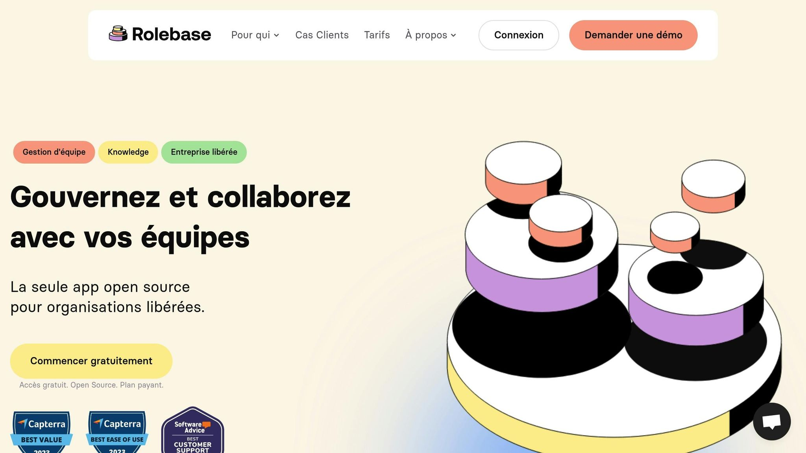

**Donner des retours constructifs est essentiel pour améliorer la collaboration et la performance au travail. Voici 10 conseils clés pour y parvenir efficacement :**

1. **Établir la confiance**: Créez un environnement sûr où chacun peut s’exprimer librement sans crainte.

2. **Utiliser le modèle SCI (Situation-Comportement-Impact)**: Structurez vos retours en décrivant la situation, le comportement observé et son impact.

3. **Pratiquer l’écoute active**: Montrez que vous écoutez vraiment en reformulant et en posant des questions.

4. **Se concentrer sur des faits observables**: Évitez les jugements et basez-vous sur des comportements concrets.

5. **Équilibrer critiques et retours positifs**: Combinez reconnaissance et suggestions d’amélioration.

6. **Adapter les retours à chaque personne**: Tenez compte des préférences individuelles et des différences culturelles.

7. **Utiliser des outils collaboratifs**: Simplifiez et structurez les échanges avec des plateformes comme [Rolebase](/).

8. **Instaurer un calendrier régulier**: Planifiez des retours fréquents pour éviter les malentendus et renforcer la confiance.

9. **Former les équipes**: Apprenez à donner et recevoir des retours de manière professionnelle.

10. **Encourager une culture de feedback**: Faites du feedback un pilier quotidien dans votre organisation.

**Résumé rapide :** Ces conseils permettent d’améliorer la communication, de renforcer les relations au travail et de stimuler la performance collective. En appliquant ces pratiques, vous transformerez chaque retour en une opportunité d’apprentissage et de progrès.

## Faire un feedback : 8 étapes clés et 18 conseils pratiques

<Youtube videoId="inD0ucD9NUM" />

## 1. Établir la confiance et définir des attentes claires

La confiance est la pierre angulaire des échanges constructifs entre collègues. Sans elle, même les conseils les plus bienveillants risquent d’être mal interprétés et perçus comme des critiques. Dans les environnements où la confiance est forte, les employés rapportent une réduction du stress, une énergie accrue, une meilleure productivité et un engagement renforcé.

### Créer un environnement psychologiquement sûr

La sécurité psychologique, c’est la possibilité de s’exprimer librement sans craindre de répercussions ou d’humiliations. Pourtant, selon une enquête [Gallup](https://www.gallup.com/home.aspx) de 2019, seuls 3 employés sur 10 pensent que leur opinion est réellement prise en compte au travail. Pour favoriser ce climat, les managers et les équipes doivent adopter des comportements respectueux, comme l’écoute active, et transformer les erreurs en opportunités d’apprentissage.

### Définir des attentes mutuelles précises

Une fois la confiance établie, il est crucial de clarifier les attentes. Cela passe par une discussion ouverte sur les objectifs, les limites et les rôles de chacun. Cette démarche permet à chaque membre de l’équipe de comprendre exactement ce qu’on attend de lui et comment son travail s’inscrit dans la mission globale. Documenter ces attentes par écrit peut servir de point de référence commun et renforcer la coordination.

### Encourager une communication transparente

Un article de la [Harvard Business Review](https://hbr.org/) souligne que le respect est le principal facteur qui stimule l’engagement des employés. La transparence, quant à elle, repose sur un partage honnête des informations et la possibilité de poser des questions sans crainte de jugement. Les leaders jouent un rôle clé en montrant l’exemple : admettre leurs erreurs et faire preuve de vulnérabilité inspire les autres à s’ouvrir davantage lors des échanges.

Ces éléments – confiance, attentes claires et communication ouverte – sont essentiels pour tirer le meilleur parti des outils collaboratifs et des méthodes organisées, et ainsi optimiser les retours entre collègues.

## 2. Utiliser le modèle Situation-Comportement-Impact (SCI)

Une fois la confiance établie, il est essentiel d'organiser vos retours de manière claire et structurée. Le modèle SCI est un outil puissant pour y parvenir, en divisant chaque feedback en trois éléments : la situation, le comportement et l'impact.

### Les trois éléments clés du modèle SCI

**La situation** : Elle sert à préciser le contexte. Par exemple, au lieu de dire « tu es souvent en retard », soyez spécifique : « mardi dernier, lors de la réunion d'équipe à 9h00 ». Cette précision évite les généralisations et réduit les risques de réactions sur la défensive.

**Le comportement** : Ici, concentrez-vous sur des faits observables. Plutôt que de dire « tu semblais désintéressé », décrivez objectivement : « tu consultais ton téléphone fréquemment et n'as pas participé à la discussion ». En restant factuel, vous maintenez un échange objectif et constructif.

**L'impact** : Expliquez les conséquences concrètes du comportement en utilisant des formulations personnelles. Par exemple : « cela a donné l'impression que tu n'étais pas pleinement engagé, ce qui a compliqué la tâche de l'équipe pour bénéficier de tes idées. »

### Exemples d'utilisation du modèle SCI

Pour un **retour positif** après une présentation client :

- **Situation**: « Lors de la présentation client de la semaine dernière... »

- **Comportement**: « ...tu as présenté le planning avec clarté et répondu avec assurance aux questions... »

- **Impact**: « ...ce qui a renforcé la confiance du client envers notre équipe. »

Pour un **retour constructif** sur un retard dans la gestion des tâches :

- **Situation**: « Vendredi dernier, pendant la finalisation du rapport... »

- **Comportement**: « ...tu as remis ta section deux heures après la deadline... »

- **Impact**: « ...ce qui a retardé le travail de l'équipe et généré un stress supplémentaire. »

Ces exemples montrent comment le modèle SCI permet de donner des retours précis et utiles, tout en ouvrant la porte à des améliorations concrètes.

### Astuces pour une mise en œuvre réussie

- **Préparez-vous à l'avance**: Identifiez les trois éléments (situation, comportement, impact) avant l'entretien. Cela vous aidera à rester factuel et à éviter que des émotions ne viennent perturber l'échange.

- **Choisissez le bon moment**: Donnez votre feedback peu de temps après l'événement, idéalement dans les 24 à 48 heures, lorsque les souvenirs sont encore frais mais que les émotions se sont apaisées.

- **Adoptez un ton professionnel et neutre**: L'objectif est d'encourager la croissance et l'amélioration, et non de critiquer. Cela favorise un dialogue ouvert et limite les résistances.

En utilisant le modèle SCI, vous transformez des conversations potentiellement délicates en moments d'apprentissage et de développement, créant un environnement où chacun peut progresser.

## 3. Pratiquer l'écoute active et la reformulation

L'écoute active dépasse de loin une simple écoute passive. Elle constitue le socle d'échanges constructifs et aide à instaurer un climat où chacun se sent **entendu et compris**. Associée à la reformulation, cette méthode transforme les retours en véritables opportunités d'apprentissage.

### Les bases essentielles de l'écoute active

Écouter activement, c'est accorder une **attention totale** à votre interlocuteur. Cela implique de prêter attention non seulement aux mots, mais aussi au langage corporel et au ton employé, afin de saisir toutes les subtilités de l'échange.

Montrez que vous êtes pleinement engagé dans la conversation en utilisant des **signaux visuels** comme le contact visuel ou des hochements de tête. Ces petits gestes renforcent la connexion et l'intérêt. Par ailleurs, éloignez-vous des distractions comme les téléphones ou les écrans d'ordinateur qui pourraient nuire à votre concentration.

> « L'écoute active exige que vous écoutiez attentivement un orateur, que vous compreniez ce qu'il dit, que vous répondiez et réfléchissiez à ce qui est dit, et que vous reteniez l'information pour plus tard. »

Une écoute attentive pave naturellement le chemin vers une reformulation efficace et constructive.

### La reformulation : un outil pour valider et clarifier

Reformuler revient à redire, avec vos propres mots, ce qui a été exprimé. C'est une manière de vérifier que vous avez bien compris tout en montrant à votre interlocuteur que son point de vue est pris en compte. Introduisez votre reformulation avec des phrases comme « Si je comprends bien... » ou « En d'autres termes... ».

Après avoir reformulé, posez une **question de confirmation** : « Est-ce bien cela ? » ou « Ai-je bien compris votre idée ? ». Cela donne à votre interlocuteur la possibilité de corriger ou d'approfondir son propos.

Attention cependant à ne pas simplement répéter mot pour mot ce qui a été dit. L'objectif est d'**interpréter et de reformuler selon votre compréhension**, en montrant que vous avez intégré et analysé l'information.

### Des échanges plus fluides et productifs

Associer écoute active et reformulation peut transformer la qualité des échanges. Il a été démontré que **les employés se sentent deux fois plus écoutés** lorsque leurs responsables prennent le temps d'écouter et d'agir en conséquence. Dans les discussions entre collègues, cela renforce la confiance et encourage une plus grande ouverture au dialogue.

Les malentendus, souvent à l'origine de conflits, diminuent considérablement. Une mauvaise communication est responsable de l'arrêt de collaboration pour plus des deux tiers des équipes. En adoptant ces techniques, vous créez un cadre où les idées circulent avec clarté et précision.

### Conseils pratiques pour intégrer ces techniques

- Posez des**questions de clarification**pour approfondir les points flous. Par exemple : « Que voulez-vous dire par... ? » ou « Pouvez-vous illustrer cela avec un exemple ? ».

- Résumez les points clés à la fin de chaque échange pour confirmer une compréhension partagée.

- Gardez une**attitude ouverte**et suspendez tout jugement pendant que votre interlocuteur parle. Évitez de préparer mentalement votre réponse avant qu'il ait terminé. Cela favorise une écoute sincère et attentive.

> « L'écoute active consiste d'abord à comprendre l'autre personne, puis à être compris en tant qu'auditeur. »

En appliquant ces techniques, vous favorisez des interactions plus riches et posez les bases pour des retours toujours plus constructifs.

## 4. Se concentrer sur les comportements observables, pas sur les suppositions

Quand vous donnez un retour à un collègue, distinguer ce que vous observez de ce que vous supposez peut radicalement changer la qualité de l'échange. Comme pour l'écoute active, s'appuyer sur des faits concrets renforce la pertinence et l'efficacité des retours. Les comportements observables sont des actions que l'on peut vérifier, tandis que les suppositions impliquent des jugements sur le caractère ou les intentions.

Focaliser vos retours sur des comportements précis permet d'ouvrir des discussions plus objectives et moins émotionnelles. En basant vos commentaires sur des faits et des données, vous rendez votre retour plus clair et constructif. Cette méthode minimise aussi les risques que vos remarques soient perçues comme des critiques personnelles, ce qui réduit les réactions défensives. Cela s'inscrit dans une communication plus neutre et factuelle, comme évoqué précédemment.

> « Un retour efficace se concentre sur des comportements spécifiques et observables sans jugement. L'utilisation d'un langage précis sur les pratiques et les exemples améliore l'impact du retour. » - [Edustaff](https://www.edustaff.org/)

### La différence entre observation et jugement

> « Lorsque vous donnez un retour, vos déclarations sont-elles largement observationnelles ou critiques ? Si vous essayez de faire passer un jugement pour un fait, vous risquez de vous tromper et de créer un climat de défensive, de résistance, ou pire. »

Prenons un exemple proposé par [BetterUp](https://www.betterup.com/). Plutôt que de dire : « Le présentateur n'a aucune expérience d'animation d'ateliers », préférez une observation telle que : « Le présentateur semblait un peu hésitant, et la session n'a pas vraiment trouvé son rythme ». Ce type de reformulation met l'accent sur des faits observables, évitant ainsi les conclusions hâtives.

### Techniques pratiques pour rester objectif

Pour intégrer cette approche dans vos échanges, voici quelques techniques simples à adopter :

- Orientez vos commentaires vers des actions ou des comportements spécifiques plutôt que vers la personnalité. Par exemple, commencez par « J'ai remarqué que… » pour maintenir un ton respectueux et neutre.

- Évitez les termes vagues en choisissant des expressions précises qui décrivent directement le problème. Parlez de l'impact des actions plutôt que de faire des jugements personnels.

- Posez des questions pour comprendre les raisons derrière un comportement, surtout si vous sentez que vous pourriez porter un jugement.

| **Comportements observables**                          | **Suppositions**                       |
| ------------------------------------------------------ | -------------------------------------- |
| « Vous avez interrompu trois fois pendant la réunion » | « Vous ne respectez pas les autres »   |
| « Le rapport a été remis avec deux jours de retard »   | « Vous n'êtes pas organisé »           |
| « Vous n'avez pas répondu aux emails depuis mardi »    | « Vous ne vous souciez pas du projet » |

Adopter une approche basée sur les faits permet à votre interlocuteur d'expliquer son point de vue ou ses intentions. Cela favorise un échange constructif, plutôt qu'une confrontation.

En suivant ces principes, vous contribuez à instaurer un climat propice aux échanges ouverts et à l'amélioration continue.

## 5. Équilibrer les critiques avec les renforcements positifs

Donner un retour constructif, c’est trouver le juste équilibre entre critiques et reconnaissance des forces. Cela permet non seulement d’encourager, mais aussi de transformer chaque échange en une opportunité d’amélioration.

D’après les recherches, un ratio moyen de **5,6 retours positifs pour chaque critique** est recommandé. Ce chiffre montre à quel point il est important de souligner les réussites, même lorsqu’il s’agit d’introduire des ajustements nécessaires. Trop de critiques peuvent entraîner du stress et, à terme, un épuisement professionnel. À l’inverse, des éloges excessifs ou non sincères risquent de provoquer une complaisance qui freine les progrès.

> "Constructive feedback - both positive and negative - is essential to helping managers enhance their best qualities and address their worst so they can excel at leading." - Harvard Business Review

### Techniques pratiques pour un feedback équilibré

Pour appliquer ces principes, utilisez des méthodes simples comme la technique du sandwich. Elle consiste à débuter par un retour positif, aborder ensuite les points d’amélioration, puis conclure sur une note encourageante. L’essentiel est de formuler des éloges **précis et mérités** pour qu’ils conservent leur impact.

Voici quelques exemples de formulations équilibrées :

- _"Vous êtes excellent(e) dans la résolution de problèmes. Ce serait formidable de voir cette compétence davantage mise en avant lors de nos réunions d’équipe."_

- _"Vous avez un réel talent pour établir des relations. Cependant, il arrive parfois que votre message ne soit pas clair. Peut-être pourriez-vous prendre le temps de décomposer vos idées en plusieurs étapes ou de les expliquer plus simplement."_

### L'impact sur la performance et l'engagement

Les chiffres parlent d’eux-mêmes : les employés recevant des retours axés sur leurs forces affichent une **rentabilité supérieure de 8,9 %**. Par ailleurs, **79 % des employés** qui quittent leur poste mentionnent le manque de reconnaissance comme raison principale. Les équipes pratiquant une communication ouverte et positive augmentent leurs chances de succès dans leurs projets de **47 %**.

> "Never assume that an employee knows he/she is doing a good job. Support self-efficacy by 'catching them doing well' and praising their efforts." - Positive Psychology

### Adapter le feedback à chaque individu

Enfin, il est crucial de personnaliser vos retours. Chaque personne a des préférences différentes : certains apprécient les éloges en public, d’autres préfèrent un cadre privé. Prenez le temps d’observer vos collègues pour adapter votre approche. Connecter vos retours aux objectifs personnels et professionnels de chacun permet de les rendre plus pertinents et motivants. Cette personnalisation crée un cercle vertueux, renforçant l’amélioration continue et consolidant les bases d’une communication efficace.

## 6. Adapter le feedback aux préférences individuelles

Chaque individu communique à sa manière, et ajuster vos retours en fonction de ces différences peut transformer vos échanges professionnels en véritables outils de progression. Cette approche personnalisée complète les méthodes structurées évoquées précédemment, rendant vos retours encore plus efficaces et constructifs.

### Comprendre les styles de communication de vos collègues

Pour personnaliser vos retours, commencez par observer attentivement vos collègues. Analysez leur langage corporel, leurs expressions faciales et leurs réactions. Certains préfèrent des retours directs, basés sur des faits concrets, tandis que d'autres, plus orientés vers les détails, privilégient des explications approfondies. Les collaborateurs axés sur la coopération mettent l'accent sur les relations humaines, alors que ceux qui valorisent l'influence accordent une grande importance aux connexions émotionnelles.

### Comment adapter vos retours de manière concrète

Adoptez une approche proactive en posant des questions ou en menant des sondages pour comprendre leurs préférences : quels canaux privilégient-ils ? Quelle fréquence de retours attendent-ils ? Préfèrent-ils un ton formel ou détendu ? Cette démarche montre votre volonté de créer un environnement respectueux et adapté à chacun.

- Avec des personnes méticuleuses, fournissez des informations détaillées et précises.

- Pour les collaborateurs orientés vers l'influence, optez pour un ton chaleureux et synthétisez les points essentiels.

- Les profils plus réservés apprécieront votre patience et la reconnaissance de leurs contributions.

- Face à des personnalités affirmées, adoptez un ton sûr et engageant.

### Ne pas oublier les différences culturelles

Les différences culturelles jouent un rôle majeur dans la perception des retours. Dans certaines cultures, une communication franche est la norme, alors que d'autres préfèrent une approche plus indirecte pour préserver l'harmonie. Dans un environnement multiculturel, il est crucial de clarifier les attentes implicites et de discuter ouvertement des normes de communication.

> "Knowing your personal communication style - and adapting that style to the needs of your team - will help avoid misunderstandings and keep your team operating at peak effectiveness." - Mary Sharp Emerson, Digital Content Producer at Harvard DCE

En ajustant vos retours aux besoins individuels, vous favorisez une meilleure cohésion et une efficacité accrue au sein de votre équipe, tout en jetant les bases d'une amélioration continue.

## 7. Utiliser des outils de feedback structuré

Après avoir exploré comment personnaliser vos retours, intéressons-nous aux outils qui permettent d’organiser ces échanges de manière plus méthodique. S'équiper des bons outils n’est pas seulement une question de confort, mais une étape clé pour instaurer des pratiques durables et équitables.

Les outils de feedback structuré permettent d’organiser les évaluations entre collègues avec cohérence et objectivité. Contrairement aux retours informels, ces solutions offrent un cadre défini qui réduit la subjectivité et garantit des évaluations plus justes pour tous les membres de l’équipe.

### Les avantages concrets des outils structurés

Ces outils jouent un rôle crucial dans le suivi des performances au fil du temps, tout en renforçant la transparence au sein de l’organisation. Une statistique parlante : 96 % des demandeurs d’emploi estiment que la transparence en entreprise est essentielle, et les retours positifs entre collègues ont un impact financier plus marqué que ceux émanant uniquement des managers.

Pourtant, moins de 30 % des employés reçoivent régulièrement des retours, alors que 65 % en souhaitent davantage. Ce décalage souligne l’importance de systématiser le processus grâce à des outils adaptés. Ces bénéfices concrets permettent de mieux cerner les fonctionnalités indispensables à rechercher.

### Quelles fonctionnalités privilégier ?

Lors de la sélection d’un outil, optez pour des solutions qui proposent :

- La collecte de feedback en temps réel

- Des options d’anonymat pour garantir l’honnêteté

- Une intégration fluide avec vos systèmes RH actuels

- Des analyses exploitables pour orienter les décisions

Les équipes qui reçoivent des retours réguliers constatent une augmentation de 14,9 % de leur productivité.

Un exemple à retenir : **Rolebase**. Cette plateforme se distingue par ses organigrammes sous forme de cercles, qui clarifient les responsabilités, ses [fiches de rôles](/fr/features) détaillées et sa [gestion simplifiée des réunions](/fr/features). Elle centralise les outils essentiels, facilite le partage d’informations grâce à une recherche intelligente et assure un stockage efficace des documents.

### Des résultats qui parlent d’eux-mêmes

Les bénéfices de ces outils sont tangibles. En 2021, [GitLab](https://about.gitlab.com/solutions/devops-platform/) a constaté que 67 % de ses employés étaient plus engagés grâce à des retours en temps réel. De son côté, [Buffer](https://buffer.com/) a noté en 2020 une augmentation de 33 % de la productivité globale après l’adoption d’un système de feedback continu.

Ces solutions ne se contentent pas de structurer les échanges : elles instaurent une véritable culture d’amélioration continue. Chaque interaction devient une opportunité de progresser, posant ainsi les bases d’un cycle régulier de feedback au sein de votre organisation.

###### sbb-itb-77d9745

## 8. Maintenir un calendrier de feedback régulier

Une fois les outils structurés en place (voir section 7), instaurer une fréquence régulière de feedback devient une étape clé pour transformer des retours occasionnels en un véritable levier d'amélioration continue.

Selon Gallup, **80 % des employés qui reçoivent un feedback pertinent chaque semaine sont pleinement engagés**, et ils se sentent **3,6 fois plus motivés** lorsque ce feedback est quotidien plutôt qu'annuel.

### Pourquoi un feedback régulier fait la différence

Un calendrier de feedback bien établi permet de limiter les malentendus et d'instaurer un environnement où les problèmes peuvent être identifiés et résolus rapidement. Cela renforce également la confiance et encourage une communication ouverte au sein de l'équipe.

Caitlin Collins, psychologue organisationnelle et directrice de stratégie chez [Betterworks](https://www.betterworks.com/), résume parfaitement cette idée :

> « Le feedback n'a vraiment de valeur que lorsqu'il se produit dans l'instant et en temps réel... La vraie valeur du feedback se manifeste quand vous pouvez saisir les gens au moment où ils peuvent apprendre et disposent du bon contexte. »

Ces observations soulignent l'importance d'organiser un calendrier de feedback régulier pour maintenir une dynamique positive et proactive.

### Structurer un calendrier efficace

Pour établir un calendrier de feedback, commencez par planifier des réunions régulières axées sur la performance. Ces sessions permettent de reconnaître les réussites et d’identifier des opportunités d’évolution.

Les chiffres parlent d’eux-mêmes : **43 % des travailleurs très engagés reçoivent un feedback hebdomadaire**, tandis que **40 % des employés se désengagent** en l'absence de retours réguliers. De plus, une étude de [McKinsey](https://www.mckinsey.com/) révèle que des équipes qui communiquent efficacement peuvent voir leur productivité augmenter de **20 à 25 %**. Ces gains s'expliquent par une meilleure compréhension mutuelle des forces et des axes d'amélioration de chacun.

### Un impact profond sur la dynamique d'équipe

Un feedback constant montre un véritable engagement envers la progression collective et contribue à bâtir une équipe soudée. Cette approche encourage une culture où la communication ouverte et la confiance sont au cœur des interactions.

En intégrant le feedback dans le quotidien, chaque échange devient une opportunité d'apprendre. Cela crée un cercle vertueux où l'amélioration continue n'est plus une exception, mais une habitude naturelle et spontanée dans le cadre professionnel.

## 9. Former les équipes aux techniques de feedback efficaces

Même si un calendrier de feedback est bien organisé, la qualité des échanges repose principalement sur les compétences des participants. Saviez-vous que **63 % des employés qui reçoivent un feedback de mauvaise qualité sont plus enclins à quitter leur poste** ? Cela montre à quel point il est crucial de former les équipes à donner et recevoir des retours de manière constructive. Voici les éléments clés pour structurer un programme de formation efficace.

### Les bases d'un bon programme de formation

Un programme de formation au feedback doit enseigner à exprimer et à recevoir des retours de manière professionnelle et constructive. Les thèmes essentiels incluent :

- Différencier feedback positif et négatif.

- S'appuyer sur des modèles éprouvés pour structurer les retours.

- Gérer les émotions dans des échanges parfois sensibles.

- Adapter le message en fonction du destinataire.

L'empathie joue un rôle central dans un feedback constructif. Les formations doivent intégrer des exercices favorisant l'écoute active et empathique. Cela aide les managers à formuler leurs retours de manière respectueuse et claire, tout en restant efficaces.

### Les bénéfices mesurables d'une formation structurée

Les données parlent d'elles-mêmes : **les employés recevant régulièrement du feedback sont 3 fois moins susceptibles de chercher un nouvel emploi** et **1,4 fois plus enclins à rester dans leur entreprise actuelle**. Par ailleurs, les retours correctifs sont perçus comme trois fois plus utiles pour améliorer les performances que les retours positifs.

Prenons l'exemple de **[Deutsche Bank](https://www.db.com/)**, qui a instauré un cadre global de feedback tenant compte des spécificités locales. Résultat : **une augmentation de 30 % des scores d'engagement des employés** à l’échelle mondiale.

### Exercices pratiques : apprendre en situation

Les cercles de feedback constituent un excellent exercice. Ils permettent aux managers de s'exercer à donner et recevoir des retours dans un cadre sécurisé et bienveillant. Ces sessions aident à identifier l'impact de leur style de communication.

Les jeux de rôle sont également très utiles. Par exemple, simuler des situations comme gérer un supérieur autoritaire, aborder des retards répétés ou résoudre des conflits entre collègues. Ces mises en situation aident à développer des compétences pour rester calme et efficace, même dans des conversations émotionnellement délicates.

### Prendre en compte la diversité et les contextes culturels

Dans un environnement multiculturel, les malentendus culturels peuvent compliquer les échanges : **71 % des managers considèrent cela comme un obstacle majeur dans le travail transfrontalier**. Une formation efficace doit inclure des modules sur la reconnaissance des biais culturels et encourager des discussions ouvertes sur ces différences.

Un exemple marquant est celui d'**IBM**, qui a lancé des programmes de formation au leadership mondial axés sur la sensibilisation culturelle. Ces initiatives ont permis d'augmenter de 15 % la satisfaction et la rétention des employés.

Enfin, intégrer des bilans réguliers, où les managers peuvent échanger sur leurs progrès et défis avec un mentor ou un coach, est une excellente manière de compléter le processus de formation.

## 10. Utiliser des plateformes collaboratives comme [Rolebase](/)

Les outils technologiques changent profondément la manière dont les équipes partagent des retours constructifs. Les employés travaillant dans des entreprises prônant une culture d'apprentissage ont **147 % plus de chances de se connecter avec leurs collègues**.

### Les bénéfices concrets des plateformes collaboratives

Des plateformes comme Rolebase révolutionnent le feedback entre pairs en automatisant les tâches répétitives et en standardisant les processus. Contrairement aux méthodes traditionnelles, ces outils offrent une **flexibilité accrue**, permettant aux équipes de collaborer depuis n'importe où, à condition d'avoir une connexion internet. Ces avancées technologiques se traduisent par des résultats concrets, comme le montrent plusieurs témoignages.

Prenons l'exemple d'Evea, une société de conseil qui, en décembre 2023, a intégré Rolebase dans ses pratiques. Les bénéfices ont été immédiats, comme l'explique Damien Delmotte, Communication & Brand Manager chez Evea :

> "Rolebase est devenu un outil indispensable à Evea. Les équipes retrouvent facilement qui fait quoi. On peut disposer à tout instant d'une cartographie en temps réel des rôles au sein de l'entreprise."

### Des fonctionnalités pensées pour améliorer le feedback

Rolebase propose des [organigrammes dynamiques](/fr/features) qui rendent les responsabilités de chacun beaucoup plus claires. Cette transparence facilite les échanges en identifiant rapidement les bonnes personnes à contacter et leurs missions spécifiques.

En outre, la [gestion des rôles](/fr/blog/role-based-management) et le suivi des tâches permettent de contextualiser les retours. Les équipes peuvent ainsi fournir des feedbacks plus précis, directement liés aux objectifs et missions de chacun. Résultat : un gain de temps considérable et des économies budgétaires importantes.

### Un impact direct sur le temps et la productivité

Grâce à Rolebase, les entreprises économisent **187,2 heures et 4 569 € de budget**, selon Frédéric Faurennes, Fondateur & CEO d'IDS-Media. Cette efficacité découle notamment de la [réduction du temps passé en réunions](/fr/features), un élément clé quand on sait que les employés y consacrent environ **83 % de leur semaine**.

> "Rolebase facilite l'onboarding de nos nouvelles recrues, nous aide à organiser des réunions courtes et efficaces et à conserver le focus dans le temps. Bref, on ne peut plus s'en passer. Sa simplicité permet une adoption rapide et un bénéfice immédiat en productivité des équipes."

### Un outil clé pour le management horizontal

Pour les organisations qui adoptent un management horizontal, Rolebase devient indispensable. La plateforme favorise une communication plus fluide, améliore le partage des connaissances et renforce la coordination. En brisant les silos, elle contribue à un engagement accru des employés.

De plus, l'apprentissage entre pairs se révèle souvent plus engageant et économique que les formations classiques. Eric Mazur, professeur de physique à Harvard, souligne d'ailleurs que :

> "Un feedback efficace double la vitesse d'apprentissage des étudiants".

En somme, Rolebase transforme le feedback entre collègues en un processus structuré et fluide, ouvrant la voie à des pratiques collaboratives plus performantes. La suite de cet article explorera davantage ces impacts à travers une analyse comparative.

## Tableau comparatif

Examinons les principales distinctions entre les méthodes traditionnelles et les approches collaboratives.

### Méthodes traditionnelles vs approches collaboratives

Les méthodes traditionnelles de feedback s’appuient souvent sur des structures hiérarchiques où les retours sont principalement descendants, du management vers les équipes. Cette dynamique peut amplifier les biais, en particulier pour les groupes sous-représentés. À l’inverse, les approches collaboratives privilégient une dynamique multidirectionnelle, transformant le feedback en une conversation enrichissante et interactive, plutôt qu’en une simple transmission unilatérale. Voici un tableau qui résume ces différences :

| Critère                   | Méthodes traditionnelles | Approches collaboratives              |
| ------------------------- | ------------------------ | ------------------------------------- |
| **Direction du feedback** | Descendante (top-down)   | Multidirectionnelle                   |
| **Fréquence**             | Rare                     | Régulière                             |
| **Focus principal**       | Performance individuelle | Croissance individuelle et collective |
| **Niveau d'engagement**   | Faible potentiel         | Élevé                                 |
| **Risque de biais**       | Plus marqué              | Réduit                                |
| **Type d'interaction**    | Unidirectionnelle        | Bidirectionnelle                      |

Ces distinctions montrent une nette évolution vers un environnement de feedback plus interactif et participatif, que nous approfondirons dans la suite.

### L'impact concret des plateformes collaboratives

Certaines entreprises ont enregistré une croissance impressionnante, atteignant jusqu’à 968 % sur une décennie, grâce à l’adoption de ces approches. De plus, une étude de McKinsey démontre que l’intégration de technologies sociales peut augmenter la productivité de 20 à 25 % dans les organisations adoptant fortement la collaboration.

### Les atouts technologiques des outils modernes

Des outils comme Rolebase offrent des interfaces intuitives qui surpassent largement les méthodes classiques comme les e-mails ou les documents physiques. Ces plateformes facilitent une collaboration en temps réel, accélérant ainsi la prise de décision. Elles augmentent également la transparence en offrant une meilleure visibilité sur les progrès des projets, les échéances et les responsabilités. Nous explorerons ensuite les témoignages d’experts qui confirment ces avantages.

### Témoignages d'experts sur les approches collaboratives

Hazel Kassu, de Sudduth Search, met en avant le rôle clé du leadership dans cette transition :

> "Les bons leaders encouragent le feedback, qu'il soit positif ou négatif, et ils apprennent de celui-ci."

Paul Whitney, de Sysdig, partage une perspective complémentaire :

> "Le leadership ne consiste pas à imposer ma vision, mais à aider l'équipe à trouver sa voie."

### Résultats concrets des approches collaboratives

Adopter des technologies collaboratives peut augmenter l’engagement des employés de 23 %. Cet engagement accru se traduit aussi par une rentabilité améliorée, avec une hausse pouvant atteindre 21 %. En parallèle, les équipes qui misent sur une communication efficace et des pratiques collaboratives constatent une progression de leur productivité allant jusqu’à 25 %.

Le passage des méthodes traditionnelles aux approches collaboratives est bien plus qu’un simple changement d’outils. C’est une transformation profonde qui place l’apprentissage mutuel et la co-création au centre des pratiques organisationnelles. Ce tournant confirme que les approches collaboratives favorisent non seulement une meilleure communication, mais aussi une évolution collective alignée avec la philosophie de Rolebase.

## Conclusion

Ces dix conseils ont le pouvoir de transformer la manière dont votre organisation perçoit et pratique le feedback, en créant un cadre où les échanges constructifs deviennent un levier essentiel de croissance collective.

Les chiffres parlent d’eux-mêmes : les entreprises qui mettent le feedback au cœur de leur culture constatent une baisse de 14,9 % du turnover, et 73 % des employés déclarent avoir progressé grâce à ces échanges. Ces données soulignent à quel point des retours honnêtes et bienveillants peuvent être un moteur de transformation.

Justin Rosenstein, co-fondateur d’Asana, résume parfaitement cette idée :

> "Les retours honnêtes et critiques peuvent en réalité renforcer vos liens plutôt que les dégrader."

Cette citation illustre l’essence même d’un feedback constructif : renforcer les relations tout en instaurant une confiance durable.

L’utilisation d’outils collaboratifs comme Rolebase peut également jouer un rôle clé dans cette démarche. En clarifiant les rôles et responsabilités de chacun, ces solutions favorisent une gouvernance transparente. Damien Delmotte, Communication & Brand Manager chez Evea, souligne d’ailleurs combien cette clarté est essentielle pour instaurer une dynamique saine. En intégrant de tels outils, vous facilitez l’adoption de [pratiques de feedback](/fr/blog/oscar-feedback) efficaces.

En appliquant ces dix conseils, accompagnés des bons outils, votre organisation peut évoluer en un véritable espace d’apprentissage continu. Les retours ne sont plus perçus comme des critiques, mais comme des opportunités de croissance mutuelle, renforçant à la fois l’engagement des équipes et leur capacité à relever les défis à venir.

Pourquoi ne pas commencer dès aujourd’hui ? Intégrez un ou deux de ces conseils dans vos échanges quotidiens. Pas à pas, vous verrez votre culture de feedback s’épanouir, améliorant les relations au travail et la performance collective. Chaque petit changement compte.

## FAQs

### Comment créer un climat de confiance pour encourager des retours constructifs entre collègues ?

## Instaurer un climat de confiance pour des retours constructifs

Créer un environnement où les retours sont bien accueillis repose sur une communication ouverte et empreinte de respect. Organisez des échanges réguliers où **chaque membre de l'équipe se sent écouté et valorisé**. Prenez le temps de reconnaître les efforts et les contributions de chacun, car cela motive et renforce l'engagement.

Tenez toujours vos promesses et respectez les accords établis. Cela ne fait pas seulement preuve de professionnalisme, mais renforce également la confiance mutuelle. De plus, soyez transparent en expliquant clairement vos attentes et les objectifs à atteindre. Ces pratiques simples mais puissantes encouragent une culture de feedback positif et favorisent une meilleure collaboration au sein de l'équipe.

### Quels sont les bénéfices d’utiliser des outils comme Rolebase pour structurer les retours entre collègues ?

## Les avantages d’un outil collaboratif comme **Rolebase**

Utiliser un outil collaboratif tel que **Rolebase** peut transformer la manière dont les équipes échangent et s’organisent. Voici quelques bénéfices majeurs qu’il apporte :

- **Organisation simplifiée**: En centralisant les retours, il devient plus facile de suivre les échanges, de répartir les responsabilités et de clarifier les attentes de chacun.

- **Amélioration de la communication**: Ces outils encouragent des discussions ouvertes et constructives, renforçant ainsi la confiance et favorisant une culture de feedback positive.

- **Collaboration plus fluide**: Grâce à des fonctionnalités comme la gestion des rôles et des tâches, les équipes peuvent fonctionner de manière coordonnée et partager leurs savoirs sans friction.

En somme, ces outils ne se contentent pas d’améliorer la productivité, ils soutiennent aussi l’apprentissage continu et l’évolution collective des équipes.

### Comment puis-je adapter mes retours pour respecter les préférences culturelles et personnelles de mes collègues ?

## Adapter vos retours aux préférences culturelles et personnelles

Pour rendre vos retours plus adaptés à vos collègues, commencez par observer attentivement leur style de communication. Dans certaines cultures, les échanges passent par des formulations indirectes, avec des expressions comme _« peut-être »_ ou _« je me demande si »_. D'autres, en revanche, préfèrent une approche plus directe et sans détour. Comprendre ces nuances vous permettra d’ajuster votre façon de formuler vos commentaires.

Il est également utile de clarifier vos intentions dès le départ. Soyez attentif aux signaux non verbaux, comme les expressions faciales ou le langage corporel, qui peuvent indiquer si vos collègues se sentent à l’aise ou non avec vos remarques. En adaptant votre ton et en faisant preuve d’empathie, vous contribuerez à instaurer un climat de travail basé sur le respect et la collaboration.
