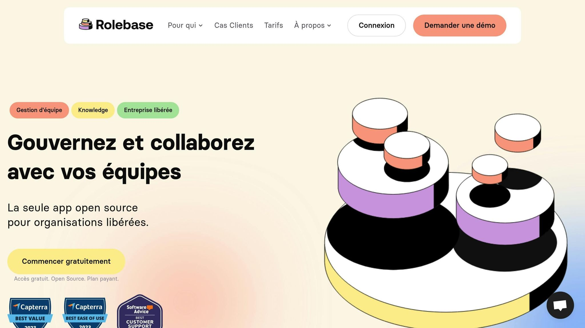

**Les fiches de poste classiques freinent l'adaptabilité et la collaboration.** Dans un monde du travail en constante évolution, le management par rôles offre une alternative plus flexible et efficace.

### Pourquoi passer à la gestion par rôles ?

- **Plus de flexibilité**: Les rôles s'adaptent aux besoins changeants.

- **Collaboration renforcée**: Moins de silos, plus de travail d'équipe.

- **Valorisation des compétences**: Mise en avant des soft skills et des contributions globales.

- **Réactivité accrue**: Les équipes réagissent mieux aux changements.

### Comparaison rapide

| Aspect            | Fiche de Poste                 | Management par Rôles   |
| ----------------- | ------------------------------ | ---------------------- |
| **Priorité**      | Tâches spécifiques             | Contributions globales |
| **Flexibilité**   | Structure rigide               | Approche souple        |
| **Collaboration** | Peu prise en compte            | Au cœur du système     |
| **Développement** | Axé sur compétences techniques | Inclut les soft skills |

### Résultat ?

Une organisation plus agile et des équipes plus motivées. Vous êtes prêt à transformer votre gestion ?

## Problèmes des fiches de poste actuelles

### Les limites d'une structure rigide

Les fiches de poste imposent une rigidité qui freine aussi bien le développement des compétences que l'efficacité au travail. Cette structure empêche souvent de tirer pleinement parti des talents individuels. L'Amiral Rickover illustre bien ce point :

> "Il faut permettre à ses collaborateurs de rechercher des tâches supplémentaires et d'assumer des responsabilités accrues. Dans mon organisation, il n'existe ni descriptions de poste formelles ni organigrammes. Les responsabilités sont définies de manière générale, de sorte que chacun puisse agir selon son propre jugement, et qu'il soit libre de solliciter l'aide de quiconque et d'aller vers qui il le souhaite. Chaque personne est alors limitée uniquement par sa propre capacité."

En plus de limiter les initiatives personnelles, cette rigidité structurelle fragmente les équipes, ce qui nuit à la collaboration.

### Les freins à la collaboration

Des responsabilités trop cloisonnées créent des silos qui entravent le travail collectif. Cette fragmentation, comme le souligne David Bohm, a des effets profonds :

> "La fragmentation est donc une attitude d'esprit qui incline l'esprit à considérer les divisions entre les choses comme absolues et définitives, plutôt que comme des manières de penser ayant une portée utile et une validité relatives et limitées. Elle conduit, par conséquent, à une tendance générale à décomposer les choses de manière non pertinente et inappropriée selon notre manière de penser. Et ainsi, elle est évidemment et intrinsèquement destructrice."

Cela se traduit par plusieurs problèmes concrets :

| Impact        | Conséquence                          |
| ------------- | ------------------------------------ |
| Communication | Création de barrières entre services |
| Innovation    | Moins d'initiatives collaboratives   |
| Agilité       | Réaction lente aux changements       |
| Performance   | Baisse d'efficacité globale          |

### Un modèle dépassé pour les équipes modernes

Les fiches de poste classiques ne tiennent pas compte des réalités actuelles du travail. Elles omettent souvent des compétences clés comme le travail en équipe ou l'amélioration continue. Avec l'évolution rapide des métiers et technologies, les besoins en polyvalence, en soft skills et en flexibilité organisationnelle s'intensifient.

Ces limites rendent les fiches de poste traditionnelles peu adaptées aux exigences des équipes modernes, qui nécessitent davantage de réactivité et de collaboration. Des approches plus souples et alignées sur ces enjeux deviennent essentielles pour améliorer la performance organisationnelle.

## Les atouts de la gestion par rôles

### Une organisation plus réactive aux changements

La gestion par rôles aide les entreprises à répondre rapidement aux évolutions du marché et aux nouvelles exigences. Plutôt que de s'appuyer sur des fiches de poste rigides, cette méthode propose une structure adaptable qui accompagne la croissance et les transformations de l'organisation.

Elle permet notamment de :

- Réaffecter les ressources rapidement selon les priorités

- Ajuster les compétences en fonction des besoins

- Répondre efficacement aux opportunités du marché

Cette approche rend l'organisation plus fluide et facilite une meilleure collaboration entre les équipes.

### Une performance collective optimisée

En clarifiant les responsabilités tout en laissant de la flexibilité, la gestion par rôles améliore la dynamique et l'efficacité des équipes. Voici quelques avantages concrets :

| Aspect        | Avantage                             |
| ------------- | ------------------------------------ |
| Communication | Responsabilités mieux définies       |
| Coordination  | Moins de tâches redondantes          |
| Collaboration | Utilisation optimale des compétences |
| Implication   | Motivation accrue des équipes        |

### Un focus sur les compétences des collaborateurs

Au-delà de l'adaptabilité et de l’efficacité collective, cette méthode met en lumière les compétences réelles des employés. Elle reconnaît que le monde du travail actuel exige une approche plus souple et individualisée.

Avec cette philosophie, les contributions des collaborateurs sont mieux valorisées. Elle encourage l'apprentissage continu et permet une progression professionnelle basée sur les aptitudes réelles.

Des dimensions souvent ignorées dans les fiches de poste classiques, comme la créativité, le travail d'équipe ou la capacité à apprendre, deviennent centrales. Cela permet une meilleure correspondance entre les talents individuels et les besoins de l'entreprise, tout en offrant une vision plus équilibrée de la valeur de chaque employé.

## Comprendre enfin le rôle des managers en entreprise (et ...

<Youtube videoId="-HvqKFWmvnE" />

###### sbb-itb-77d9745

## Comment passer à la gestion par rôles

Vous avez compris l'intérêt de la gestion par rôles ? Voyons maintenant comment la mettre en place de manière concrète.

### Créer des rôles clairs et adaptés

Pour réussir cette transition, il faut une démarche structurée. Commencez par analyser les besoins actuels de votre organisation afin de définir des rôles adaptés aux objectifs de l’entreprise.

Voici les étapes clés pour structurer vos rôles :

- Identifiez les**responsabilités principales**et les**compétences nécessaires**pour aligner chaque rôle avec les objectifs de l'entreprise.

- Assurez une**cohérence globale**entre les rôles et la stratégie de l'organisation.

- Définissez précisément les**contributions attendues**, les compétences requises et les interactions avec les autres membres de l'équipe.

Ces descriptions doivent rester flexibles pour évoluer avec l'organisation. Elles ne doivent pas être figées mais plutôt constituer un cadre adaptable.

### Impliquer vos équipes

Après avoir défini les rôles, impliquez vos collaborateurs dans le processus. Les rôles dans une entreprise ne se limitent pas à des listes de tâches ; ils concernent aussi les interactions et les dynamiques d'équipe.

Pour une intégration réussie, suivez cette méthode en trois phases :

| Phase         | Actions                                                 | Objectifs                                        |
| ------------- | ------------------------------------------------------- | ------------------------------------------------ |
| Consultation  | Réunir l’équipe et organiser des entretiens individuels | Recueillir les avis et suggestions de chacun     |
| Documentation | Co-créer les descriptions de rôles                      | Assurer la précision et l’implication collective |
| Validation    | Réviser et ajuster avec l’équipe                        | Obtenir une adhésion collective                  |

Cette participation active garantit une meilleure acceptation et une mise en œuvre plus fluide.

### Utiliser des outils adaptés

Les outils de gestion des rôles peuvent simplifier le processus et améliorer la collaboration. Ils permettent notamment de :

- Visualiser la structure organisationnelle en temps réel.

- Suivre les changements dans les responsabilités.

- Faciliter la communication entre les équipes.

- Identifier des opportunités de développement pour les collaborateurs.

Optez pour des outils simples à utiliser et conçus pour encourager la collaboration. En liant les descriptions de rôles aux parcours professionnels, ces plateformes offrent également une vision claire des possibilités d'évolution pour chaque membre de l'équipe.

Chaque étape doit être validée collectivement pour garantir une transition fluide et réussie vers la gestion par rôles. Cela renforce l'engagement des collaborateurs et assure une adoption durable.

## Fonctionnalités [Rolebase](/) pour la Gestion des Rôles

### Fonctions Principales de Rolebase

Rolebase met à disposition des outils pratiques pour gérer efficacement les rôles dans une organisation :

- **Organigramme interactif**: Visualisez la structure de votre organisation en temps réel.

- **Gestion des rôles et responsabilités**: Attribuez et suivez les rôles de manière claire.

- **Outils de collaboration**: Facilitez le travail en équipe grâce à des outils intégrés.

- **Module de gestion des réunions**: Planifiez et synchronisez les agendas en toute simplicité.

Ces outils permettent d'améliorer la clarté organisationnelle et d'optimiser les processus internes.

### Points Forts de Rolebase

Adopter Rolebase peut transformer la manière dont votre organisation fonctionne. Voici quelques avantages concrets :

| Aspect            | Bénéfice                                            |
| ----------------- | --------------------------------------------------- |
| **Transparence**  | Une meilleure répartition des responsabilités.      |
| **Flexibilité**   | Une structure qui évolue selon vos besoins.         |
| **Collaboration** | Une communication renforcée au sein des équipes.    |
| **Autonomie**     | Des équipes plus indépendantes et responsabilisées. |

> "Que vous soyez manager ou dirigeant, vous y trouverez des clés pour mieux distribuer les rôles dans votre organisation et confier davantage d'autonomie à vos équipes." - Godefroy de Compreignac, CEO @Lonestone

### Formules d'Accompagnement et Formation

Pour simplifier l'intégration de ses outils, Rolebase propose trois options adaptées à vos besoins :

**Formule Auto-service**

- Accès à une documentation détaillée.

- Utilisation des outils de base pour la gestion des rôles.

**Formule avec Onboarding**

- Audit de votre organisation.

- Session de coaching de 2 heures.

- Configuration adaptée à vos spécificités.

**Formule avec Coaching**

- Accompagnement personnalisé pour vos équipes.

- Support dédié et suivi continu.

Que vous dirigiez une petite équipe ou une grande structure, Rolebase facilite la transition vers un modèle de management horizontal tout en garantissant une mise en œuvre maîtrisée.

## Conclusion : Les Rôles comme Nouveau Standard

Après avoir examiné les limites des fiches de poste traditionnelles, la gestion par rôles apparaît comme une approche efficace et moderne.

### Résumé des Points Importants

La gestion par rôles répond aux exigences actuelles des entreprises. Voici ses principaux atouts :

- Une meilleure capacité à s'adapter rapidement aux changements du marché.

- Des responsabilités clairement définies, ce qui simplifie l'organisation.

- Une mise en avant des compétences spécifiques pour chaque rôle.

- Une collaboration renforcée entre les équipes grâce à une structure plus fluide.

Cette méthode offre un cadre dynamique qui répond aux besoins des entreprises d'aujourd'hui, en favorisant agilité et efficacité.

### Étapes pour Passer à l'Action

Pour adopter cette approche, voici les étapes à suivre :

1. **Clarifiez vos objectifs et définissez les rôles**

- Repérez les domaines nécessitant plus de souplesse et d'efficacité.

- Déterminez les responsabilités clés et les compétences nécessaires.

- Mettez en place des indicateurs pour évaluer les performances.

2. **Utilisez les bons outils**

- Organisez visuellement votre structure interne.

- Gérez l'attribution et l'évolution des rôles.

- Facilitez la collaboration entre les équipes.

Adopter une gestion basée sur les rôles peut transformer votre organisation en une entreprise plus réactive et performante.
