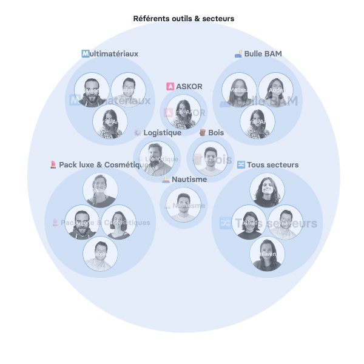

### **EVEA est un cabinet-conseil, un organisme de formation et un éditeur et distributeur d'outils logiciels ([ASKOR](https://askor.eco/)) qui aide les entreprises à améliorer leur performance environnementale et sociale.**

Depuis 2005, la Scop (société coopérative et participative) accompagne les organisation vers une offre de produits et de services plus responsables.

L'entreprise répartie sur 3 sites (Nantes, Lyon, Troyes) déploie des compétences multisectorielles rassemblant des consultant·e·s, ingénieur·e·s, des informaticien·ne·s, et des formateur·rice·s en analyse du cycle de vie (ACV), en éco-conception, en socio-conception, en design, en développement de logiciels, en recherche et innovation.

Le pilier de la culture d'entreprise de cette société coopérative repose sur la gouvernance partagée, la prééminence de la personne humaine, la solidarité et le partage.

[Découvrir l'activité d'EVEA en détail.](https://evea-conseil.com/fr#decouvez_evea)

> **_Rolebase est devenu un outil indispensable à EVEA. Les équipes retrouvent facilement qui fait quoi. On peut disposer à tout instant d'une cartographie en temps réel des rôles au sein de l'entreprise._**

Damien Delmotte - Communication & Brand Manager

## Le Challenge rencontré

EVEA connait une croissance exponentielle, en activité depuis 2005, l'entreprise comptait 60 collaborateurs dans ses équipes en 2020, pour 140 en 2023.

Un powerpoint était mis en place pour y voir clair dans l'organisation, en raisons de facteurs :

- Géographiques : avec des équipes sur 3 bureaux et certains collaborateurs en télétravail complet
- Répartition des compétences : Avec plus de 8 pôles de compétences différents et des missions transverses
- Expertises sectorielles : Plus d'une dizaines de lignes d'expertises au sein de chaque pôle de compétences

Une vraie problématique pour savoir représenter les différentes entités d'EVEA à un instant T et représentant un frein dans la logique participative de l'entreprise.

> **_Représenter EVEA visuellement et simplement revenait à explorer les méandres d'une rivière inconnue avec une carte dessinée à la main._**

Damien Delmotte - Communication & Brand Manager

## La solution

Jean-Baptiste Puyou, directeur général et fondateur d'EVEA a rencontré Godefroy lors d'un salon nantais. La vision commune de « simplifier la vie des équipes » a convaincu EVEA à faire un test.

L'entreprise a pu donner vie à un organigramme dynamique où elle à l'image exacte à l'instant T des différentes entités business, support et de gouvernance.

Ce sont avant tout 140 visages qui sont mis en avant et à qui on rend l'aspect complet de leurs compétences et engagement.

En effet, une consultante en ACV et éco-conception peut aussi être membre du CSE, faire partie du groupe de travail sur la méthodologie, être formatrice, bilingue en espagnol et pratiquer l'escalade.

> **_Pour mon rôle de responsable de la communication externe et interne, Rolebase est devenu un outil indispensable pour présenter EVEA sous tous ses angles, même devant des partenaires, des clients, ou au cours du processus de recrutement._**

Damien Delmotte - Communication & Brand Manager

[Découvrez l'article sur le blog d'EVEA révélant le rôle qu'à Rolebase dans leur gouvernance partagée.](https://evea-conseil.com/fr/actualites/article/optimiser-gouvernance-partagee-rolebase)
